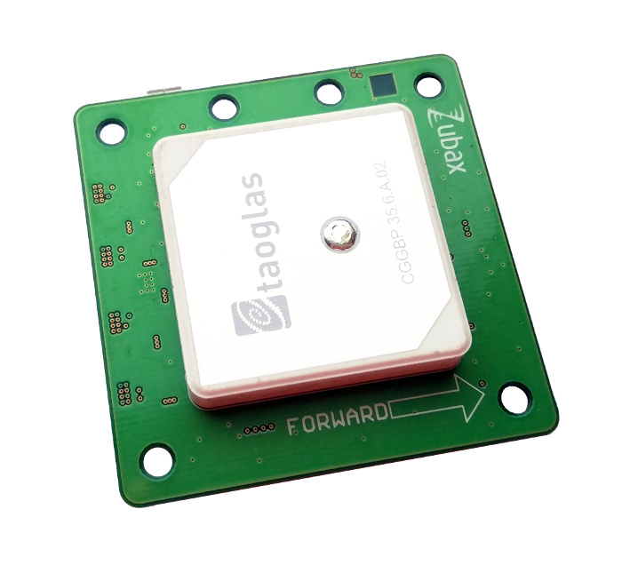
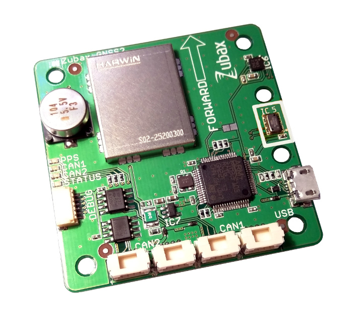
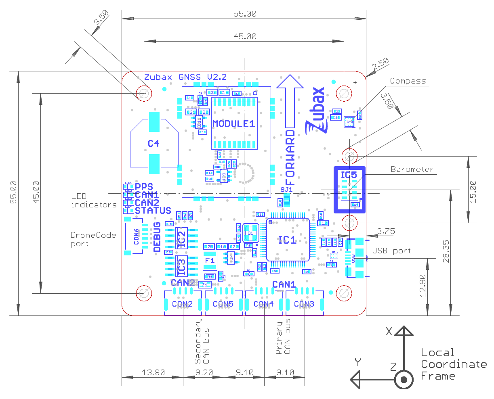
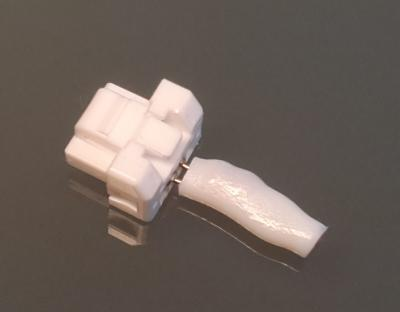
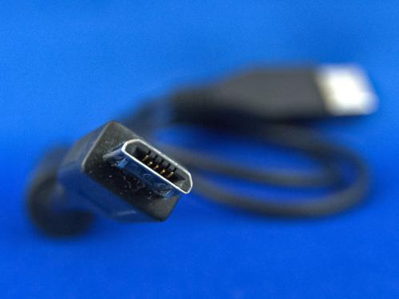
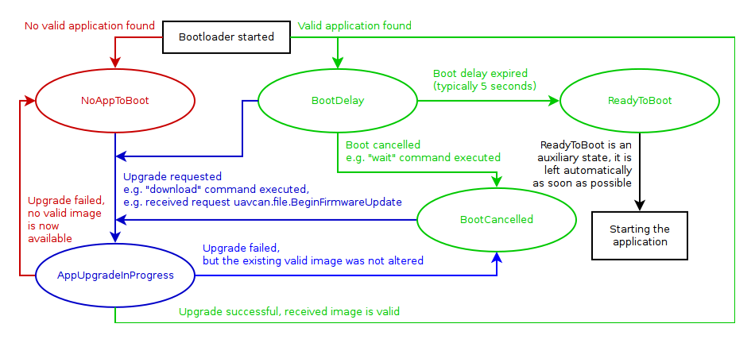

# Zubax GNSS 2




Zubax GNSS 2 is a multipurpose high-performance positioning module interfaced via CAN bus, USB, and UART.
It includes a state-of-the-art multi-system GPS/GLONASS receiver, a high-precision barometric altimeter,
and a 3-axis compass with thermal compensation.
Zubax GNSS 2 supports variety of standard protocols, which ensures compatibility with most of existing
software and hardware: [UAVCAN](/uavcan) (over CAN bus), NMEA 0183 (over USB and UART),
and u-Blox M8 protocol.

If you're just looking for a quick-start guide, check out the [tutorials](tutorials),
but please return to this page afterwards.

Links to the firmware sources and 3D printable models are available at the bottom of this page.

## Characteristics

### Mechanical

The drawing below documents the basic mechanical characteristics of Zubax GNSS 2,
such as the placement of connectors, LED indicators and mounting holes (click to enlarge):



Two extra holes around the barometer can be used to install a protective cover.

<info>
If your Zubax GNSS 2 was supplied with a protective tape on the barometer, make sure to remove it before first use.
</info>

### General

#### Environment

##### Hardware v2.2 and newer

Parameter               | Minimum       | Maximum       | Units | Note
------------------------|---------------|---------------|-------|------------------------------------------------------
Board temperature       | -40           | 70            | &deg;C| GNSS hot start is not expected to work reliably below -20&deg;C.
Magnetic field strength |               | 9             | Gauss |

##### Hardware v2.1 and older

Parameter               | Minimum       | Maximum       | Units | Note
------------------------|---------------|---------------|-------|------------------------------------------------------
Board temperature       | -30           | 60            | &deg;C| GNSS hot start is not expected to work reliably below -20&deg;C.
Magnetic field strength |               | 1.3           | Gauss |

#### Power supply

Parameter       | Minimum       | Typical       | Maximum       | Units | Note
----------------|---------------|---------------|---------------|-------|----------------------------------------------
Supply voltage  | 4.5           | 5.0           | 5.5           | V     | Any power input
Supply current  | 70            | 95            | 180           | mA    | Any power input

#### CAN bus

Parameter                               | Minimum       | Typical       | Maximum       | Units
----------------------------------------|---------------|---------------|---------------|-------
Bit rate (manually configurable)        | 20            | 1000          | 1000          | Kbps
Bit rate (autodetect)                   |        | 1000<br/>500<br/>250<br/>125 |       | Kbps
Positive-going input threshold voltage  |               | 750           | 900           | mV
Negative-going input threshold voltage  | 500           | 650           |               | mV
Differential output voltage, dominant   | 1.5           | 2.0           | 3.0           | V
Differential output voltage, recessive  | -120          | 0             | 12            | mV

#### UART

Parameter                               | Minimum       | Typical       | Maximum       | Units
----------------------------------------|---------------|---------------|---------------|-------
Low-level input voltage                 | -0.3          | 0             | 1.6           | V
High-level input voltage                | 2.1           | 3.3           | 5.5           | V
Low-level output voltage                | 0             | 0             | 0.5           | V
High-level output voltage               | 2.8           | 3.3           | 3.4           | V
Source/sink current                     |               |               | 10            | mA

### Sensor suite

#### GNSS receiver

Please refer to the specifications provided by the sensor manufacturer.

Sensor model:
[u-blox MAX-M8Q](http://www.u-blox.com/en/gps-modules/pvt-modules/max-m8-series-concurrent-gnss-modules.html)

#### Digital barometer

Please refer to the specifications provided by the sensor manufacturer.

Sensor model: [TE Connectivity MS5611](http://www.meas-spec.com/product/pressure/MS5611-01BA03.aspx)

#### Three-axis digital compass with thermocompensation

Please refer to the specifications provided by the sensor manufacturer.

* Zubax GNSS v2.1 and v2.0:
[Honeywell HMC5983](http://www51.honeywell.com/aero/common/documents/myaerospacecatalog-documents/Defense_Brochures-documents/HMC5983_3_Axis_Compass_IC.pdf)
* Zubax GNSS v2.2: [LIS3MDL](http://www.st.com/en/mems-and-sensors/lis3mdl.html)

## Interfaces

Zubax GNSS 2 features three communication interfaces, each of which is described in detail in the subsequent parts
of this document. The interfaces are as follows:

* Doubly redundant [UAVCAN interface](#UAVCAN_interface) with two connectors for each interface.
This interface provides access to all features of Zubax GNSS 2, including measurements output,
configuration, time synchronization, firmware update, etc.
Connector type is UAVCAN Micro connector (Molex CLIK-Mate).
* [USB port](/usb) (CDC ACM profile, also known as virtual serial port).
This interface can be used for NMEA output and configuration.
Connector type is USB micro B (which is the most common USB connector).
* [DroneCode port, used for NMEA output and diagnostics. Connector type is DCD-M (JST SH)](/dronecode_probe).

The device can be powered via the following:

* Any single UAVCAN port.
* Both UAVCAN ports simultaneously (the power supply circuit prevents direct current flow between these power inputs).
* USB.
* DroneCode port (hardware revisions v2.1 and newer).

It is allowed to power the device simultaneously via USB and UAVCAN, since the power supply circuit prevents
back-powering via these interfaces.

Power supply characteristics are identical regardless of the power input used - refer to the tables below for details.

## Continuous self-diagnostics

Zubax GNSS 2 continuously monitors its own status and sensor outputs for anomalies and malfunctions.
Results of the continuous self-testing are mapped to three health codes: OK, WARNING, and ERROR.
The table below documents how the device uses health codes to report its status.

Health  | Conditions
--------|----------------------------------------------------------------------------------------------
OK      | Everything is OK; all enabled sensors are functioning properly.
WARNING | See below.
ERROR   | Sensor malfunction. The device may stop sending corresponding sensor measurements.

Possible reasons for the health being `WARNING`:

* GNSS fix quality is below the configured threshold (see [configuration parameters](#Configuration_parameters))
(disabled by default).
* Operating temperature range violation (see [characteristics](#Characteristics)).
* Magnetic field strength is too high (see [characteristics](#Characteristics)) (likely a sensor malfunction).
* Magnetic field strength vector remained zero for several seconds (likely a sensor malfunction).

## LED indication

### PPS LED

This LED indicator blinks with the rate of 1 Hz if the GNSS receiver has a navigation fix.

### Status LED

<style>
div.led {
    padding: 0 2px;
    animation-iteration-count: 1;
}
div.led:hover {
    animation-iteration-count: infinite;
}
div.led-ok {
    animation-name: led-ok;
    animation-duration: 1s;
}
div.led-warning {
    animation-name: led-warning;
    animation-duration: 0.3s;
}
div.led-error {
    animation-name: led-error;
    animation-duration: 0.1s;
}
@keyframes led-ok {
    0%   {background-color:red;}
    5%   {background-color:white;}
    100% {background-color:white;}
}
@keyframes led-warning {
    0%   {background-color:red;}
    16%  {background-color:white;}
    100% {background-color:white;}
}
@keyframes led-error {
    0%   {background-color:red;}
    50%  {background-color:white;}
    100% {background-color:white;}
}
</style>

This LED indicator shows the health of the device derived from the continuous self-diagnostics as described above:

Health  | Blinking ON/OFF duration
--------|------------------------------------------------
OK      | <div class="led led-ok">0.05/0.95 seconds</div>
WARNING | <div class="led led-warning">0.05/0.25 seconds</div>
ERROR   | <div class="led led-error">0.05/0.05 seconds</div>

### CAN1 and CAN2 LEDs

These LED indicators show the CAN bus traffic.

Each blink indicates that there was a CAN frame that was *successfully* transmitted or *successfully*
received during the last few milliseconds.
Under high bus load, these LED indicators are expected to glow steadily.
If the interface is not connected to the bus, its LED indicator will be inactive,
even if the device is actually attempting to transmit.

Note that CAN frames filtered out by the hardware acceptance filters will not cause the LED indicators to blink.

### LED indication during firmware update and bootup

#### Firmware v4.0 and newer

During first few seconds after power-on or after restart, and also in the process of firmware update,
Zubax GNSS 2 uses its LED indicators in a different way, as described in the section dedicated to the
bootloader below.

#### Firmware v3.x and older

During first few seconds after power-on or after restart, and also in the process of firmware update,
Zubax GNSS 2 uses its LED indicators in a different way, as described in the table below.

Status                          | INFO  | CAN1  | CAN2
--------------------------------|-------|-------|-------
CAN bit rate detection          |       | Solid |
Dynamic node ID allocation      | Solid |       |
Update in progress              | Solid | Solid |

States that are not listed in the table indicate errors.

## UAVCAN interface

This section describes the properties specific for this product only.
For general info about the UAVCAN interface, please refer to the [UAVCAN interface documentation page](/uavcan).

<info>If Zubax GNSS 2 is used in a setup with non-redundant CAN bus, only CAN1 must be used.</info>

### Mode and status codes

Zubax GNSS 2 employs the following UAVCAN-defined operating modes:

UAVCAN operating mode   | Conditions
------------------------|----------------------------------------------------------------------------------------------
INITIALIZING            | The device has just started and is not ready to begin normal operation yet.
OPERATIONAL             | This is the main operating mode.
SOFTWARE_UPDATE         | The device is undergoing firmware update via UAVCAN. It will automatically transition to OPERATIONAL mode upon completion.

While the device resides in OPERATIONAL mode, its internal health codes are mapped directly to UAVCAN health codes.
The description of internal health codes is provided above.

The following table describes the meanings of the standard UAVCAN health codes in the mode `SOFTWARE_UPDATE`.

UAVCAN health code      | Possible reasons
------------------------|----------------------------------------------------------------------------------------------
OK                      | Everything is OK.
WARNING                 | Not used.
ERROR                   | Not used.
CRITICAL                | Firmware update has failed; another attempt will be made soon.

<info>See [UAVCAN GUI Tool](http://uavcan.org/GUI_Tool)</info>

### Time synchronization

This device can act as a
[UAVCAN-compliant time synchronization master](http://uavcan.org/Specification/6._Application_level_functions/#time-synchronization),
but this feature is disabled by default.
If time synchronization is enabled, the GNSS UTC time will be used as the time source,
which implies that the time synchronization master will be functional only if the device has had at least one
successful GNSS time fix since power on.

### Services

This device does not call any services.

The following service servers are implemented:

Data type                                       | Note
------------------------------------------------|----------------------------------------------------------------------
`uavcan.protocol.GetNodeInfo`                   | Please refer to the [identification information section](#Identification_information).
`uavcan.protocol.GetDataTypeInfo`               |
`uavcan.protocol.GetTransportStats`             |
`uavcan.protocol.RestartNode`                   |
`uavcan.protocol.file.BeginFirmwareUpdate`      | Reboots the device into the bootloader and commences the firmware download process.
`uavcan.protocol.param.GetSet`                  | Configuration parameters are described later in this document.
`uavcan.protocol.param.ExecuteOpcode`           | Note that this request may cause transient disruptions to output sensor feeds. Starting from firmware v4.0, configuration parameters are saved automatically after modification, so no explicit invokation of this service is necessary.

### Messages

Input:

Data type                                       | Note
------------------------------------------------|----------------------------------------------------------------------
`uavcan.protocol.GlobalTimeSync`                | Always synchronizes with network time, if present.
`uavcan.protocol.dynamic_node_id.Allocation`    | Used to allocate node ID if dynamic node ID allocation is enabled (it is enabled by defualt).

Output (publishing frequency is configurable per message type):

Data type                                       | Note
------------------------------------------------|----------------------------------------------------------------------
`uavcan.protocol.GlobalTimeSync`                | Disabled by default.
`uavcan.protocol.NodeStatus`                    |
`uavcan.equipment.gnss.Fix`                     | This message definition is deprecated; refer to the UAVCAN specification for detail. Enabled by default for compatibility reasons, but **it is recommended to disable it**.
`uavcan.equipment.gnss.Fix2`                    | This is a replacement to the deprecated message type `uavcan.equipment.gnss.Fix`.
`uavcan.equipment.gnss.Auxiliary`               |
`uavcan.equipment.ahrs.MagneticFieldStrength`   |
`uavcan.equipment.air_data.StaticPressure`      | Disabled by default.
`uavcan.equipment.air_data.StaticTemperature`   | Priority is shared with `uavcan.equipment.air_data.StaticPressure`. See a note below on publication frequency. Disabled by default.
`uavcan.protocol.dynamic_node_id.Allocation`    | Used to allocate node ID if dynamic node ID allocation is enabled (it is enabled by defualt).

The publication frequency of `uavcan.equipment.air_data.StaticTemperature` is defined as follows:

* For firmware versions prior to v4.0, the message `uavcan.equipment.air_data.StaticTemperature` is published at the same rate as `uavcan.equipment.air_data.StaticPressure`.
* For firmware versions v4.0 and newer, the message `uavcan.equipment.air_data.StaticTemperature` is published at 1/5th of the rate of `uavcan.equipment.air_data.StaticPressure`.
E.g. if the pressure data is broadcasted at 20 Hz, the temperature data will be broadcasted at 4 Hz.

## USB interface

The USB interface allows to use Zubax GNSS 2 as a standalone USB GNSS receiver (also known as "GPS mouse")
interfaced via the standard NMEA 0183 protocol; also it provides access to configuration parameters.

Please refer to the [USB command line interface documentation page](/usb)
for more information specific to this interface.

### Protocol selection

**Zubax GNSS 2 will automatically enable NMEA output via USB if the virtual serial port is opened with any baud rate
within the range 4800 to 57600 baud, inclusive.
If the port is open with any other baud rate, e.g. 115200, NMEA output will not be enabled,
and only the command line interface will be available.**

The baud rate range is chosen this way because all standard NMEA baud rates fall within this range,
which allows to use Zubax GNSS 2 with GNSS software (e.g. GIS systems, navigation software, etc.) right out of the box
without any preparatory configuration.

### NMEA output

Zubax GNSS 2 reports sensor data using the following standard NMEA sentences.
Please also refer to the list of configuration parameters below to see what can be asjusted if necessary.

More information on NMEA can be found here: <http://www.catb.org/gpsd/NMEA.html>.

Refer to the tutorials to see examples of using Zubax GNSS 2 with
<abbr title="Geographic information system">GIS</abbr> software.

#### Standard sentences

NMEA sentence   | Component     | Purpose
----------------|---------------|--------------------------------------------------------------
`GPRMC`         | GNSS receiver | Recommended minimum navigation information
`GPGGA`         | GNSS receiver | Global positioning system fix data
`GPGSA`         | GNSS receiver | GPS DOP and active satellites
`GPGSV`         | GNSS receiver | Information about satellites in view
`HCHDG`         | Compass       | Raw magnetic heading; not calibrated, only valid if the board is mounted horizontal
`YXXDR` (type `P`)|Altimeter    | Static barometric pressure *(only if sensor is enabled)*
`YXXDR` (type `C`)|Altimeter    | Static air temperature *(only if sensor is enabled)*

#### Vendor-specific sentences

The NMEA specification dedicates the prefix `$P` followed by the vendor ID for vendor-specific sentences.
All Zubax products use the vendor-specific prefix `ZUBAX`.
The first field of the sentence contains the sentence type identifier, which is a string containing upper case
latin letters, arabic digits, and the minus symbol `-`.

##### Raw magnetic field strength

Vendor-specific sentence type ID: `MAG-FLD-XYZ`.

Availability: firmware v4.0 and newer.

Fields:

1. Magnetic field strength of the X axis.
2. Magnetic field strength of the Y axis.
3. Magnetic field strength of the Z axis.
4. A single character `G` that indicates that the units of measurement are Gauss.
5. Reserved.
6. Reserved.

Example: `$PZUBAX,MAG-FLD-XYZ,1.345,-1.345,0.345,G,,*12`

#### Sample output

```
$GPRMC,072626.30,A,0036.27144,N,00042.93538,E,1.097,235.8,141215,,*35
$GPGGA,072626.30,0036.27144,N,00042.93538,E,1,14,1.44,239.382,M,13.2,M,,*5E
$GPGSV,4,1,15,08,52,283,17,10,80,126,26,14,27,155,34,15,15,039,08*74
$GPGSV,4,2,15,16,00,216,16,18,49,073,13,21,25,109,22,22,77,181,25*7F
$GPGSV,4,3,15,27,59,219,15,32,03,232,16,01,74,188,27,02,19,214,17*76
$GPGSV,4,4,15,08,47,047,22,23,29,145,21,24,80,177,18*4A
$HCHDG,266.0,,,,*40
$YXXDR,P,0.98966,B*57
$YXXDR,C,29.9,C*7F
$GPRMC,072626.36,A,0036.27143,N,00042.93547,E,1.402,235.8,141215,,*34
$GPGGA,072626.36,0036.27143,N,00042.93547,E,1,15,1.44,239.467,M,13.2,M,,*5A
$GPGSA,A,3,08,10,14,18,21,22,27,01,02,23,24,12,2.24,1.44,1.71*04
$HCHDG,266.2,,,,*42
$YXXDR,P,0.98968,B*59
```

### Command-line interface

This section documents supported CLI commands.

#### `zubax_id`

This is the standard Zubax identification command.
It is supported by all devices that implement a command line interface.
Please refer to the [USB command line interface documentation page](/usb) for more info.

#### `cfg`

Allows to view or modify configuration parameters.

Execute without arguments to get usage info. Supported arguments:

* `list` - list all parameters, their values and ranges.
* `set <name> <value>` - change parameter value.
* `save` - save all parameters to the non-volatile memory.
* `erase` - reset all parameters to defaults.

<info>
Starting from firmware v4.0, configuration parameters are saved automatically after modification.
Thus, it is no longer necessary to execute `cfg save`.
</info>

#### `reset`

Restarts the device. Note that sensors will not be restarted.

#### `gnssbridge`

Activates the direct bridge connection between USB CLI and the GNSS receiver.
This feature allows to receive GNSS information using native u-Blox M8 protocol.

Once the bridge is activated, the state of the device changes as follows until reboot:

* CLI becomes unavailable because it is being used to communicate with the GNSS receiver.
* The device stops publishing GNSS messages via UAVCAN.
* Status code changes to CRITICAL because GNSS sensor data are not available anymore.

Aside from the above, the device continues to work virtually as usual, e.g., its UAVCAN stack operates normally,
other sensors are working (if enabled), etc.

#### `help`

Prints the list of available commands

#### `bootloader`

Available in firmware v4.0+.

Reboots the board into the bootloader.

## DroneCode port


DroneCode port provides access to JTAG/SWD and UART interfaces.
This port allows to update firmware and provides access to the UART interface that is used to log events,
report problems, and output measurements in NMEA format.
Hardware revisions v2.1 and newer can also be powered via this port.

DroneCode port can be accessed using [Zubax DroneCode Probe](/dronecode_probe).

If outputting NMEA over UART is not of interest, this port will not be needed during normal use of the device.

### NMEA output over UART

For general information about NMEA output interface, [refer to the corresponding section above](#NMEA_output).
Note that NMEA output over UART is disabled by default; refer to the
[description of configuration parameters](#Configuration_parameters) to see how to enable it.

The following connector pinout can be used to read NMEA over UART:

Pin     | Type  | Name          | Comment
--------|-------|---------------|--------------------------------------------------------------------------------------
1       | POWER | `+5VDC`       | Power supply (hardware v2.1 and newer). On hardware v2.0 this pin must be left unconnected.
2       | OUT   | `UART_TX`     | NMEA output
3       | N/C   |               |
4       | N/C   |               |
5       | N/C   |               |
6       | GND   | `GND`         | Ground

UART parameters are fixed and provided below:

* Baud rate: 115200
* Byte size: 8
* Parity: None
* Stop bits: 1

## Configuration parameters

This section documents the available configuration parameters.
Read the documentation on the interfaces to learn how to access the configuration parameters.

<info>Reboot is required in order for all configuration changes to take effect.</info>

<info>
Starting from firmware v4.0, configuration parameters are saved automatically after modification.
</info>

### `uavcan.bit_rate`

**Removed in firmware v4.0.**

CAN bus bit rate, all interfaces.
Value 0 (which is default) causes the device to detect bit rate automatically at every boot up.

Default value: 0

Units: bits/sec

### `uavcan.node_id`

UAVCAN Node ID
Value 0 (which is default) causes the device to request a dynamically allocated node ID at every boot up.

Default value: 0

### `uavcan.pubp-time`

Publication interval of `uavcan.protocol.GlobalTimeSync`. Zero means disabled.

Default value: 0

Units: Microsecond

### `uavcan.prio-time`

Priority of `uavcan.protocol.GlobalTimeSync`.

Default value: 1

### `uavcan.pubp-stat`

Publication interval of `uavcan.protocol.NodeStatus`.

Default value: 200000

Units: Microsecond

### `uavcan.prio-stat`

Priority of `uavcan.protocol.NodeStatus`.

Default value: 20

### `uavcan.pubp-pres`

Publication interval of `uavcan.equipment.air_data.StaticPressure`. Zero means disabled.
When disabled:

* The driver of the appropriate sensor will not be initialized.
* The sensor will not be monitored - implying that, if it fails, it will not be detected and reported.
* Measurements will not be reported via any of the available interfaces.

This setting also affects `uavcan.equipment.air_data.StaticTemperature`.

Default value: 0 (disabled)

Units: Microsecond

### `uavcan.prio-pres`

Priority of `uavcan.equipment.air_data.StaticPressure`.
This setting also affects `uavcan.equipment.air_data.StaticTemperature`.

Default value: 16

### `uavcan.pubp-mag`

Publication interval of `uavcan.equipment.ahrs.MagneticFieldStrength`.

Default value: 20000

Units: Microsecond

### `uavcan.prio-mag`

Priority of `uavcan.equipment.ahrs.MagneticFieldStrength`.

Default value: 16

### `uavcan.pubp-fix`

Publication interval of `uavcan.equipment.gnss.Fix`.

Default value: 100000

Units: Microsecond

### `uavcan.pubp-aux`

Publication interval of `uavcan.equipment.gnss.Auxiliary`.

Default value: 1000000

Units: Microsecond

### `uavcan.prio-fix`

#### Firmware v4.0 and newer

This setting directly assigns the priority of the message `uavcan.equipment.gnss.Fix2`.
The depreacted message `uavcan.equipment.gnss.Fix`, if enabled, will be using the next lower priority level.
For example, if this setting is set to 16, the deprecated message will be broadcasted at the priority level 17,
which is one lower than 16.

Default value: 16

#### Firmware v3.x and older

Priority of `uavcan.equipment.gnss.Fix`.

Default value: 16

### `uavcan.prio-aux`

Priority of `uavcan.equipment.gnss.Auxiliary`.

Default value: 20

### `pres.variance`

Pressure variance reported via `uavcan.equipment.air_data.StaticAirData`.

Default value: 100

Units: Pascal<sup>2</sup>

### `temp.variance`

Temperature variance reported via `uavcan.equipment.air_data.StaticAirData`.

Default value: 4

Units: Kelvin<sup>2</sup>

### `mag.variance`

Magnetic field variance reported via `uavcan.equipment.ahrs.Magnetometer`.

Default value: 0.005

Units: Gauss<sup>2</sup>

### `mag.scaling_coef`

**New in firmware v3.1.**

Magnetic field vector scale.
Some UAV autopilot systems (PX4, APM) do not correclty handle magnetic field measurements made in highly
magnetically distorted environments.
It is possible to work around these issues by reducing the magnitude of the magnetic field vector.

For PX4 and APM users: if your autopilot reports that magnetometer offsets are too high,
reduce this parameter to approximately 0.6 and recalibrate the magnetometer.

Default value: 1.0, i.e. no rescaling.

### `gnss.warn_dimens`

Set the node status to WARNING if the number of dimensions in the GNSS solution is below this threshold.
Values: 1 - time-only fix, 2 - 2D fix, 3 - 3D fix.

Default value: 0

### `gnss.warn_sats`

Set the node status to WARNING if the number of satellites used in the GNSS solution is below this threshold.

Default value: 0

### `nmea.uart_on`

Enable NMEA output via DroneCode port (UART).
This configuration parameter does not affect NMEA output over USB.

Default value: 0 (disabled)

### `mag.pwron_slftst`

**New in firmware v4.0.**

Perform power on self test of the magnetometer when booting.
Note that the manufacturer of the magnetometer recommends to hold the sensor stationary during the self test procedure.
Therefore it is recommended to disable this feature unless it is expected that the board will be always held stationary
during powering on. Otherwise the self test may be occasionally failing, delaying the proper start up of the device.

Default value: 1 (enabled)

### `gnss.old_fix_msg`

**New in firmware v4.0.**

Broadcast the deprecated message `uavcan.equipment.gnss.Fix` alongside the new message `uavcan.equipment.gnss.Fix2`.
This feature is enabled by default for compatibility purposes; however, it is recommended to disable it in order to
reduce the CAN bus traffic if it is not needed.

Default value: 1 (compatibility mode)

## Identification information

This section documents device properties that are reported in response to identification requests:
CLI command `zubax_id` and UAVCAN service `uavcan.protocol.GetNodeInfo`.

* Product ID and UAVCAN node name: `com.zubax.gnss`.
* Hardware version: 2.x.

## Accessories

Zubax GNSS 2 can be used with the following accesories:

* [**Enclosure** (suitable for 3D printing)](https://github.com/Zubax/zubax_gnss/tree/master/hardware)
* [UAVCAN Micro Patch Cable](/uavcan#UAVCAN_Micro_Patch_Cable)
* [UAVCAN Micro to DF13 Adapter Cable](/uavcan#UAVCAN_Micro_to_DF13_Adapter_Cable)
* [UAVCAN Micro Termination Plug](/uavcan#UAVCAN_Micro_Termination_Plug)
* USB micro B cable (the most common type of USB cable)





**The acessories can be purchased from [our distributors](https://zubax.com/sales-network).**

## Firmware update

<info>Instructions below are only applicable to Zubax GNSS v2.2 and newer.</info>

Zubax GNSS 2 employs the Zubax Embedded Bootloader for purposes of firmware update and integrity checking.
The following state machine lies at the core of the bootloader.



State ID| State name            | Comment
--------|-----------------------|--------------------------------------------------------------------------------------
0       | `NoAppToBoot`         | There is no valid application to boot; the bootloader will be waiting for commands forever.
1       | `BootDelay`           | The bootloader will start the application in a few seconds, unless the boot is cancelled or a firmware update is requested.
2       | `BootCancelled`       | There is a valid application to boot, however, boot was cancelled by an external command.
3       | `AppUpgradeInProgress`| Application is currently being upgraded. If interrupted, the bootloader will go into either `NoAppToBoot` or `BootCancelled`.
4       | `ReadyToBoot`         | The application is about to boot. This state is very transient and is left automatically as soon as possible.

On Zubax GNSS 2, the boot delay is set to 5 seconds.

The bootloader supports the following communication interfaces:

Interface       | Parameters            | Protocol                                              | Note
----------------|-----------------------|-------------------------------------------------------|----------------------
USB             | CDC ACM               | YMODEM, XMODEM, XMODEM-1K (autodetect)                | When connected, the DCD port is inactive
DCD port (UART) | 115200-8N1 (fixed)    | Same as USB CDC ACM                                   | Available only while USB is disconnected
CAN bus         | Autoconfigured        | UAVCAN firmware update protocol                       | Always available

As can be seen from the table, there are two families of protocols: serial and CAN based; both are reviewed below.

### Via USB/UART

Once started, the bootloader exposes a CLI via either DCD port or USB.
The USB is always preferred if it is connected to the host;
otherwise the CLI falls back to the UART interface of the DCD port.

The CLI can be used to query the state of the bootloader, modify it,
obtain the information about the running firmware, and upgrade it if necessary.

The CLI prompt is of the following format: `StateName> `,
which features the human readable name of the current state of the bootloader,
followed by the ASCII greater character (ASCII code 62),
followed by a space.
For example: `BootDelay> `.
Such prompt allows the user (or software) to easily identify the state of the bootloader.

#### CLI commands

##### `reboot`

Restarts the bootloader.

##### `zubax_id`

This is the standard command supported by all products by Zubax Robotics that have a CLI.
It takes no arguments, and outputs a YAML key-value dictionary containing the vital information
about the device, the firmware it is running, unique ID, installed certificates of authenticity,
version of the hardware, and possibly some other information.
Aside from the standard fields, this command also provides at least the following fields in its output:

* `bl_version` - bootloader version, major and minor.
* `bl_vcs_commit` - build identifier of the bootloader.
* `mode` - set to the string `bootloader` to indicate that the bootloader is running.

If there is a valid firmware, its version information will also be provided via the standard fields
`fw_version` and `fw_vcs_commit`.
If the bootloader could not find a valid firmware, these fields will be omitted.

##### `wait`

Do not boot the application.
If the current state is `BootDelay`, the state will be switched to `BootCancelled`.
In all other states the command will have no effect.

##### `download`

Start the serial receiver and prepare to receive the new firmware image as a flat binary via the serial link
using either YMODEM, XMODEM, or XMODEM-1K.
The bootloader will automatically detect which protocol to use.
According to the YMODEM specification, if no transfer was initiated by the host within one minute,
the command will exit with an error.

Note that while this command is running, the CLI will be unavailable,
since the same serial link will be temporarily occupied by the file transfer protocol.

If the YMODEM protocol is used, the file name field in the transfer header packet will be ignored.

There are heaps of software products and scripts that support these file transfer protocols.
For instance, the popular program `sz` (available on most Linux distributions) can be used as follows:

```bash
sz -vv --ymodem --1k $file > $port < $port
```

### Via CAN bus

#### Supported messages

#### Supported services

## Links

* [Purchase](http://shop.titaneliteinc.com/index.php?route=product/product&product_id=987)
* [Product description](http://zubax.com/product/zubax-gnss-2)
* [Source repository (firmware sources, 3D printable models, etc)](https://github.com/Zubax/zubax_gnss)
* [Tutorials](tutorials)
