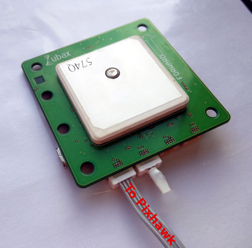
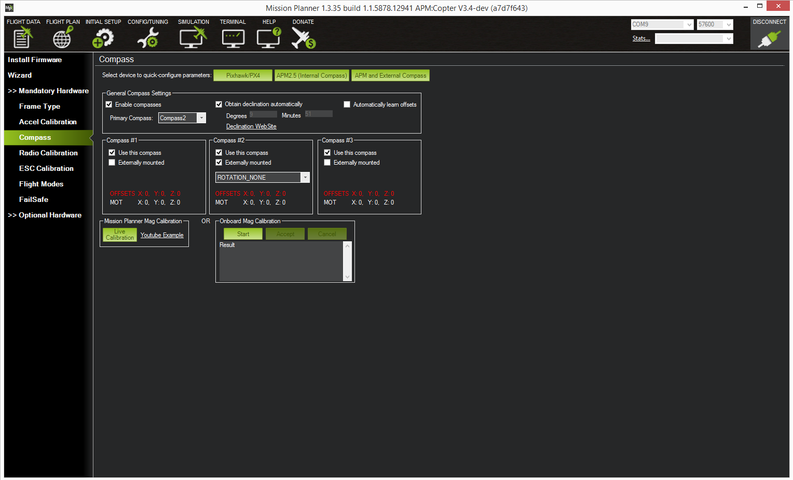

# Using with Pixhawk

This tutorial shows how to connect and use [Zubax GNSS 2](/zubax_gnss_2) with [Pixhawk](http://pixhawk.org)
running APM or the native PX4 firmware.

Zubax GNSS 2 can be set up for use with any other [UAVCAN](http://uavcan.org)-enabled system in a very similar way.

## Required parts

Aside from Zubax GNSS 2 itself and the Pixhawk it will be connected to, the following parts are needed:

* UAVCAN Micro to DF13 adapter cable
* UAVCAN Micro termination plug

The parts listed above can be purchased from [Zubax distributors](http://zubax.com/sales-network).
Alternatively, customers can choose to manufacture the needed cables/plugs on their own in order to suit some
custom needs, in which case they should refer to the relevant documentation for details.

## Configuring Zubax GNSS 2

Zubax GNSS 2 will be able to auto-configure itself upon connection to the vehicle bus.
However, it may be needed to enable some features that are disabled by default, such as barometer.
Please [refer to the doc page to learn how to alter configuration parameters](/zubax_gnss_2#Configuration_parameters).

## Configuring Pixhawk with APM firmware

<info>If you don't know what firmware you're using - you're using APM.</info>

The following chapters assume that [Mission Planner](http://planner.ardupilot.com/) is installed on the user's computer,
and that Pixhawk is otherwise properly configured.

Remember that it may be necessary to restart Pixhawk before the changes take full effect.

Please note that the APM firmware needs to be not older than the specified below version numbers:

* ArduCopter 3.4
* ArduPlane 3.5

### Enabling UAVCAN in APM

Open Mission Planner, navigate to the tab `CONFIG/TUNING`, and set the parameter `BRD_CAN_ENABLE` to `2`.

### GPS

In order to make APM receive measurements from an UAVCAN-interfaced GNSS receiver, set the parameter `GPS_TYPE` to 9.

### Compass

In order to make APM receive measurements from an UAVCAN-interfaced compass, open the tab `INITIAL SETUP`,
then select `Mandatory Hardware` &rarr; `Compass`.
Find the compass that is marked with the check `Externally mounted`, and make sure that it is selected in
the drop-down field `Primary Compass`. See the screenshot below for an example.

You may need to select a different rotation if the arrow printed on Zubax GNSS 2 is not aligned with the
vehicle's longitudinal axis.

Don't forget to perform compass calibration when done.

### Barometer

Set the configuration parameter `GND_PRIMARY` to 1.
Make sure that [the barometer is enabled on Zubax GNSS 2](/zubax_gnss_2#Configuration_parameters).

## Configuring Pixhawk with PX4 firmware

Set the configuration parameter `UAVCAN_ENABLE` to `2` or `3`, then reboot.

Please refer to the [Pixhawk documentation](http://pixhawk.org/firmware/apps/uavcan) for extra info.

## Connecting

Since Zubax GNSS 2 can be powered directly from the bus, the electrical connections are quite simple:

1. Connect Zubax GNSS 2 with Pixhawk using the appropriate cable.
In case you're using a non-redundant CAN interface (which is the only available option for Pixhawk v1),
only CAN1 must be used, leaving CAN2 empty.
2. Terminate the CAN bus using the termination plug.

Now the setup is ready to work.

## Links

* [Zubax GNSS 2 docs](/zubax_gnss_2)
* [Zubax GNSS 2 product page](http://zubax.com/product/zubax-gnss-2)
* [Where to buy parts](http://zubax.com/sales-network)
