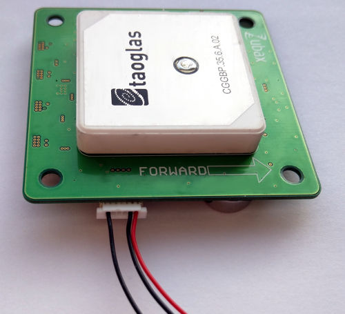
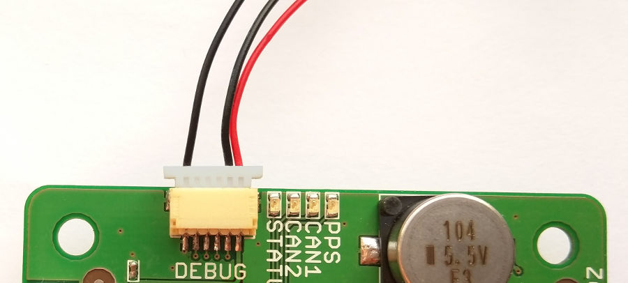
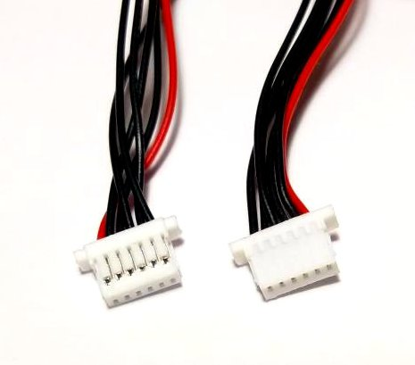
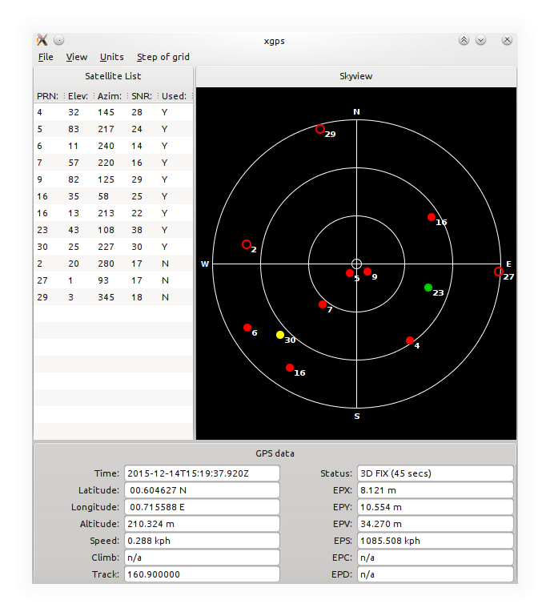

# Using with non-UAVCAN-enabled systems

NMEA output over UART or USB allows to use [Zubax GNSS 2](/zubax_gnss_2) with systems that do not support UAVCAN,
such as older autopilots and computers not equipped with CAN bus interface.

This tutorial covers two topics:

1. How to use standard NMEA output over UART;
2. How to use Zubax GNSS 2 with ROS.

## Connecting via UART





### Parts needed

The only part that will be needed is a cable with JST SH 6-pin connector, also known as
[DCD-M connector](/dronecode_probe#DCD-M_and_DCD-S).
It can be purchased from [our distributors](https://zubax.com/sales-network)
as well as from [other places](https://www.sparkfun.com/products/9123) (it's rather popular).

### Configuring Zubax GNSS 2

NMEA output over UART is disabled by default, so we need to enable it.

[Connect USB, open CLI at 115200 baud](/usb_command_line_interface#How_to_connect), then execute:

```
cfg set nmea.uart_on 1
cfg save
reboot
```

If necessary, also enable the altimeter or [configure other features](/zubax_gnss_2#Configuration_parameters).

### Connecting to the UART port

Connect one end of the cable to Zubax GNSS 2's DroneCode port using the following pinout:

Pin     | Type  | Name          | Comment
--------|-------|---------------|--------------------------------------------------------------------------------------
1       | Power | `+5VDC`       | Power supply (hardware v2.1 and newer). On hardware v2.0 this pin must be left unconnected. More info on power supply can be found in the product specification.
2       | OUT   | `UART_TX`     | NMEA output
3       | N/C   |               |
4       | N/C   |               |
5       | N/C   |               |
6       | GND   | `GND`         | Ground

Connect the other end of the cable to your hardware.

Parameters of UART are provided below:

* Baud rate: 115200
* Byte size: 8
* Parity: None
* Stop bits: 1

### Testing

Now power on Zubax GNSS 2 and your hardware will be able to read NMEA stream from UART.
Sample NMEA output is provided below:

```
$GPRMC,072626.30,A,0036.27144,N,00042.93538,E,1.097,235.8,141215,,*35
$GPGGA,072626.30,0036.27144,N,00042.93538,E,1,14,1.44,239.382,M,13.2,M,,*5E
$GPGSV,4,1,15,08,52,283,17,10,80,126,26,14,27,155,34,15,15,039,08*74
$GPGSV,4,2,15,16,00,216,16,18,49,073,13,21,25,109,22,22,77,181,25*7F
$GPGSV,4,3,15,27,59,219,15,32,03,232,16,01,74,188,27,02,19,214,17*76
$GPGSV,4,4,15,08,47,047,22,23,29,145,21,24,80,177,18*4A
$HCHDG,266.0,,,,*40
$YXXDR,P,0.98966,B*57
$YXXDR,C,29.9,C*7F
$GPRMC,072626.36,A,0036.27143,N,00042.93547,E,1.402,235.8,141215,,*34
$GPGGA,072626.36,0036.27143,N,00042.93547,E,1,15,1.44,239.467,M,13.2,M,,*5A
$GPGSA,A,3,08,10,14,18,21,22,27,01,02,23,24,12,2.24,1.44,1.71*04
$HCHDG,266.2,,,,*42
$YXXDR,P,0.98968,B*59
```

## Connecting via USB

If your system is running Windows version earlier than 10, you will need to
[install the driver first as described on the USB interface documentation page](/usb_command_line_interface#Configuring_older_versions_of_Windows).
All other operating systems, including all distributions of Linux, Mac OS, and Windows versions starting from 10,
will recognize Zubax GNSS 2 automatically.

Once connected, use your software to open the newly appeared virtual serial port.
If your software allows to configure baud rate, select any value within the range 4800 to 57600, inclusive.
If there is no baud rate configuration option (which is typically the case),
your software will do the right thing automatically.

Few examples below will show how to use some popular software with Zubax GNSS 2.

### Using with [gpsd](http://www.catb.org/gpsd/)



gpsd is a daemon for Unix platforms that connects to variety of GNSS hardware.
On Ubuntu gpsd can be installed via APT as follows:

```bash
sudo apt-get install gpsd gpsd-clients
```

Once gpsd is installed, it needs to be configured to listen the correct port.
A simpler way to make gpsd listen the right port is just to restart the daemon with correct arguments:

```bash
killall -INT gpsd
gpsd /dev/ttyACM0
```

On most Linux systems, instead of directly specifying TTY device such as `/dev/ttyACM0`,
it is possible to use persistent symlinks in `/dev/serial/by-id/`.
These symlinks allow to refer directly to the device using its vendor name, product name, and unique ID,
which is more convenient because unlike TTY number these parameters are persistent.
For example, `/dev/ttyACM0` in the example above could be replaced with
`/dev/serial/by-id/usb-Zubax_Robotics_Zubax_GNSS_34FFD305435730343944224300000000-if00`
(unique ID of your Zubax GNSS will be different), or just
`/dev/serial/by-id/usb-Zubax_Robotics_Zubax_GNSS*` to refer to any connected Zubax GNSS regardless of its unique ID.

```bash
$ ls -l /dev/serial/by-id/
total 0
lrwxrwxrwx 1 root root 13 Dec 14 15:50 usb-Zubax_Robotics_Zubax_GNSS_34FFD305435730343944224300000000-if00 -> ../../ttyACM0
```

When gpsd is up and running, you can check its configuration with commands like `gpsmon` and `xgps`.

```
$ gpsmon
┌──────────────────────────────────────────────────────────────────────────────┐
│Time: 2015-12-14T14:47:41.870Z Lat:  00 36' 15.522" N Lon:  00 42' 56.250" E  │
└───────────────────────────────── Cooked PVT ─────────────────────────────────┘
┌──────────────────────────────────────────────────────────────────────────────┐
│ GPGSA HCHDG GPRMC GPGGA GPGSV                                                │
└───────────────────────────────── Sentences ──────────────────────────────────┘
┌──────────────────┐┌────────────────────────────┐┌────────────────────────────┐
│Ch PRN  Az El S/N ││Time:      144741.87        ││Time:      144741.87        │
│ 0   2 294 24  16 ││Latitude:    0036.25871 N   ││Latitude:  0036.25871       │
│ 1   3 153 10  23 ││Longitude:  00042.93750 E   ││Longitude: 00042.93750      │
│ 2   7 216 42  27 ││Speed:     0.324            ││Altitude:  264.388          │
│ 3   9 267 82  33 ││Course:    272.7            ││Quality:   1   Sats: 07     │
│ 4  16  75 38  19 ││Status:    A       FAA:     ││HDOP:      1.29             │
│ 5  23 102 57  22 ││MagVar:                     ││Geoid:     13.2             │
│ 6  26  45 25  13 │└─────────── RMC ────────────┘└─────────── GGA ────────────┘
│ 7  30 222 11  22 │┌────────────────────────────┐┌────────────────────────────┐
│ 8   4 136 49  27 ││Mode: A 3                   ││UTC:           RMS:         │
│ 9  14  66 69  18 ││Sats: 3 7 9 16 23 26 30 4   ││MAJ:           MIN:         │
│10  14  66 69  19 ││DOP: H=1.29  V=1.37  P=1.88 ││ORI:           LAT:         │
│11                │└─────────── GSA ────────────┘│LON:           ALT:         │
└────── GSV ───────┘                              └─────────── GST ────────────┘
```

### Using with [Robotic Operating System (ROS)](http://ros.org)

ROS provides a number of packages that can be used to convert NMEA input to ROS-standard GNSS topics.
Some of them are reviewed below.

#### [`nmea_navsat_driver`](http://wiki.ros.org/nmea_navsat_driver)

Install the package. For example, on Ubuntu the package can be installed as follows (assuming ROS Indigo):

```bash
sudo apt-get install ros-indigo-nmea-navsat-driver
```

Then start the node:

```bash
roscore &
rosrun nmea_navsat_driver nmea_serial_driver _port:=/dev/serial/by-id/usb-Zubax_Robotics_Zubax_GNSS_34FFD305435730343944224300000000-if00
```

The long path can also be replaced with just TTY name, e.g. `/dev/ttyACM0`.
Having started the node, open a second terminal and you'll see the data:

```yaml
$ rostopic echo /fix
header:
  seq: 14
  stamp:
    secs: 1450103910
    nsecs: 61619043
  frame_id: /gps
status:
  status: 0
  service: 1
latitude: 00.6046158333
longitude: 00.7155701667
altitude: 228.17
position_covariance: [1.2544000000000002, 0.0, 0.0, 0.0, 1.2544000000000002, 0.0, 0.0, 0.0, 5.017600000000001]
position_covariance_type: 1
---
```

#### [`gpsd_client`](http://wiki.ros.org/gpsd_client)

This package requires that the system has running [gpsd](http://www.catb.org/gpsd/) installation.
[Refer to the instructions above to see how to configure gpsd](#Using_with_gpsd).

Having gpsd configured and running, install the ROS package and try it:

```
$ roscore &
$ rosrun gpsd_client gpsd_client &
$ rostopic echo /fix
header:
  seq: 205
  stamp:
    secs: 1450104688
    nsecs: 839999914
  frame_id: ''
status:
  status: 0
  service: 1
latitude: 00.604582
longitude: 00.715618833
altitude: 231.312
position_covariance: [8.121, 0.0, 0.0, 0.0, 10.554, 0.0, 0.0, 0.0, 43.7]
position_covariance_type: 2
---
...
```
