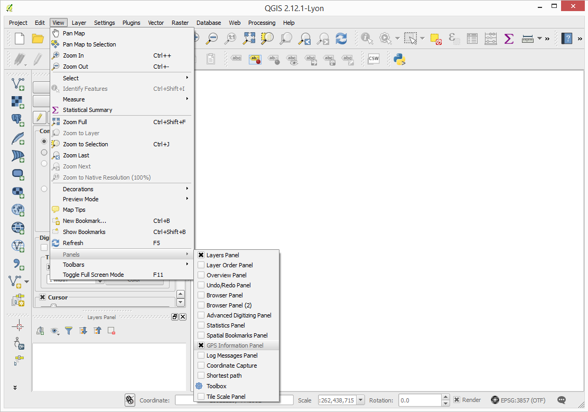
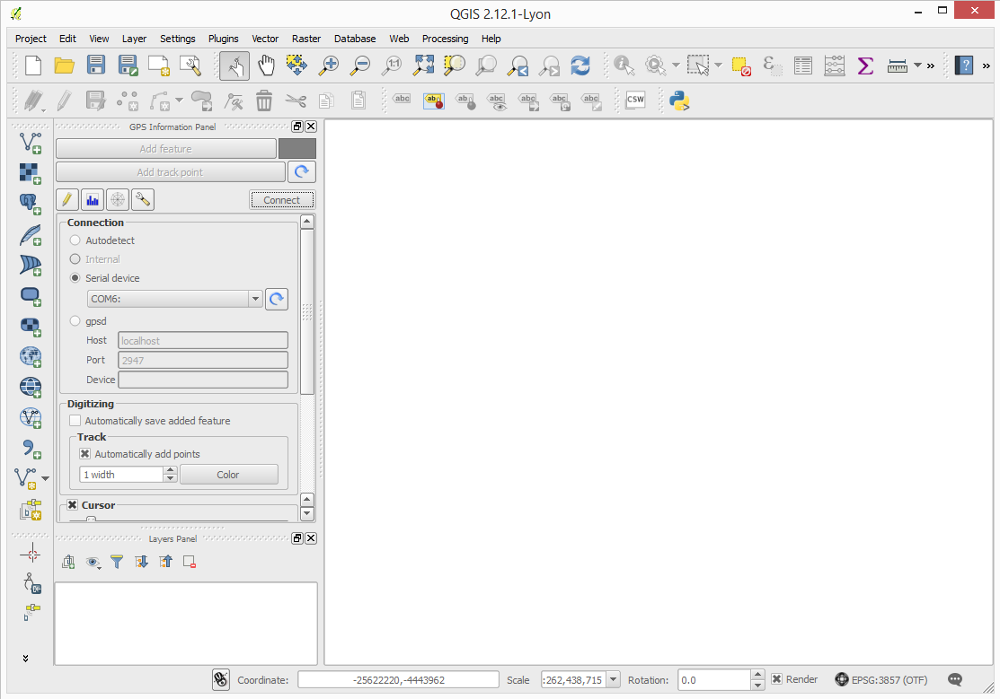
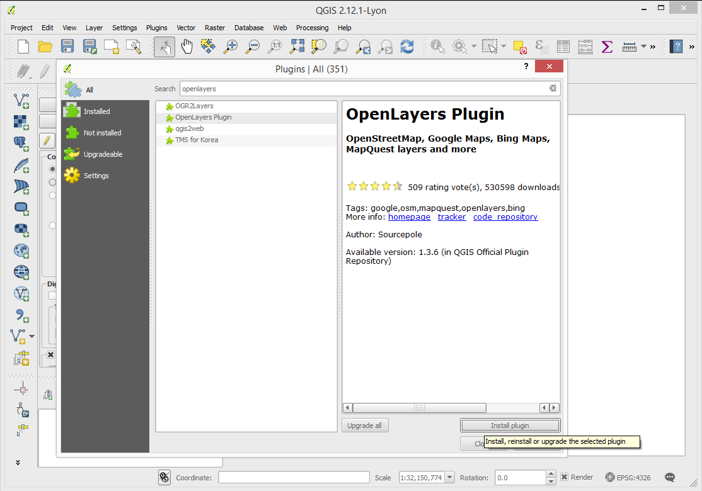
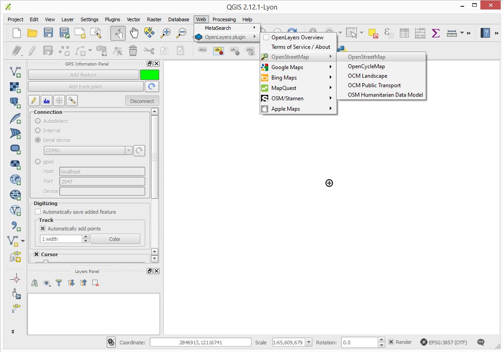
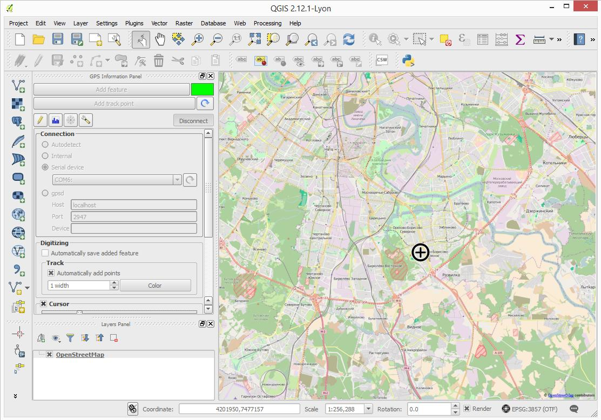

# Using with GIS and navigation software

Since Zubax GNSS 2 supports standard NMEA protocol,
it can be used with virtually any software designed to work with GNSS receivers.
This tutorial shows how to use Zubax GNSS 2 with GIS software using QGIS as an example.
QGIS is a free and open source cross-platform geographic information system that works on Windows, Linux, and Mac.
Explanations provided in this tutorial are also applicable to other software products.

## Installing QGIS

QGIS installation files for Windows, Mac, and Linux can be freely downloaded from
<http://www.qgis.org/en/site/forusers/download.html>.

On some Linux distributions it is also possible to install it from software repository,
e.g. on Ubuntu: `sudo apt-get install qgis`.

Once QGIS is installed, launch it, and connect Zubax GNSS 2 to the computer via USB.
Note that if you're running Windows version older than 10, you will likely need to install the driver -
please refer to the [USB interface documentation page for details](/usb_command_line_interface).

## Configuring QGIS

In order to make QGIS receive measurements from your Zubax GNSS 2 in real time,
enable the GNSS information panel by clicking `View` &rarr; `Panels` &rarr; `GPS Information Panel`.

A panel will appear like shown on the screenshot below.
On the panel:

* Select `Serial device`
* Select the right serial port number in the dropdown list.
* Press `Connect`.

Now the software is connected and receiving measurements from Zubax GNSS 2.
The current position will be indicated with a cross.
However, right now it's not of much use, so in the steps below we'll add a map.

Click `Plugins` &rarr; `Manage and Install Plugins...`. A window like shown below will appear.
In the window, find the plugin `OpenLayers Plugin` using the search bar, select it, and press `Install plugin`.

Having installed the plugin, click `Web` &rarr; `OpenLayers plugin` &rarr; `OpenStreetMap` &rarr; `OpenStreetMap`.

The result is shown on the screenshot below.

