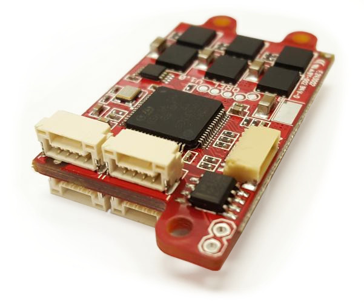
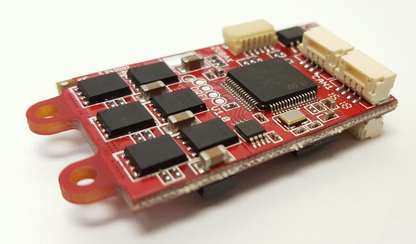
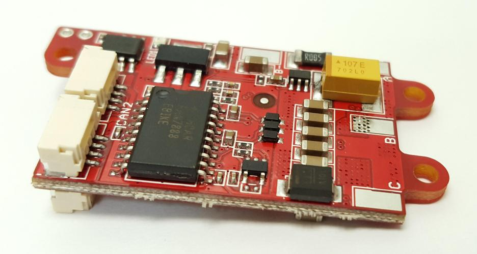
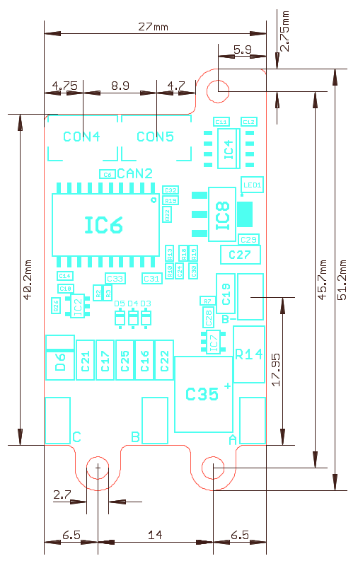

# Zubax Orel 20

Zubax Orel 20 is an advanced ESC (BLDC motor controller) with doubly redundant CAN bus interface, designed for
unmanned aerial vehicles.
Zubax Orel 20 runs [PX4 Sapog - an advanced open source multiplatform BLDC motor controller firmware](/sapog).
Power capability: 9~18 V, 20 A.

This page contains only information that is relevant to the hardware.
Information about the firmware and its usage is provided in the section dedicated to [Sapog](/sapog).

## Characteristics

### Mechanical

The drawing below documents the basic mechanical characteristics of Zubax Orel 20,
such as the placement of connectors and mounting holes (click to enlarge):

Both connectors of the primary CAN interface are located on the top side of the board.
They are explicitly marked as `CAN1` on the PCB silkscreen.
Connectors of the secondary CAN interface are located on the bottom side of the board,
and marked as `CAN2`.
For reference, the red (positive) power supply wire is connected to the top side of the board.

### General

#### Environment

Parameter               | Minimum       | Maximum       | Units         | Note
------------------------|---------------|---------------|---------------|-----------------------
Board temperature       | -40           | 105           | &deg;C        |
Relative humidity       | 0             | 100           | %RH           | Non-condensing

#### Power

Parameter       | Minimum       | Typical       | Maximum       | Units | Note
----------------|---------------|---------------|---------------|-------|----------------------------------------------
Supply voltage  | 9             | 14.8          | 18.3          | V     | Suitable Lithium-ion battery packs: LiCoO2: 3S ~ 4S; LiFePO4: 4S ~ 5S
Average motor current   |       |               | 20            | A     | See temperature limits
Peak phase current      |       |               | 100           | A     | See temperature limits
Power stage thermal resistance || 50            |               | K/W   | Junction to air

#### CAN bus

Parameter                               | Minimum       | Typical       | Maximum       | Units
----------------------------------------|---------------|---------------|---------------|-------
Bit rate (manually configurable)        | 20            | 1000          | 1000          | Kbps
Bit rate (autodetect)                   |        | 1000 500 250 125 |       | Kbps
Positive-going input threshold voltage  |               | 750           | 900           | mV
Negative-going input threshold voltage  | 500           | 650           |               | mV
Differential output voltage, dominant   | 1.5           | 2.0           | 3.0           | V
Differential output voltage, recessive  | -120          | 0             | 12            | mV

#### UART

Parameter                               | Minimum       | Typical       | Maximum       | Units
----------------------------------------|---------------|---------------|---------------|-------
Low-level input voltage                 | -0.3          | 0             | 1.6           | V
High-level input voltage                | 2.1           | 3.3           | 5.5           | V
Low-level output voltage                | 0             | 0             | 0.5           | V
High-level output voltage               | 2.8           | 3.3           | 3.4           | V
Source/sink current                     |               |               | 10            | mA

#### RCPWM input

Parameter                               | Minimum       | Typical       | Maximum       | Units
----------------------------------------|---------------|---------------|---------------|-------
Low-level input voltage                 | -0.3          | 0             | 1.6           | V
High-level input voltage                | 2.1           | 3.3           | 5.5           | V

## Interfaces

### Power

Power supply is available via two wires with 3.5 mm bullet male connectors.

Motor is connected via three wires with 3.5 mm bullet female connectors.

### UAVCAN

Zubax Orel 20 has two CAN bus interfaces available via the standard UAVCAN Micro Connectors,
two connectors per interface in parallel.

The device does not use the 5V supply from the UAVCAN bus.

<warning>
CAN2 (secondary CAN bus interface) can only be used in configurations with redundant CAN bus.
If the bus is not redundant, only CAN1 (primary CAN bus interface) can be used.
</warning>

### DroneCode Debug Port

Zubax Orel 20 provides the standard [DCD-M debug port](/dronecode_probe).
The UART RX pin of the port is shared with the RCPWM input.

### RCPWM

RCPWM input is available via the DroneCode Debug Port connector on the pin `UART_RX` (number 3).

Since by default RCPWM is disabled, UART can be used freely without interference with the RCPWM interface.
If RCPWM is enabled, UART should be used in read-only mode.

## Accessories

Zubax Orel 20 can be used with the following accesories:

* [UAVCAN Micro Patch Cable](/uavcan#UAVCAN_Micro_Patch_Cable)
* [UAVCAN Micro to DF13 Adapter Cable](/uavcan#UAVCAN_Micro_to_DF13_Adapter_Cable)
* [UAVCAN Micro Termination Plug](/uavcan#UAVCAN_Micro_Termination_Plug)

**The acessories can be purchased from [our distributors](https://zubax.com/sales-network).**

## Links

* [Purchase](http://shop.titaneliteinc.com/index.php?route=product/product&product_id=995)
* [Product description](http://zubax.com/product/zubax-orel-20)
* [Sapog documentation](/sapog)
