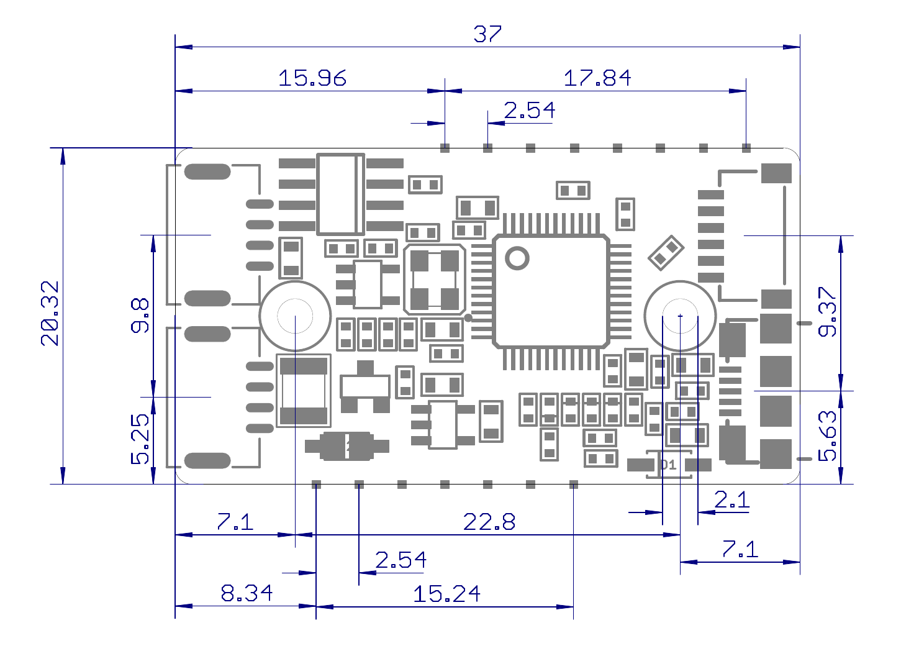
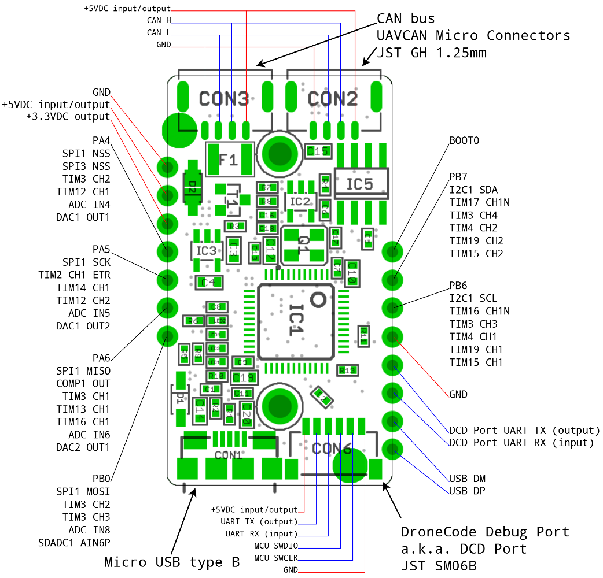
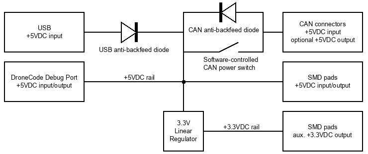
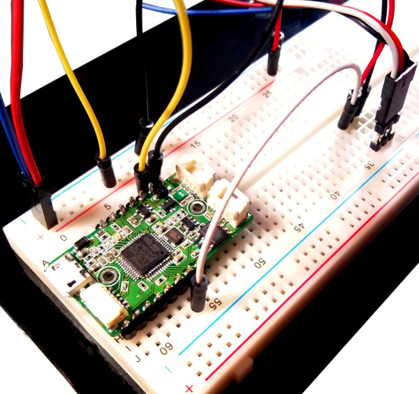

# Zubax Babel


Zubax Babel is an advanced USB-CAN and UART-CAN adapter that can be used as a standalone device
or as an embeddable module for <abbr title="Original Equipment Manufacturers">OEM</abbr>.
It features a software-controlled termination resistor, embedded bus power supply
and bus voltage monitoring.
Zubax Babel uses the quasi-standard SLCAN (aka LAWICEL) protocol (with Zubax extensions)
for transferring CAN data over serial port.

The adapter has a number of important features that are rarely seen in competing designs:

* Low latency - cumulative latency between the USB CDC ACM interface on the host system and
the CAN bus is under 1 millisecond.
Tested with USB connection on desktop Linux 3.13 using low-latency SLCAN driver from
[PyUAVCAN](http://uavcan.org/Implementations/Pyuavcan).
* High throughput - the device handles over 5000 frames per second in either direction continuously.
Tested with USB connection on desktop Linux 3.13.
When using UART interface, the throughput of the device is limited by the UART baud rate.
* Proper prioritization of outgoing CAN frames.
The adapter properly schedules the outgoing frames, avoiding the inner priority inversion in the TX queue.
* Large RX buffer (255 CAN frames plus 2KB of serial buffers) allows the device to handle short-term traffic bursts
without frame losses, even when interfaced with a low-speed UART.

Zubax Babel is primarily intended for UAVCAN applications, although other CAN bus protocols are supported equally well.
We recommend the [UAVCAN GUI Tool](http://uavcan.org/GUI_Tool) for use with Zubax Babel; however,
there is a wide selection of software products that can talk with SLCAN adapters
and therefore are compatible with Zubax Babel too.

## Characteristics

### Mechanical

The drawing below documents the basic mechanical characteristics of Zubax Babel,
such as the placement of connectors and mounting holes (click to enlarge):



Pinout is shown on the diagram (click to enlarge):



### General

#### Environment

Parameter               | Minimum       | Maximum       | Units         | Note
------------------------|---------------|---------------|---------------|-----------------------
Board temperature       | -40           | 85            | &deg;C        |
Relative humidity       | 0             | 100           | %RH           | Non-condensing

#### Power

Parameter                       | Minimum       | Typical       | Maximum       | Units | Note
--------------------------------|---------------|---------------|---------------|-------|------------------------------
Supply voltage                  | 4.0           | 5.0           | 5.5           | V     | Any power input
Supply current                  | 30            | 50            | 80            | mA    | SMD pads floating, UART and SWD lines floating
3.3 V rail output voltage       | 3.2           | 3.3           | 3.4           | V     |
3.3 V rail external load        |               |               | 100           | mA    |

#### CAN bus

Parameter                               | Minimum       | Typical       | Maximum       | Units
----------------------------------------|---------------|---------------|---------------|-------
Bit rate (manually configurable)        | 20            | 1000          | 1000          | Kbps
Bit rate (autodetect)                   |        | 1000<br/>500<br/>250<br/>125 |       | Kbps
Positive-going input threshold voltage  |               | 750           | 900           | mV
Negative-going input threshold voltage  | 500           | 650           |               | mV
Differential output voltage, dominant   | 1.5           | 2.0           | 3.0           | V
Differential output voltage, recessive  | -120          | 0             | 12            | mV

#### UART

Parameter                               | Minimum       | Typical       | Maximum       | Units
----------------------------------------|---------------|---------------|---------------|-------
Supported baud rates                    | 2400          | 115200        | 3000000       | baud/s
Low-level input voltage                 | -0.3          | 0             | 1.6           | V
High-level input voltage                | 2.1           | 3.3           | 5.5           | V
Low-level output voltage                | 0             | 0             | 0.5           | V
High-level output voltage               | 2.8           | 3.3           | 3.4           | V
Source/sink current (magnitude)         |               |               | 10            | mA

#### SMD signal pads

Parameter                               | Minimum       | Typical       | Maximum       | Units
----------------------------------------|---------------|---------------|---------------|-------
Low-level input voltage                 | -0.3          | 0             | 1.6           | V
High-level input voltage                | 2.1           | 3.3           | 5.5           | V
Low-level output voltage                | 0             | 0             | 0.5           | V
High-level output voltage               | 2.8           | 3.3           | 3.4           | V
Source/sink current (magnitude)         |               |               | 10            | mA

## Power supply

The device is powered by 5VDC which can be delivered via any (or multiple) of the interface connectors:

* USB connector (input only)
* CAN connectors (input, optional output)
* DroneCode Debug Port connector (input and output)
* SMD pads (input and output)

The device has a reverse current protection on the USB power input,
to prevent back-powering the USB host when it is turned off.
The CAN power output has a key that can be enabled and disabled programmatically
(more on this in the later sections); however, the device can be powered from the CAN
bus regardless of the state of the power key.
Additional 3.3VDC output on the SMD pads can be used to power the external circuit when the device is used in OEM mode.
See the following diagram:



## LED indicators

Color   | Indicates
--------|--------------------------------------------------------------------------------------------------------------
Red     | CAN power switch is turned ON.
Orange  | 120&#8486; CAN terminator is turned ON.
Blue    | Status, see below.
Green   | Blinks once if there was at least one CAN frame sent or received in the last 25 milliseconds. This allows to visually evaluate the load of the CAN bus.

The status LED behaves as follows:

Status                                          | Pattern
------------------------------------------------|----------------------------------------------------------------------
Bootloader is running                           | Glowing continuously
CAN channel is closed                           | Turned OFF
CAN channel is open and operating normally      | Blinking 1 Hz (slowly), short pulses (50 ms)
CAN channel is open, CAN error passive          | Blinking 4 Hz (quickly)
CAN channel is open, CAN bus off                | Blinking 10 Hz (frantically)

While the bootloader is running, the green LED is used to indicate the bootloader's status as follows:

Status                                                  | Pattern
--------------------------------------------------------|--------------------------------------------------------------
Ready to boot, or waiting for boot delay expiration     | Turned OFF
Boot cancelled by external request (e.g. CLI command)   | Blinking 1 Hz, short pulses (50 ms)
Application upgrade is in progress                      | Blinking 1 Hz, long pulses (500 ms)
No valid application found, boot is not possible        | Blinking 10 Hz (frantically)

## Interfaces

### USB

Zubax Babel exposes a USB CDC ACM interface (a.k.a. virtual serial port) via full-speed USB 2.0 port.
For more information about the serial port and drivers, please refer to the
[dedicated article](/usb_command_line_interface).

The device implements the SLCAN protocol with custom extensions on top of the CDC ACM interface,
which is documented in the later sections.

Note that while USB is connected, the UART interface of the DroneCode Debug Port is not available.
In order to use UART, USB must be disconnected.

### DroneCode Debug Port

The DroneCode Debug Port exposes the standard ARM SWD interface and a UART port.
The UART port exposes a <abbr title="Command Line Interface">CLI</abbr>.
Same SLCAN protocol operates on top of the UART CLI as on the USB CLI.

Note that while USB is connected, the UART interface of the DroneCode Debug Port is not available.
In order to use UART, USB must be disconnected.

### CAN bus

Zubax Babel implements [ISO 11898](http://www.can-cia.org/index.php?id=systemdesign-can-physicallayer#high),
also known as high-speed CAN.

The CAN bus interface is exposed via two parallel 4-pin JST GH connectors.
These are the [standard UAVCAN Micro Connectors](http://uavcan.org/Specification/8._Hardware_design_recommendations).

The device has an embedded 120&#8486; termination resistor that can be enabled and disabled via the SLCAN interface.

A power key, when turned on, delivers the 5VDC supply to the CAN bus, which can be used to power other CAN bus nodes
from Zubax Babel (see the power system diagram).

### SMD pads



SMD pads address two use cases:

* Use of Zubax Babel in larger devices as a PCB component.
* Use of Zubax Babel as a prototyping platform or as a UAVCAN development board.
The SMD pads are placed with the standard 2.54mm pitch, which facilitates installation into breadboards.

More information is provided in the OEM section below.

## SLCAN protocol

SLCAN (also known as LAWICEL) is a quasi-standard protocol designed for tunneling CAN data
(frames, commands and adapter status information) via serial links
(UART or <abbr title="Also known as Virtual Serial Port">USB CDC ACM</abbr>).
Zubax Babel implements all mandatory SLCAN commands, so that its compatibility with third party
software products that rely on SLCAN is ensured.
A brief recap of standard SLCAN commands, prepared by Oliver Hartkopp, can be found in this document:
[`Generic_SLCAN_API.pdf`](Generic_SLCAN_API.pdf).

SLCAN is an ASCII protocol, where the data is exchanged in blocks, each block may contain only printable
ASCII characters and is terminated with either ACK (`\r`, ASCII code 13) or NACK (`\a`, ASCII code 7).
Every block begins with a well-defined character which indicates what information the block is carrying;
in this description we're going to refer to this character as Block ID.
Three types of blocks are defined:

* Command - these blocks are sent from the host to the adapter.
* Response - these blocks are sent from the adapter to the host as a reaction to the corresponding command.
Any command always results in exactly one response.
* Indication - these blocks are generated by the adapter itself asynchronously.

All commands and indications are always terminated with ACK (`\r`).
A response will be terminated with ACK if the command was executed successfully,
and with NACK if the command failed or if the command ID could not be mapped to any known command handler.

Zubax Babel also implements an extension on top of SLCAN that allows the host to execute arbitrary
<abbr title="Command Line Interface">CLI</abbr> commands, sharing the same serial port with SLCAN.
This feature is documented later in this section.

Note that some commands alter the configuration parameters of the adapter.
All parameters can be stored into the non-volatile memory on the adapter,
in which case they will be re-initialized to the saved values autimatically every time the adapter is turned on.
The non-volatile memory feature is explained later in this section.

### SLCAN commands

#### CAN controller configuration

Block ID| Arguments             | Purpose
--------|-----------------------|--------------------------------------------------------------------------------------
`S`     | Decimal number, see below | Set CAN bitrate.
`O`     | None                  | Open CAN channel at the specified bitrate in normal mode; re-open if already open.
`L`     | None                  | Open CAN channel at the specified bitrate in silent mode (listen only); re-open if already open.
`l`     | None                  | Open CAN channel at the specified bitrate in normal mode with loopback enabled; re-open if already open.
`C`     | None                  | Close CAN channel; do nothing if channel is not open.
`M`     | Any, not checked      | This command is not applicable for Zubax Babel, it is implemented only for compatibility reasons.
`m`     | Any, not checked      | See `M`

All commands return `\r` on success and `\a` on failure.
Commands that are implemented for compatibility always report success.

The command `S` accepts a non-negative decimal number which represents the desired CAN bitrate.
If the channel is open, changes in bitrate will not take effect until it's re-open again.
The values are interpreted as follows:

Value           | Interpretation, bits per second
----------------|------------------------------------------------------------------------------------------------------
0               | 10000
1               | 20000
2               | 50000
3               | 100000
4               | 125000
5               | 250000
6               | 500000
7               | 800000
8               | 1000000
Any other       | The number is interpreted as-is, no additional conversion is performed.

When the channel is open with loopback enabled, all transmitted frames will be sent back to
the host, with the loopback flag set (if SLCAN flags are enabled).
See more on this in the section dedicated to SLCAN indications.

#### CAN frame transmission

In the command table, arguments are indicated as defined in the table below.
Valid hexadecimal characters are the following: `0123456789``abcdef``ABCDEF`.

Symbol  | Meaning
--------|--------------------------------------------------------------------------------------------------------------
`i`     | Hexadecimal digit of a CAN ID
`d`     | Hexadecimal <abbr title="Data Length Code">DLC</abbr> value
`*`     | Useful data, encoded as a hexadecimal string, e.g. `0110FF` for the following sequence: 1, 16, 255.

Block ID| Arguments     | Purpose                       | Example
--------|---------------|-------------------------------|--------------------------------------------------------------
`T`     | `iiiiiiiid*`  | Transmit 29-bit data frame    | `T0123456780102030405060708`
`t`     | `iiid*`       | Transmit 11-bit data frame    | `t7FF0`
`R`     | `iiiiiiiid`   | Transmit 29-bit RTR frame     | `R1234f00d8` (RTR frames have no payload)
`r`     | `iiid`        | Transmit 11-bit RTR frame     | `r0008` (RTR frames have no payload)

All above listed commands may generate the following responses:

Response| Meaning
--------|--------------------------------------------------------------------------------------------------------------
`Z\r`   | The frame has been successfully scheduled for transmission (for 29-bit ID)
`z\r`   | The frame has been successfully scheduled for transmission (for 11-bit ID)
`\a`    | The adapter could not transmit the frame (e.g. malformed frame, CAN channel is not open, etc.)

#### Miscellaneous commands

Block ID| Arguments     | Purpose
--------|---------------|----------------------------------------------------------------------------------------------
`U`     | Decimal number, see below | Set UART baud rate
`Z`     | `0` or `1`    | Enable (if 1) or disable (if 0) RX and loopback timestamping
`F`     | None          | Get and clear status flags
`V`     | None          | Get hardware and software version
`N`     | None          | Get unique ID (conventional SLCAN adapters return the serial number, which Zubax products may not have)

The command `U` accepts a non-negative decimal number which represents the desired UART bitrate.
Changes will take effect shortly after the command was executed (typically within 100 milliseconds),
no reboot is necessary.
The number is interpreted as follows:

Value           | Interpretation, baud per second
----------------|------------------------------------------------------------------------------------------------------
0               | 230400
1               | 115200
2               | 57600
3               | 38400
4               | 19200
5               | 9600
6               | 2400
Any other       | The number is interpreted as-is, no additional conversion is performed.

The following baud rates are supported:
2400, 9600, 19200, 38400, 57600, 115200 (this is the default), 230400, 460800, 921600, 1000000, 3000000.
Other baud rates may also work too.

The command `Z` can be used to enable and disable timestamping.
Changes will take effect shortly after the command was executed (typically within 100 milliseconds),
no reboot is necessary.
More on timestamping is in the following sections.

The command `F` produces `F??\r`, where `??` is a hexadecimal bitmask,
where the bits are assigned the following meanings:

Bit     |2<sup>Bit</sup>| Name          | Meaning
--------|---------------|---------------|----------------------------------------------------------------------------------------------
3       | 8             | RX Overrun    | The RX queue has overflowed at least once since the last invocation of the `F` command or since the channel was open.
5       | 32            | Error Passive | The CAN error counters have exceeded the error passive limit (refer to the CAN bus specification for details).
7       | 128           | Bus Off       | The CAN controller is in the bus off mode (refer to the CAN bus specification for details).

Other bits should be ignored.

The command `V` produces `V????\r`, where the fields are hexadecimal numbers with the following meanings, in that order:

* Hardware version, major.
* Hardware version, minor.
* Software version, major.
* Software version, minor.

The command `N` produces `N????????????????????????????????\r`,
where the sequence of `?` represents a 128-bit hexadecimal number that is the globally unique ID of the device.

### SLCAN notifications

Zubax Babel may generate SLCAN notifications only in the following cases:

1. A CAN frame is received.
2. If loopback is enabled: a CAN frame is successfully transmitted.

The format of notifications is the same as for [CAN transmission commands](#CAN_frame_transmission):

Block ID| Payload       | Purpose
--------|---------------|-------------------------------
`T`     | `iiiiiiiid*`  | Received or successfully transmitted a 29-bit data frame
`t`     | `iiid*`       | Same, 11-bit data frame
`R`     | `iiiiiiiid`   | Same, 29-bit RTR frame
`r`     | `iiid`        | Same, 11-bit RTR frame

Additionally, frame notification blocks may be extended with timestamp information and/or with flags,
depending on the configuration.

When timestamping is enabled, frame notification blocks will be extended with four more hexadecimal characters,
containing the time, in milliseconds, when they were received.
The millisecond timestamp overflows every 60000 milliseconds (once a minute),
so the valid values lie in the range from 0 to 59999, inclusive.
In loopback mode with timestamping enabled,
the loopback frames will have the timestamp of the moment when they were delivered to the bus.

When SLCAN flags are enabled, frame indications will be amended as follows:

* Loopback frames will be appended the character `L` at the end of the block.
This option allows the host to distinguish between received frames and the frames that were received from the bus.

For example, a frame `T12345678401234568` will be returned back as follows, depending on the configuration:

Flags enabled   | Timestamping enabled  | Representation
----------------|-----------------------|------------------------------------------------------------------------------
No              | No                    | `T12345678401234568` (no changes)
No              | Yes                   | `T123456784012345680BED` (timestamp 3053 milliseconds)
Yes             | No                    | `T12345678401234568L` (added flag `L`)
Yes             | Yes                   | `T123456784012345680BEDL` (both of the above)

### CLI extensions

Zubax Babel implements an extension of the SLCAN protocol that allows it to run a conventional CLI shell
over the same serial port that is used for SLCAN communications, while maintaining full compatibility with SLCAN.

A CLI command is a sequence of printable ASCII characters terminated with `\r\n` (ASCII codes 13, 10).
Every CLI command returns a response, which may be empty. Response begins with the exact copy of the received command,
terminated with `\r\n`, then followed by an arbitrary number of lines, each terminated with `\r\n`,
and finalized with the ASCII ENF-OF-TEXT character (code 3) immediately followed by the final `\r\n`.

For example, a command `cfg   list` (the excessive spaces were added for demonstrational purposes)
may produce the following response (non-printable characters are shown with escape sequences, e.g. `\r`):

```
cfg   list\r\n
can.bitrate           = 1000000     [10000, 1000000] (1000000)\r\n
can.power_on          = 0           [0, 1] (0)\r\n
can.terminator_on     = 0           [0, 1] (0)\r\n
slcan.timestamping_on = 1           [0, 1] (1)\r\n
slcan.flags_on        = 0           [0, 1] (0)\r\n
uart.baudrate         = 115200      [2400, 3000000] (115200)\r\n
\x03\r\n
```

Where `\x03` is the ASCII END-OF-TEXT character.

The fact that CLI commands and their responses are terminated with `\r\n` rather than plain `\r`
can be used to distinguish SLCAN data from CLI data in real time.
A compliant SLCAN driver that is capable of dealing with CLI extensions at virtually zero performance penalty can
be found in the [PyUAVCAN library](http://uavcan.org/Implementations/Pyuavcan).

CLI commands can be executed manually if the SLCAN port is open in a terminal emulator program
(it is recommended to enable local echo, since SLCAN does not provide remote echo).
Read this article for reference: [USB command line interface](/usb_command_line_interface).

#### CLI commands

This section documents what CLI commands are implemented.

##### `cfg`

This command allows to manage the configuration parameters.
Execute without arguments to see usage info.
More detailed description of configuration parameters is provided in a dedicated section.
The following use cases are the most important:

* `cfg list` - list all configuration params, one per line, each line is formatted as follows:
`name = value [min, max] (default)`.
Floating point parameters are rendered with explicit decimal separator, e.g. `1.0` rather than `1`.

* `cfg set <name> <value>` - assign the parameter a new value.
The response may contain `Error:` followed by the description of the error in case of failure.

* `cfg save` - save the current configuration into the non-volatile memory.

* `cfg erase` - remove the stored configuration from the non-volatile memory.
Next restart will reset all parameters to defaults.

##### `zubax_id`

When executed without arguments, returns the device identification information
formatted as YAML dictionary, such as name, version, unique ID, and so on.
Example output:

```
product_id   : 'com.zubax.babel'
product_name : 'Zubax Babel'
sw_version   : '1.0'
sw_vcs_commit: 48923790
sw_build_date: Jun 20 2016
hw_version   : '1.0'
hw_unique_id : 'OAAyAA1XMkEzNjkgAAAAAA=='
hw_info_url  : http://device.zubax.com/device_info?uid=380032000D5732413336392000000000
hw_signature : 'SknsmA7XugU9pF/+NNOoU26Gdq9VvhO3O1Cw2qim17RXsU8yOISoKOdMIh4QIHtXr36sMfxH397RlSNc0TtWDPOyA713z0k+v+ZY5PGXkRFiUfspnU/EJ8+r0url2dYp7NApx4lOklOgNgHrGCA6lPxA8UqoW9jdqaASuqpFZKg='
```

This command may also accept one argument, which must be the Base64 encoded RSA-1024 Certificate of Authenticity
of the device.
This use case does not serve any useful purpose during normal use of the device.

##### `stat`

Returns a YAML dictionary containing the immediate state information of the adapter.
Example output:

```
open                  : true
state                 : error_active
receive_error_counter : 0
transmit_error_counter: 0
errors                : 0
bus_off_events        : 0
sw_rx_queue_overruns  : 0
hw_rx_queue_overruns  : 0
frames_tx             : 0
frames_rx             : 0
tx_queue_capacity     : 100
tx_queue_peak_usage   : 0
rx_queue_capacity     : 255
rx_queue_peak_usage   : 0
tx_mailbox_peak_usage : 0
bus_voltage           : 4.8
```

##### `bootloader`

Reboots the device into the bootloader, where it will wait forever for commands.
What bootloader is needed for and how to use it is documented in the dedicated section below.

##### `reboot`

Reboots the device.

## Configuration parameters

Configuration parameters can be stored in the non-volatile memory on the adapter.
Stored parameters will be re-initialized to the saved values autimatically every time the adapter is turned on.

Changes in adapter configuration take effect shortly after the corresponding command changing them is executed,
typically within 100 milliseconds, unless stated otherwise elsewhere.

Some configuration parameters are aliased via dedicated standard SLCAN commands.

Name                    | SLCAN alias   | Default value | Purpose
------------------------|---------------|---------------|--------------------------------------------------------------
`can.bitrate`           | `S`           |               | CAN bitrate.
`can.power_on`          |               | 0             | Open the CAN power switch (see the power supply diagram).
`can.terminator_on`     |               | 0             | Enable the 120&#8486; termination resistor.
`slcan.timestamping_on` | `Z`           | 1             | Provide timestamp information for CAN frame indications.
`slcan.flags_on`        |               | 0             | Append flags to CAN frame indications (this is a non-standard SLCAN extension).
`uart.baudrate`         | `U`           | 115200        | UART baud rate.

## <abbr title="Original Equipment Manufacturer">OEM</abbr> mode

## Bootloader

## Accessories


Zubax Orel 20 can be used with the following accesories:

* [UAVCAN Micro Patch Cable](/uavcan#UAVCAN_Micro_Patch_Cable)
* [UAVCAN Micro to DF13 Adapter Cable](/uavcan#UAVCAN_Micro_to_DF13_Adapter_Cable)
* [UAVCAN Micro to D-SUB DB9F CAN Adapter Cable](#UAVCAN_Micro_to_D-SUB_DB9F_CAN_Adapter_Cable)

**The acessories can be purchased from [our distributors](https://zubax.com/sales-network).**

## Links

* [Purchase](https://zubax.com/sales-network)
* [Product description](http://zubax.com/product/zubax-babel)
