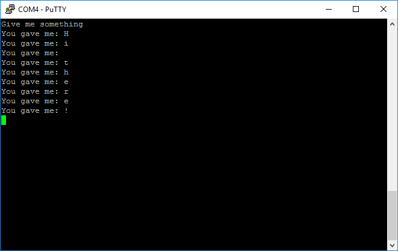

# Developing custom applications #
Zubax Babel is a miniature USB-CAN adapter.  But beside its direct purpose it can also be used as a development board for custom applications. To start with this Babel firmware source code is needed. It can be found [here](https://github.com/Zubax/zubax_babel)
In order to build babel firmware *nix-environment will be needed.  If you use any kind of Linux -  you probably already have everything needed(except for gnu arm toolchain). If you have win machine, you will need:

- [git](https://git-scm.com/download/win)
- gnu utilities, which may be found [here](http://gnuwin32.sourceforge.net/)
- [Python 3+](https://www.python.org/downloads/)
- gnu arm toolchain. It is very version-dependant, so you should use [this version](https://launchpad.net/gcc-arm-embedded/4.9/4.9-2015-q3-update)

After you download and install everything make sure you have all these your environment variable PATH set up correctly and have access to all necessary utilities from console. For example, PATH variable should look like this:


Now its time to try to build the original firmware. Go to console and clone the repository

`git clone https://github.com/Zubax/zubax_babel`

Then follow [instructions from the repository](https://github.com/Zubax/zubax_babel/blob/master/firmware/src/board/board.hpp). If everything is fine, you will find file `compound.elf` in directory `/%reponame%/firmware/build/`. This is firmware in binary form, which may be loaded to the device with Drone code probe. There are two ways of loading firmware to the device: 

- Using DroneCode probe(DCP)
- Using bootloader

## Loading firmware in windows environment ##
### Loading with DCP ###
Go to terminal and start gdb
`C:\Users\j3qq4hch>arm-none-eabi-gdb`
Then connect to DCP load your firmware and run it
```
(gdb) tar ext COM6
Remote debugging using COM6
(gdb) mon swdp_scan
Target voltage: 4.4V
Available Targets:
No. Att Driver
1  STM32F3
(gdb) file C:\\zubax_babel\\firmware\\build\\compound.elf
Reading symbols from C:\zubax_babel\firmware\build\compound.elf...warning: Loadable section "bootloader" outside of ELF segments
done.
(gdb) attach 1
Attaching to program: C:\zubax_babel\firmware\build\compound.elf, Remote target
0x0800d9fe in watchdogReset (id=id@entry=0) at zubax_chibios///zubax_chibios/platform/stm32/watchdog_stm32.cpp:139
139 if ((_mask & valid_bits_mask) == valid_bits_mask)
(gdb) load
Loading section bootloader, size 0x5571 lma 0x8000000
Loading section startup, size 0x1c0 lma 0x8008000
Loading section constructors, size 0x4 lma 0x80081c0
Loading section .padding1, size 0x1c lma 0x80081c4
Loading section .text, size 0x7c48 lma 0x80081e0
Loading section .data, size 0x90 lma 0x800fe28
Loading section .noinit, size 0x8 lma 0x800feb8
Start address 0x80081e0, load size 54321
Transfer rate: 16 KB/sec, 890 bytes/write.
(gdb) run
The program being debugged has been started already.
Start it from the beginning? (y or n) y
Starting program: C:\zubax_babel\firmware\build\compound.elf
```
### Loading with bootloader ###
coming soon

----------
## Loading firmware in *nix environment ##
### Loading with DCP ###
### Loading with bootloader ###
----------

## Tutorials ##

### Blink (in C) ###

A couple words about general code organisation must be said first.
Zubax Babel firmware uses ChibiOS and therefore this tutorial also relies on ChibiOS and its HAL in particular.
Firmware is written in C++ and you should use C++ too . 
As in any OS code is organised as threads which are executed in a pseudo-parallel way. Each thread is represented as separate endless function, which is called by the OS-scheduler according to its rules and desires. It is highly recommended to read [ChibiOS tutorial and manuals](http://www.chibios.org/dokuwiki/doku.php?id=chibios:documentation:start). 

You should begin with writing HELLO_WORLD for MCU - blinking an onboard LED. According to Babel schematic one of the LEDs is connected to `pin8` of `PORTE`. Create a blink thread:

```c++
class BlinkerThread : public chibios_rt::BaseStaticThread<128>
{
    void main() override
    {
        setName("blinker");
        palSetPadMode(GPIOE, 8, PAL_MODE_OUTPUT_PUSHPULL);
        while (true)
        {
            palSetPad(GPIOE,8);
            chThdSleepMilliseconds(100);
            palClearPad(GPIOE, 8);
            chThdSleepMilliseconds(100);
        }
    }

public:
    virtual ~BlinkerThread() { }
} blinker_thread_;
```
And start it from `main()`
```c++
int main()
{  
  blinker_thread_.start(NORMALPRIO + 1);
  while(1){}
}
```
Build and flash the firmware. If everything is fine, you should see red led blinking.

---
### BREATH (basic PWM) ###
The easiest way to test PWM is to use another onboard LED which is connected to one of the MCU timers. According to Babel schematic one of the LEDS is connected to channel4 of timer3. Prior to using timer3 pwm generation ChibiOS must be configured. 
Find macro `HAL_USE_PWM` in `halconf.h` and make it `TRUE`.
Find macro `STM32_PWM_USE_TIM3` in `mcuconf.h` and make it `TRUE`.
Now add `breath_thread` to you code: 
```c++
static const PWMConfig pwmcfg = {
  10000, //10KHz PWM clock frequency.   
  255, //255 ticks is pwm resolution                                    
  NULL,
  {
    {PWM_OUTPUT_DISABLED, NULL},
    {PWM_OUTPUT_DISABLED, NULL},
    {PWM_OUTPUT_DISABLED, NULL},
    {PWM_OUTPUT_ACTIVE_HIGH, NULL}
  },
  0,
  0
};

 class BreatheThread : public chibios_rt::BaseStaticThread<128>
{
    void main() override
    {
    setName("breath");
    uint8_t brightness = 0;
    palSetPadMode(GPIOB, 1, PAL_MODE_ALTERNATE(2));
    pwmStart(&PWMD3, &pwmcfg);
    pwmEnableChannelI(&PWMD3, 3, 128);

    while (true) 
    {
        while (brightness <= 250)
        {
            pwmEnableChannelI(&PWMD3, 3, brightness++);
            chThdSleepMilliseconds(3);
        }

        while (brightness >= 5)
        {
            pwmEnableChannelI(&PWMD3, 3, brightness--);
            chThdSleepMilliseconds(3);
        }
    }
    }

public:
    virtual ~BreatheThread() { }
} breathe_thread_; 
```
And change your `main()` to start this thread: 
```c++
int main()
{  
  blinker_thread_.start(NORMALPRIO + 1);
  breathe_thread_.start(NORMALPRIO + 1);
  while(1){}
}
```    
Build firmware, flash it and if everything is fine you should  watch green led blinking ON and OFF and red led smoothly chaging its brightness. 

---
---

### Command line interface(CLI) ###
There is access to `USART1` and `USART3` on Babel PCB. `USART3` may be found on CAN pins. `USART1` is available on debug connector and dedicated edge pins. We will use `USART1` further, but there is not much difference since it is the same hardware. You can use dronecode probe to connect to `USART1` via debug connector or you can use any USB-UART adapter(IMPORTANT NOTE: using USB-RS232 adapter may damage your Babel) to connect via edge pads. For example, this CH340 adapter will do the job: 

Connect its `RX` to `TX` of `USART1` and `TX` to `RX` of `USART1`

There are two ways to use USARTs in ChibiOS: relative high-level using Serial Driver and low-level using Uart Driver. In this tutorial Serial Driver will be used. First enable serial driver `SD1` associated with `USART1` by finding string  `#define STM32_SERIAL_USE_USART1    FALSE` and making it `#define STM32_SERIAL_USE_USART1    TRUE` in `mcuconf.h`
To test if it is working lets make HelloWorld routine, which will just send a string to serial interface every 0.5 sec.
```c++
char data[] = "Hello World !\r\n";
class HelloWorldThread : public chibios_rt::BaseStaticThread<128>
{
   void main() override
   {
      setName("Hello");
      while (true)
      {
         sdWrite(&SD1, (uint8_t *) data, strlen(data)); 
         chThdSleepMilliseconds(100);
      }
}

public:
    virtual ~HelloWorldThread() { }
} hello_world_thread_;
```
And change your `main()` to start this thread:

```c++
static SerialConfig uartCfg = //Init structure for serial driver. Only baudrate is crucial for now
{
    9600, // baudrate
    0,
    0,
    0
};

int main()
{  
    halInit();
    chSysInit();
    palSetPadMode(GPIOA, 9,  PAL_MODE_ALTERNATE(7)); //Config pin PA9 for uart use
    palSetPadMode(GPIOA, 10, PAL_MODE_ALTERNATE(7)); //Config pin PA10 for uart use
    sdStart(&SD1, &uartCfg);

	blinker_thread_.start(NORMALPRIO + 1);
    breathe_thread_.start(NORMALPRIO + 1);
    hello_world_thread_.start(NORMALPRIO + 1);
    while(1){}
}
```
You must see something like that in your terminal:

If terminal is empty - check your connections and try again.

Now its time to read something from `SD1`. Lets write a simple thread, that reads one symbol from serial interface and writes it back. 
```c++
class LoopbackThread : public chibios_rt::BaseStaticThread<128>
{
    void main() override
    {
        setName("Loopback");
        uint8_t c;
        sdWrite(&SD1, (uint8_t *) "Give me something\r\n", strlen("Give me something\r\n")); 
        while (true) 
        {
            sdRead (&SD1, &c, 1);
            sdWrite(&SD1, (uint8_t *) "You gave me: ", strlen("You gave me: ")); 
            sdWrite(&SD1, &c, 1); 
            sdWrite(&SD1, (uint8_t *) "\r\n", 2); 
        }
    }
public:
    virtual ~LoopbackThread() { }
} loopback_thread_;
```
And change your `main()` to launch it instead of `hello_world_thread_`
```c++
static SerialConfig uartCfg = //Init structure for serial driver. Only baudrate is crucial for now
{
    9600, // baudrate
    0,
    0,
    0
};

int main()
{  
    halInit();
    chSysInit();
    palSetPadMode(GPIOA, 9,  PAL_MODE_ALTERNATE(7)); //Config pin PA9 for uart use
    palSetPadMode(GPIOA, 10, PAL_MODE_ALTERNATE(7)); //Config pin PA10 for uart use
    sdStart(&SD1, &uartCfg);

	blinker_thread_.start(NORMALPRIO + 1);
    breathe_thread_.start(NORMALPRIO + 1);
    //hello_world_thread_.start(NORMALPRIO + 1);
    loopback_thread_.start(NORMALPRIO + 1);
    while(1){}
}
```
Now open the terminal, flash the firmware and hit any button on the keyboard. You must see something like this:
