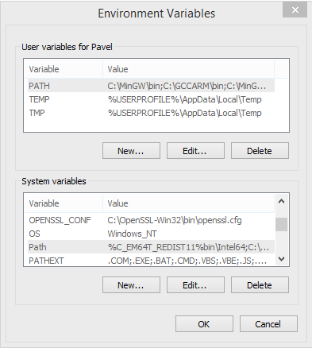

# Developing custom applications
Ok, you have your ZUBAX BABEL and want it to do something special. First of all you will need babel firmware source code, which can be found [here](https://github.com/Zubax/zubax_babel)
In order to build babel firmware, *nix-environment will be needed.  If you use any kind of Linux - good for you, you probably already have everything need(except for gnu arm toolchain). If(like me) you have only win machine, you will need:

- [git](https://git-scm.com/download/win)
- gnu utilities, which may be found [here](http://gnuwin32.sourceforge.net/)
- [Python 3+](https://www.python.org/downloads/)
- gnu arm toolchain. It is very version-dependant, so you should use [this version](https://launchpad.net/gcc-arm-embedded/4.9/4.9-2015-q3-update)

After you download and install everything - make sure you have all these your environment variable PATH set up correctly and have access to all necessary utilities from console. For example, my PATH variable looks like this:





Now its time to try to build the original firmware. Go to console and clone the repository

```Git clone https://github.com/Zubax/zubax_babel```

Then follow [instructions from the repository](https://github.com/Zubax/zubax_babel/blob/master/firmware/src/board/board.hpp). If everything is fine, you will find file compound.elf in directory /%reponame%/firmware/build/. This is firmware in binary form, which may be loaded to the device with Drone code probe. 
You should try that. There are two ways of loading firmware to the device: 


- Using DroneCode probe(DCP)
- Using bootloader

## Loading firmware with DCP ##

Go to terminal and start gdb

```C:\Users\j3qq4hch>arm-none-eabi-gdb```

Then connect to DCP load your firmware and run it

    (gdb) tar ext COM6
    Remote debugging using COM6
    (gdb) mon swdp_scan
    Target voltage: 4.4V
    Available Targets:
    No. Att Driver
     1  STM32F3
    (gdb) file C:\\zubax_babel\\firmware\\build\\compound.elf
    Reading symbols from C:\zubax_babel\firmware\build\compound.elf...warning: Loadable section "bootloader" outside of ELF segments
    done.
    (gdb) attach 1
    Attaching to program: C:\zubax_babel\firmware\build\compound.elf, Remote target
    0x0800d9fe in watchdogReset (id=id@entry=0) at zubax_chibios///zubax_chibios/platform/stm32/watchdog_stm32.cpp:139
    139 if ((_mask & valid_bits_mask) == valid_bits_mask)
    (gdb) load
    Loading section bootloader, size 0x5571 lma 0x8000000
    Loading section startup, size 0x1c0 lma 0x8008000
    Loading section constructors, size 0x4 lma 0x80081c0
    Loading section .padding1, size 0x1c lma 0x80081c4
    Loading section .text, size 0x7c48 lma 0x80081e0
    Loading section .data, size 0x90 lma 0x800fe28
    Loading section .noinit, size 0x8 lma 0x800feb8
    Start address 0x80081e0, load size 54321
    Transfer rate: 16 KB/sec, 890 bytes/write.
    (gdb) run
    The program being debugged has been started already.
    Start it from the beginning? (y or n) y
    Starting program: C:\zubax_babel\firmware\build\compound.elf
    


## Loading firware with bootloader ##
cooming soon

----------
## Tutorials: ##

[Blink](Blink.md)

[Breath](Breath.md)