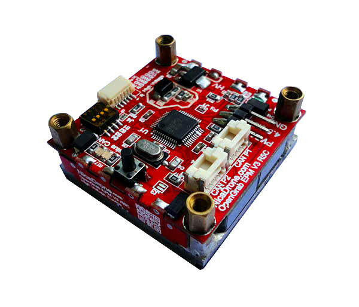
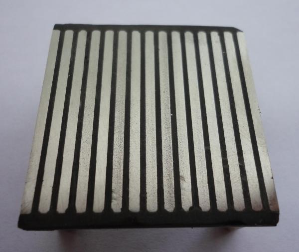
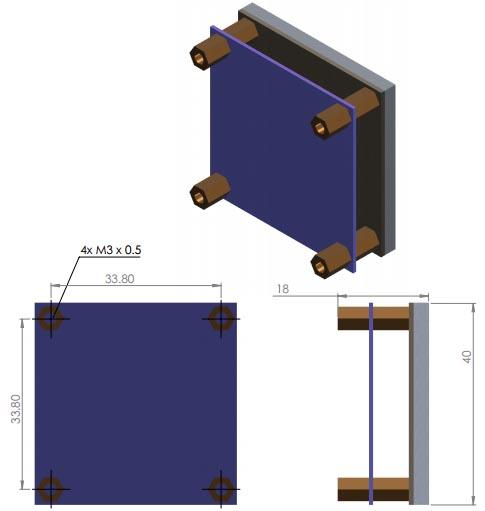
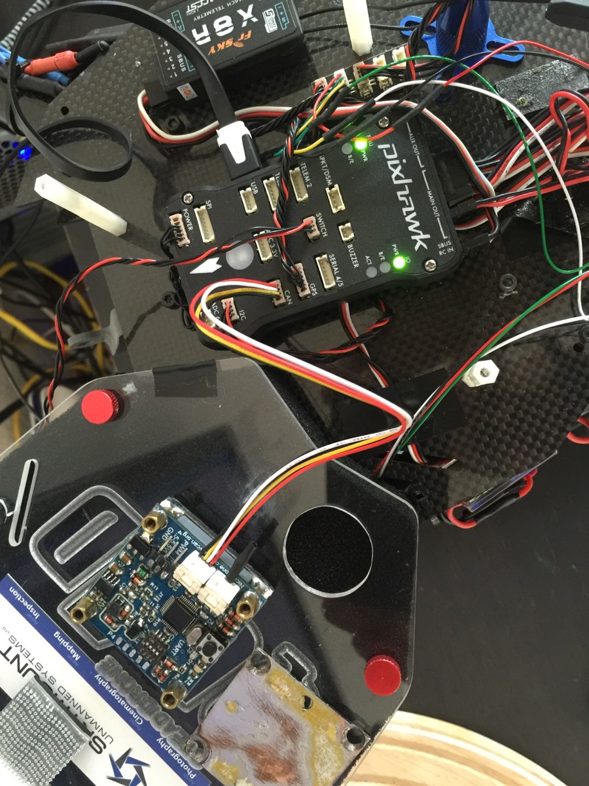
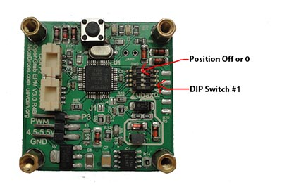

# NicaDrone OpenGrab EPM v3

## Overview

V3R5C

V3R4B

The OpenGrab EPM v3 is an electropermanent magnet, combining the advantages of electro and permanent magnets.
The device creates a very strong magnetic contact with a ferrous target.
It supports [UAVCAN](/uavcan), RC PWM and push button operation.
OpenGrab EPM v3 has been developed by NicaDrone in cooperation with Zubax Robotics.

### Theory of operation

<warning>
**&#9889; The device poses an electric shock hazard.
Do not touch exposed parts of the circuit while the magnet is operating. &#9889;**
</warning>

The NXP LPC11C24 <abbr title="Microcontroller">MCU</abbr> drives a mosfet connected to a transformer in a flyback
configuration to charge the main PET capacitors up to 475 V.

A thyristor bridge is used to discharge the capacitor in either direction through the winding inside the AlNiCo
material.
This results in a short, 20 us 300 A pulse creating a 100 kAm field in the AlNiCo material.
This causes the magnetic domains in the AlNiCo magnets to align in a particular orientation to form a magnetic
circuit with a ferrous target.
More detailed explanation of the operating principle is available on
[Wikipedia](https://en.wikipedia.org/wiki/Electropermanent_magnet#Electropermanent_magnet_principle).

An ON command results in the charging and discharging the capacitors 3 times to achieve full magnetization.

An OFF command results in charging and discharging the capacitors several times with changing direction and decreasing
amplitude, effectively degaussing the AlNiCo material.

### Applications

* Cargo lifting in <abbr title="Unmanned Aerial Vehicle">UAV</abbr> and robotic applications.
* Robot workholding.
* Education, demonstration of magnetic properties.

### Features

* Steady state power under 50 mW
* Short cycle time
* Variety of interfaces:
    * RC PWM
    * UAVCAN
    * Push button
* Open source firmware and hardware
* 5 V supply voltage, can be powered via RC PWM connector or via UAVCAN port

## Mechanical properties

<warning>
The bottom surface of the magnet should be kept clean, because dirt or metal shavings can be crushed into the surface
when the magnet is turning on, causing an insulation breakdown.
</warning>

The diagrams below document the mechanical arrangement and dimensions (click to enlarge):

### R5C and newer

### R4B and older

## Characteristics

Symbol                  |Parameter                                  | Minimum | Typical | Maximum | Unit
------------------------|-------------------------------------------|---------|---------|---------|------
Tcycle(ON)   | Time to complete one cycle                |         | 0.75    |         | s
Tcycle(OFF)  | Time to complete one cycle                |         | 1.2     |         | s
Fmax         | Max holding force                         | 200     | 300     |         | N
Vsupply      | Operating voltage                         | 4.75    | 5.0     | 6.5     | V
Isteady      | Steady state current draw                 |         | 10      |         | mA
Ipeak        | Peak current draw during cycle execution  |         |         | 1000    | mA
m                       | Mass of the device                        |         | 65      |         | g
toperating   | Operating temperature                     | -40     |         | +70     | &deg;C
RHoperating  | Operating humidity (non-condensing)       | 0       |         | 75      | %

## Human-machine interface

### Push button

Pressing this button for at least 200 milliseconds will toggle the EPM.

### LED indication

#### Status LED

This LED indicator shows the status of the device derived from the continuous self-diagnostics,
according to the UAVCAN node status code:

Health                | Blinking ON/OFF duration, milliseconds
----------------------|---------------------------------------
OK                    | 50/950
WARNING               | 50/500
ERROR or CRITICAL     | 50/100

#### CAN LED

This LED indicator shows the CAN bus traffic.

Each blink indicates that there was a CAN frame that was *successfully* transmitted or *successfully*
received during the last few milliseconds.
Under high bus load, this LED indicator is expected to glow constantly.

Note that CAN frames filtered out by the hardware acceptance filters will not cause the LED indicator to blink.

## RC PWM interface

Connect an RC receiver or some other hardware capable of producing RC PWM signal (e.g. Pixhawk) to the RC PWM connector.

The device divides the PWM pulse duration into three ranges:

* Neutral - while the signal is in this range, the device ignores it.
* OFF - while the signal is in this range, the device will be continuously performing the turn-off sequence.
* ON - while the signal is in this range, the device will be continuously performing the turn-on sequence.

Symbol                  |Parameter                                  | Minimum | Typical | Maximum | Unit
------------------------|-------------------------------------------|---------|---------|---------|------
TRCPWM(ON)   | RC PWM pulse duration to turn ON          | 1.75    |         | 2.5     | ms
TRCPWM(OFF)  | RC PWM pulse duration to turn OFF         | 0.5     |         | 1.25    | ms
fRCPWM       | RC PWM input frequency                    | 1       | 50      | 50      | Hz
VRCPWM(low)  | Low-level RC PWM input voltage            |         |         | 0.3 Vsupply | V
VRCPWM(high) | High-level RC PWM input voltage           | 0.7 Vsupply | |  | V

## UAVCAN interface

This section describes the properties specific for this product only.
For general info about the UAVCAN interface, please refer to the [UAVCAN interface documentation page](/uavcan).

### Mode and status codes

OpenGrab EPM v3 employs the following UAVCAN-defined operating modes:

UAVCAN operating mode   | Conditions
------------------------|----------------------------------------------------------------------------------------------
INITIALIZING            | The UAVCAN interface is undergoing initialization. This does not interfere with other functions of the device.
OPERATIONAL             | UAVCAN interface and the device itself are fully operational.

The following table describes the meanings of the standard UAVCAN health codes.

UAVCAN health code      | Conditions
------------------------|----------------------------------------------------------------------------------------------
OK                      | Everything is OK; the device is functioning properly.
WARNING                 | Not used.
ERROR                   | See below.
CRITICAL                | Not used.

Possible reasons for the health code being `ERROR`:

* Invalid input voltage.
* The high-voltage flyback charger circuit is damaged.

Also, the device reports extended status information via `uavcan.protocol.NodeStatus.vendor_specific_status_code`.
The higher byte is used to store the current voltage on the buffer capacitor, the units are
2 V per <abbr title="Least Significant Bit">LSB</abbr>.
The lower byte is used to store implementation-specific status flags.

<info>
Linux users: You can use [`uavcan_status_monitor`](http://uavcan.org/Implementations/Libuavcan/Platforms/Linux#uavcan_monitor)
to see the status code of each node on the bus.
</info>

### Services

This device does not call any services.

The following service servers are implemented:

Data type                                       | Note
------------------------------------------------|----------------------------------------------------------------------
`uavcan.protocol.GetNodeInfo`                   | Name: `com.zubax.opengrab_epm_v3`

### Messages

Input:

Data type                                       | Note
------------------------------------------------|----------------------------------------------------------------------
`uavcan.equipment.hardpoint.Command`            | Controls the magnet, see below.
`uavcan.protocol.dynamic_node_id.Allocation`    | Used to allocate node ID if dynamic node ID allocation is enabled.

Output:

Data type                                       | Note
------------------------------------------------|----------------------------------------------------------------------
`uavcan.protocol.NodeStatus`                    | Described above.
`uavcan.equipment.hardpoint.Status`             | Status of the magnet, see below.
`uavcan.protocol.dynamic_node_id.Allocation`    | Used to allocate node ID if dynamic node ID allocation is enabled.

#### `uavcan.equipment.hardpoint.Command`

This message allows to control the magnet via UAVCAN. The fields are interpreted as follows:

##### `hardpoint_id`

If the field does not equal the hardpoint ID of the current device, the message will be ignored.

##### `command`

1. If this field is zero and the magnet is turned on: the magnet will turn off.

2. If this field is non-zero and the magnet is turned off: the magnet will execute the number of turn on cycles
specified in the field, but not less than 3 and not more than 10.

3. If this field is non-zero, the magnet is turned on, and the field has changed its value: see #2.

4. In all other cases the command will be ignored.

#### `uavcan.equipment.hardpoint.Status`

This message carries the status of the magnet.

##### `hardpoint_id`

Hardpoint ID of the current magnet.

##### `payload_weight`

Always set to NaN.

##### `payload_weight_variance`

Always set to positive infinity.

##### `status`

Indicates whether the magnet is turned on or off:

* 1 - the magnet is turned on.
* 0 - the magnet is turned off.

### CAN bus characteristics

The device will configure CAN bus bit rate automatically after powering on.
The automatic configuration is done by means of listening to the bus in silent mode, alternating between the
pre-defined set of supported CAN bit rates (defined in the table) until first valid CAN frame is received.
Unconfigured CAN bus does not interfere with other functions of the device.

Symbol                  |Parameter                                  | Minimum | Typical | Maximum | Unit
------------------------|-------------------------------------------|---------|---------|---------|------
fCAN         | CAN bit rate (autodetect)                 | |100 125 250 500 1000 | | Kbps
VCAN(out)dif-dom|CAN dominant differential output voltage| 1.5     | 0       | 3       | V
VCAN(out)dif-rec|CAN recessive differential output voltage| -50    | 0       | 50      | mV
ICAN(out)dom | CAN dominant output current               | 40      | 70      | 120     | mA
ICAN(out)dom | CAN recessive output current              | -5      |         | 5       | mA
RCAN(in)diff | CAN differential input resistance         | 19      | 30      | 52      | &#8486;
tCAN(out)to-dom | CAN dominant time-out time             | 0.3     | 1       | 12      | ms

### DIP switch

The device is equipped with 4-position DIP switch that allows to configure Hardpoint ID and enable or disable
UAVCAN dynamic node ID allocation:

DIP switch # | Purpose
-------------|----------------------------------------------------------------------------------------------
1            | Hardpoint ID bit 0
2            | Hardpoint ID bit 1
3            | Hardpoint ID bit 2
4            | 0 - use dynamic node ID allocation; 1 - use fixed node ID

#### Hardpoint ID

Hardpoint ID is defined in binary by the configuration of the lowest 3 switches.
The table below clarifies the binary encoding:

Hardpoint ID | DIP #3 | DIP #2 | DIP #1
-------------|--------|--------|--------
0            | 0      | 0      | 0
1            | 0      | 0      | 1
2            | 0      | 1      | 0
3            | 0      | 1      | 1
4            | 1      | 0      | 0
5            | 1      | 0      | 1
6            | 1      | 1      | 0
7            | 1      | 1      | 1

#### Node ID selection

If the DIP switch #4 is set to OFF, the device will perform dynamic node ID allocation once the CAN bus bit rate
detection is done.
This implies that the device will not be available via UAVCAN interface unless the UAVCAN network contains
a functioning dynamic node ID allocation server.
Please refer to the
[UAVCAN specification](http://uavcan.org/Specification/6._Application_level_functions#dynamic-node-id-allocation)
for more info.

If the DIP switch #4 is set to ON, the device's node ID will be fixed at (Hardpoint ID + 100).
For example, if Hardpoint ID is set to 5, the fixed node ID will be configured as 105.
In this case the device does not require dynamic node ID allocation server, and therefore it will be accessible via
UAVCAN immediately once the CAN bus is configured.

## UART interface

The EPM reports error and status messages over this interface.
It can also be used to update the firmware - please refer to the source repository for instructions (link below).

Parameters of the serial interface:

Parameter               | Value
------------------------|--------------------------------------------
Baud rate               | 115200
Word size               | 8
Parity                  | None
Stop bits               | 1
New line sequence       | `\r\n` (CR-LF)

Symbol                  |Parameter                                  | Minimum | Typical | Maximum | Unit
------------------------|-------------------------------------------|---------|---------|---------|------
VUART(in-low)  | Low-level UART input voltage            |         |         | 0.3 Vsupply | V
VUART(in-high) | High-level UART input voltage           | 0.7 Vsupply | |  | V
VUART(out-low) | Low-level UART output voltage           |         |         | 0.4     | V
VUART(out-high)| High-level UART output voltage          | Vsupply - 0.4 | | | V

## Links

* [Source repository (firmware sources, drawings, etc)](https://github.com/Zubax/opengrab_epm_v3)
* [PCB layout and schematic] (https://upverter.com/ctech4285/1dada3422c772add/OpenGrab-EPM-V3R3/)
* [Purchase from NicaDrone] (http://nicadrone.com/index.php?id_product=66&controller=product)
