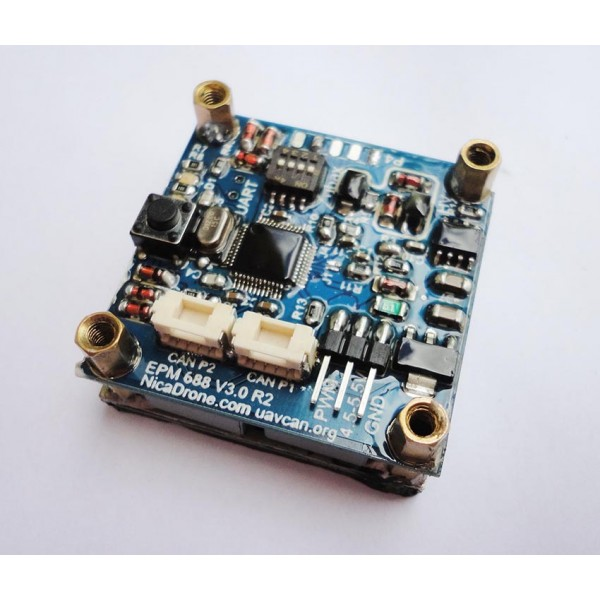
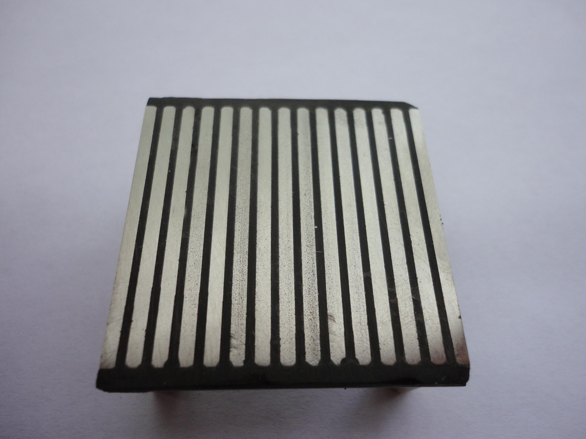
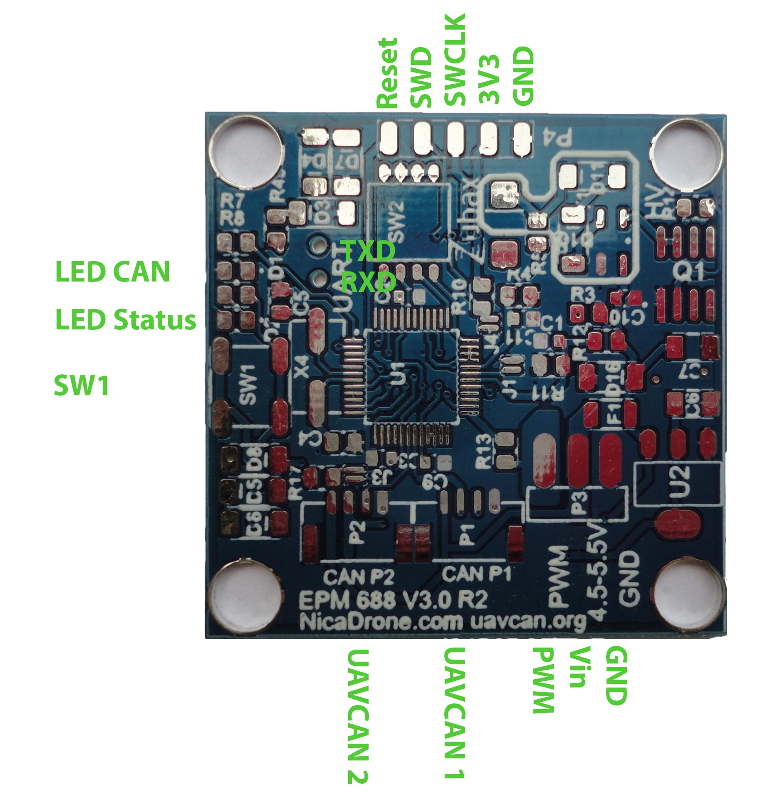
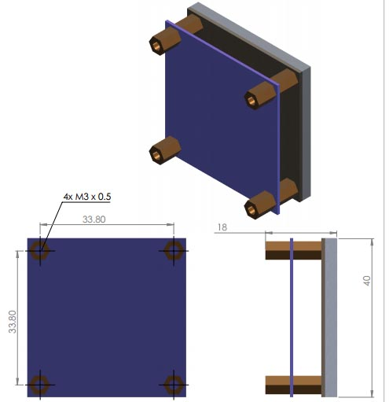

# NicaDrone OpenGrab EPM v3

## Overview

The OpenGrab EPM v3 Developed by NicaDrone in cooperation with Zubax is an Electro Permanent Magnet, combining the advantages of electro and permanent magnets. 
The magnetic domains in the AlNiCo magnets are aligned in a particular orientation as to form a magnetic circuit with a ferrous target plate. 
A short, 20us pulse current of 300A @ 475V is generated by discharging the main PET capacitor through a Thyristor full bridge into the copper winding generating a field of 100kAm. This is done 3 times to archive full turn on. Several pulses are used with decreasing amplitude and directing to demagnetize the EPM. The key advantage is a very strong electromagnet that does not consume energy during steady state operation only during cycling 
The device supports UAVCAN, RC PWM and Push Button operation.

### Theory of operation

The LPC11C24 drives a Mosfet connected to a transformer in a flyback configuration to charge the main PET capacitors to up to 475V. 

A Thyristor bridge is used to discharge the capacitor in either direction throw the winding inside the AlNiCo material. 

An on command consist of charging and discharging the capacitors 3 times to achieve full magnetization

An off command consist of charging and discharging the capacitors several times with changing direction and decreasing amplitude, effectively degaussing the AlNiCo material. 

### Applications
•	Cargo lifting in UAVs 
•	Robot work holding
•	Education demonstration of magnetic properties
### Features 
•	4.5-5.5V Vcc 
•	PWM signal 
•	UAVCAN 
•	Minimal steady state power <10mW 
•	Short cycle time
•	Onboard NXP LPC11C24 with Can transceiver and UART bootloader 
•	Open source firmware available on GitHub 

### Mechanics

The diagram below documents the Pin out, LED indicator (click to enlarge):

Mechanical Dimensions (click to enlarge):

### Recommended Operating Conditions

| Symbol    |Parameter                                  |           Value | Unit |
|-----------|-------------------------------------------|----------------:|:-----|
| Tcycle on | Time to complete one cycle                |            0.75 | s    |
| Tcycle off| Time to complete one cycle                |             1.2 | s    |
| Fmax      | Max holding force                         |             200 | N    |
| Vin       | Optimal operating voltage range           |        4.75-5.5 | V    |
| Vinmax    | Maximum input voltage                     |             6.5 | V    |
| Imax      | Max I draw during cycle execution         |            1000 | mA   |
| PWM on    | Minimum signal high                       |            1.75 | ms   |
| PWM off   | Maximum signal high                       |            1.25 | ms   |
| PWM error | PWM outside this range will be ignored    | <0.75 and >2.25 | ms   |
| Mass      |                                           |              65 | g    |
| Trange    | Temperature range for optimal performance |      -40 to +70 | degC |
| PWM Frq   | Supported PWM frequency					|              50 | Hz   | 

### Interfaces

#### Push Button

Pressing this Button will toggle the EPM with only having connected 5V 

#### PWM

Connect an RC receiver or Pixhawk with 50Hz PWM output to the PWM connector. Use a 3 position switch for off, Neutral and on. 

#### [UAVCAN interface](#UAVCAN_interface) 

with two connectors for each interface

#### Auxiliary Serial Port interface

The EPM reports error and status messages over this interface. It can also be used to update the firmware. 
Please see the readme in the firmware section of the Git reported

Power can be provided via: 

* Any single UAVCAN port
* PWM port
* The circuit does not prevent power flow from PWM to UAVCAN port

Power supply characteristics are identical regardless of the power input used - refer to the tables below for details.

### LED indication

#### INFO LED

This LED indicator shows the status of the device derived from the continuous self-diagnostics,
according to the UAVCAN node status code:

Mode            | Health                | Blinking ON/OFF duration, seconds
----------------|-----------------------|---
OPERATIONAL     | OK                    | 0.1/0.9 (blinking lazily)
OPERATIONAL     | ERROR or CRITICAL     | 0.1/0.1 (blinking frantically)

#### CAN LED

This LED indicators show the CAN bus traffic.

Each blink indicates that there was a CAN frame that was *successfully* transmitted or *successfully*
received during the last few milliseconds.
Under high bus load, these LED indicators are expected to glow constantly.
If the interface is not connected to the bus, its LED indicator will be inactive,
even if the device is actually attempting to transmit.

Note that CAN frames filtered out by the hardware acceptance filters will not cause the LED indicators to blink.

### Warnings

* The winding inside the AlNiCo magnet are 0.2mm underneath a black epoxy. Dirt or metal shavings can be crushed into the epoxy and causing an insulation break down. This normally destroys one of the Thyristors.  

* There are several high voltage traces on the PCB covered by conformal coating. Pressing a finger on for example T1 firmly while switching is in progress will probably feel quit good. 

## Links

GitHub repo, source and mechanical drawings
UAVCAN documentation 
NicaDrone.com, purchase
PCB layout and schematics 

* [Product description](http://zubax.com/product/zubax-gnss)
* [Source repository (firmware sources, drawings, etc)](https://github.com/Zubax/opengrab_epm_v3)

* [Tutorials](tutorials)
