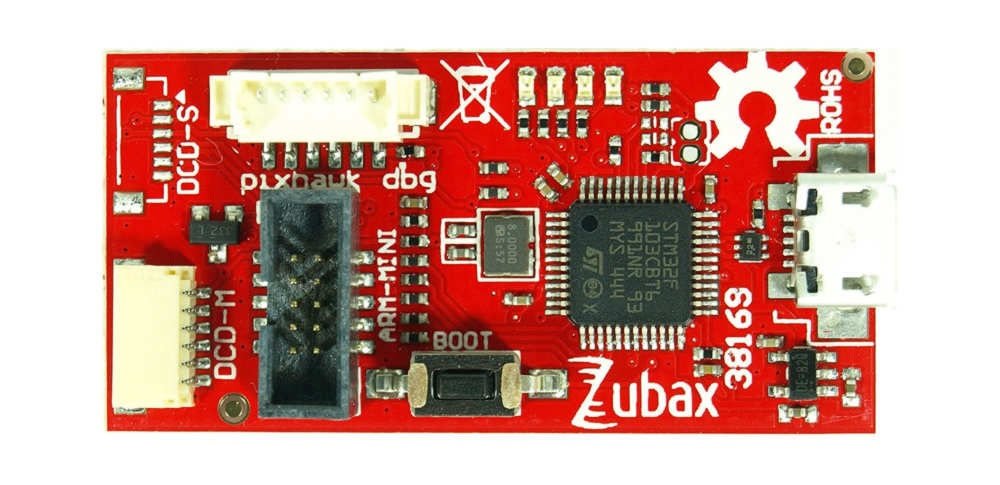
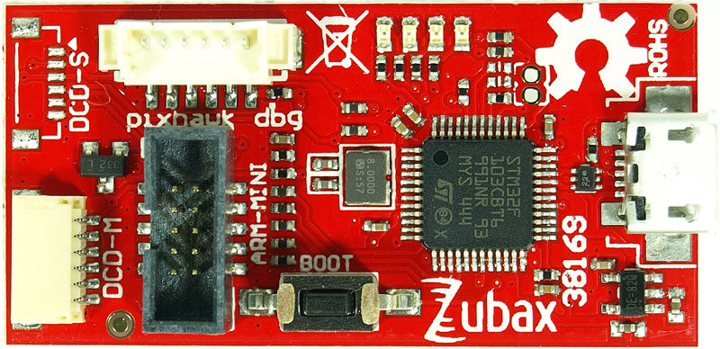
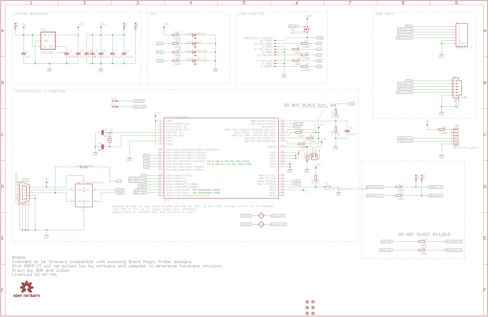
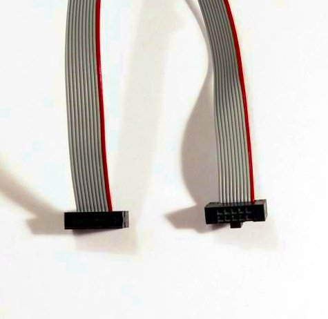

# DroneCode Probe





Zubax DroneCode Probe is a generic JTAG / SWD + UART console adapter compatible with most ARM Cortex based designs and
in particular with hardware maintained by the [DroneCode project](http://dronecode.org).

The design is based on Black Magic Probe and is distributed under open source licenses.
Additional description of its features can be found at the Black Magic Probe home page:
<http://www.blacksphere.co.nz/main/blackmagic>.

The schematics and PCB sources can be found at the project repository: <https://github.com/Zubax/dronecode_probe>.

## USB interface

DroneCode Probe will be detected by the host as two virtual serial port devices.
The port with the lower number is connected to the GDB server on the debugger.
The port with the higher number is connected to the UART interface.

For example, the host may represent the debugger as follows:

* `COM3` (on Windows), or `/dev/ttyACM0` (on Linux) - GDB interface.
Baud rate and other parameters of a typical serial port are irrelevant for this interface.
* `COM4` (on Windows), or `/dev/ttyACM1` (on Linux) - UART interface. This is a typical USB-UART adapter interface.

### Drivers for Linux/Mac/Windows

#### Linux and Mac

DroneCode Probe does not require drivers on Linux and Mac, since it uses standard CDC-ACM USB profile.

#### Windows

Windows drivers can be downloaded from the Black Magic Probe home page: <http://www.blacksphere.co.nz/main/blackmagic>.

## Connectors

This section documents the available debug interfaces and their connectors,
except micro-USB since its purpose is evident.

### DCD-M and DCD-S


Both connectors DCD-M and DCD-S feature the same pinout, documented in the table below.
They expose both SWD and UART interfaces to the target, where UART is typically used to access the debug
serial console of the target. **DCD** stands for *DroneCode Debug*,
and the letters **M** and **S** mean *medium* and *small*, respectively.

Pin     | Type  | Name          | Comment
--------|-------|---------------|--------------------------------------------------------------------------------------
1       | IN    | `TPWR`        | Target power sense; also can be used to power the target
2       | IN    | `UART_RX`     | Serial input
3       | OUT   | `UART_TX`     | Serial output
4       | IN/OUT| `SWDIO`       | SWD data line
5       | OUT   | `SWDCLK`      | SWD clock line
6       | GND   | `GND`         |

Connector part numbers are as follows:

Name    | Manufacturer | Part number                                                          | Pitch | Datasheet
--------|--------------|----------------------------------------------------------------------|-------|---------------------------
DCD-M   | JST          | **BM06B-SRSS-TB** *(top entry)*; or **SM06B-SRSS-TB** *(side entry)* | 1 mm  | <http://www.jst-mfg.com/product/pdf/eng/eSH.pdf>
DCD-S   | JST          | **SM06B-SURS-TF**                                                    | 0.8 mm| <http://www.jst-mfg.com/product/pdf/eng/eSUR.pdf>

### ARM Cortex M debug connector




This is the standard
[ARM Cortex M Debug Connector](http://infocenter.arm.com/help/topic/com.arm.doc.faqs/attached/13634/cortex_debug_connectors.pdf)
that can be seen on many other ARM debuggers.

Pin     | Name
--------|------------------------------
1       | `TPWR`
2       | `SWDIO/TMS`
3       | `GND`
4       | `SWDCLK/TCK`
5       | `GND`
6       | `SWO/TDO`
7       |
8       | `NC/TDI`
9       | `GND`
10      | `nRESET`

### Pixhawk v1 serial

This connector exposes only serial interface.
It can be used as a general UART interface, and its pinout is compatible with the debug serial port on
[Pixhawk v1](https://pixhawk.org/modules/pixhawk).

Pin     | Type          | Name      | Comment
--------|---------------|-----------|--------------------------------------------------------------------------------------
1       | Power OUT     | `5V`      | Optional 5V output to the target directly from USB. Disabled by default; refer to the schematic to see what hardware modifications are required to enable it.
2       |               |           | Not used
3       |               |           | Not used
4       | IN            | `UART_RX` | Serial input
5       | OUT           | `UART_TX` | Serial output
6       | GND           | GND       |

## Examples

Also see the Black Magic Probe wiki: <https://github.com/blacksphere/blackmagic/wiki>.

### Uploading and debugging an ELF executable

First, start GDB and pass the path to the ELF as a command line argument. For example:

```bash
arm-none-eabi-gdb firmware.elf
```

Then, execute the following in the GDB's internal command line:

```
tar ext /dev/ttyACM0    # Or another port
mon swdp_scan
attach 1
load
```

### Debugging with Eclipse

* Open your Eclipse project.
* Go `Window` → `Preferences` → `Run/Debug` → `Launching` → `Default Launchers`:
    * Select `GDB Hardware Debugging` → `[Debug]`, then tick *only* `Legacy GDB Hardware Debugging Launcher`,
and make sure that the option for GDB (DSF) is disabled.
* Go `Run` → `Debug Configurations`:
    * Invoke the context menu for `GDB Hardware Debugging`, select New.
    * Tab `Debugger`:
        * Set the field `GDB Command` to `arm-none-eabi-gdb` (or other if necessary).
        * Untick `Use remote target`.
    * Tab `Startup`:
        * If a boot loader is used, make sure that `Image offset` is configured correctly.
        * Uncheck `Resume`.
        * In the field `Run Commands`, enter `run`. This is mandatory, otherwise the debugger will try to `continue`.
        * Enter the following in the field `Initialization Commands`:

```
# Make sure to select the correct port here
target extended /dev/ttyACM0

# Use jtag_scan instead of swdp_scan if necessary
monitor swdp_scan
attach 1
monitor vector_catch disable hard

set mem inaccessible-by-default off
monitor option erase
set print pretty
```

### Powering the target from DroneCode Probe

Examples below are for the GDB's internal command line.

```
(gdb) monitor tpwr enable         # Enabling the power (it's always disabled by default)
(gdb) monitor tpwr                # Requesting the status
Target Power: enabled
(gdb) monitor tpwr disable        # Disabling the power
(gdb) monitor tpwr
Target Power: disabled
```

## Updating the device's own firmware

First, clone the firmware source repository from the link provided at the end of this page.

Connect the board to USB while holding the button `BOOT`. The red LED on the board should start blinking.

If you're running Linux, the system will report the device as follows:

```bash
$ dmesg
usb 2-6.2.3: new full-speed USB device number 12 using ehci-pci
usb 2-6.2.3: New USB device found, idVendor=1d50, idProduct=6017
usb 2-6.2.3: New USB device strings: Mfr=1, Product=2, SerialNumber=3
usb 2-6.2.3: Product: Black Magic Probe (Upgrade)
usb 2-6.2.3: Manufacturer: Black Sphere Technologies
usb 2-6.2.3: SerialNumber: B5DCABF5
```

Then go to the directory with firmware sources and execute the following script,
assuming that `src/blackmagic.bin` is the path to the firmware image:

```bash
sudo scripts/stm32_mem.py src/blackmagic.bin
```

Disconnect the board afterwards.

Alternative instructions for this step are available from: <http://px4.io/dev/jtag/black_magic_probe>.

## Links

* [Product page](http://zubax.com/product/dronecode-probe)
* [Black Magic Probe project page](http://www.blacksphere.co.nz/main/blackmagic)
* [Hardware source repository](https://github.com/Zubax/dronecode_probe)
* [Firmware source repository](https://github.com/blacksphere/blackmagic)
