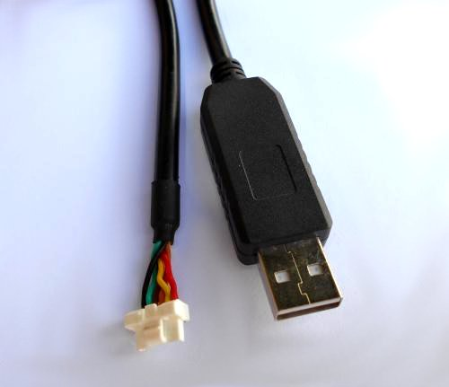

# Zubax GNSS

<warning>
**This product has been superseded with [Zubax GNSS 2](/zubax_gnss_2).**
</warning>

<info>
This page is valid for firmware version 2.0 and newer.
Documentation for older versions is [available here](http://old-docs.zubax.com/index.php?title=Zubax_GNSS&action=history).
Update instructions are [available here](http://zubax.com/news/zubax-gnss-firmware-update-v20).
</info>

## Overview


Zubax GNSS is a high-performance positioning module for outdoor environments with doubly redundant [UAVCAN](/uavcan)
bus interface.
It includes a state-of-the-art GPS/GLONASS receiver, a high-precision barometer and a 3-axis compass.

If you're just looking for a quick-start guide, check out the [tutorials](tutorials),
but please return to this page afterwards.

Links to the firmware sources, schematics and 3D printable models are available at the bottom of this page.

### Mechanics

The diagram below documents the basic mechanical characteristics of the Zubax GNSS board,
such as the placement of connectors, LED indicators and mounting holes (click to enlarge):


<info>
If your Zubax GNSS was supplied with a protective tape on the barometer, make sure to remove it before first use.
</info>

### Interfaces

Zubax GNSS features two communication interfaces, each of which is described in detail in the subsequent parts
of this document. The interfaces are as follows:

* Doubly redundant [UAVCAN interface](#UAVCAN_interface) with two connectors for each interface
* Auxiliary Serial Port interface

The device can be powered via the following:

* Any single UAVCAN port
* Both UAVCAN ports simultaneously (the power supply circuit prevents direct current flow between these power inputs)
* The auxiliary serial port

Note that when the device is powered via UAVCAN, the auxiliary serial port connector will be back-powered
from UAVCAN as well; UAVCAN ports, however, will not be back-powered from other power inputs.

Power supply characteristics are identical regardless of the power input used - refer to the tables below for details.

### LED indication

#### PPS LED

This LED indicator blinks with the rate of 1 Hz if the GNSS receiver has a navigation fix.

#### INFO LED

This LED indicator shows the status of the device derived from the continuous self-diagnostics,
according to the UAVCAN node status code:

Mode            | Health                | Blinking ON/OFF duration, seconds
----------------|-----------------------|---
INITIALIZATION  | Any                   | 0.5/0.5 (slow long blinks)
OPERATIONAL     | OK                    | 0.1/0.9 (blinking lazily)
OPERATIONAL     | WARNING               | 0.1/0.3 (blinking quickly)
OPERATIONAL     | ERROR or CRITICAL     | 0.1/0.1 (blinking frantically)

Possible reasons for each status code are listed below in this document,
in the [UAVCAN interface](#UAVCAN_interface) section.

#### CAN1 and CAN2 LEDs

These LED indicators show the CAN bus traffic.

Each blink indicates that there was a CAN frame that was *successfully* transmitted or *successfully*
received during the last few milliseconds.
Under high bus load, these LED indicators are expected to glow constantly.
If the interface is not connected to the bus, its LED indicator will be inactive,
even if the device is actually attempting to transmit.

Note that CAN frames filtered out by the hardware acceptance filters will not cause the LED indicators to blink.

#### Behavior during firmware update and bootup

During first few seconds after power-on or after restart, and also in the process of firmware update,
Zubax GNSS uses its LED indicators in a different way, as described in the table below.

Status                          | INFO  | CAN1  | CAN2
--------------------------------|-------|-------|-------
CAN bit rate detection          | Off   | Solid | Off
Dynamic node ID allocation      | Solid | Off   | Off
Update in progress              | Solid | Solid | Off

States that are not listed in the table indicate errors.

## Characteristics

### General

#### Environment

Parameter               | Minimum       | Maximum       | Units | Note
------------------------|---------------|---------------|-------|------------------------------------------------------
Temperature             | -30           | 60            | &deg;C|GNSS hot start is not expected to work reliably below -20&deg;C
Magnetic field strength |               | 1.3           | Gauss |

#### Power supply

Parameter       | Minimum       | Typical       | Maximum       | Units | Note
----------------|---------------|---------------|---------------|-------|----------------------------------------------
Supply voltage  | 4.5           | 5.0           | 5.5           | V     | Any power input
Supply current  | 70            | 95            | 180           | mA    | Any power input

#### CAN bus (UAVCAN)

Parameter                               | Minimum       | Typical       | Maximum       | Units
----------------------------------------|---------------|---------------|---------------|-------
Bit rate (configurable)                 | 20            | 1000          | 1000          | Kbps
Positive-going input threshold voltage  |               | 750           | 900           | mV
Negative-going input threshold voltage  | 500           | 650           |               | mV
Differential output voltage, dominant   | 1.5           | 2.0           | 3.0           | V
Differential output voltage, recessive  | -120          | 0             | 12            | mV

#### UART (Auxiliary Serial Port)

Parameter                               | Minimum       | Typical       | Maximum       | Units
----------------------------------------|---------------|---------------|---------------|-------
Low-level input voltage                 | -0.3          | 0             | 1.6           | V
High-level input voltage                | 2.1           | 3.3           | 5.5           | V
Low-level output voltage                | 0             | 0             | 0.5           | V
High-level output voltage               | 2.8           | 3.3           | 3.4           | V
Source/sink current                     |               |               | 10            | mA

### Sensor suite

#### GNSS receiver

Please refer to the specifications provided by the sensor manufacturer.

Sensor model:
[u-blox MAX-M8C(Q)](http://www.u-blox.com/en/gps-modules/pvt-modules/max-m8-series-concurrent-gnss-modules.html)

#### Digital barometer

Please refer to the specifications provided by the sensor manufacturer.

Sensor model:
[Measurement Specialties MS5611](http://www.meas-spec.com/product/pressure/MS5611-01BA03.aspx)

#### Three-axis digital compass

Please refer to the specifications provided by the sensor manufacturer.

Sensor model:
[Honeywell HMC5883L](http://aerospace.honeywell.com/en/products/sensors/non-inertial-sensors/magnetic-field-sensing-and-sensor-solutions/featured-product-hmc5883l)

## UAVCAN interface

This section describes the properties specific for this product only.
For general info about the UAVCAN interface, please refer to the [UAVCAN interface documentation page](/uavcan).

<info>If Zubax GNSS is used in a setup with non-redundant CAN bus, only CAN1 must be used.</info>

### Mode and status codes

Zubax GNSS employs the following UAVCAN-defined operating modes:

UAVCAN operating mode   | Conditions
------------------------|----------------------------------------------------------------------------------------------
INITIALIZING            | The device has just started and is not ready to begin normal operation yet.
OPERATIONAL             | This is the main operating mode.
SOFTWARE_UPDATE         | The device is undergoing firmware update. It will automatically transition to OPERATIONAL upon completion.

The following table describes the meanings of the standard UAVCAN health codes in OPERATIONAL mode.

UAVCAN health code      | Conditions
------------------------|----------------------------------------------------------------------------------------------
OK                      | Everything is OK; sensors are functioning properly
WARNING                 | See below.
ERROR                   | Sensor malfunction. The device may stop publishing corresponding sensor measurements to the bus.
CRITICAL                | Not used.

Possible reasons for the health code being `WARNING`:

* GNSS fix quality is below the configurable threshold (disabled by default)
* Operating temperature range violation (see [characteristics](#Characteristics))
* Magnetic field strength is too high (see [characteristics](#Characteristics)) (likely an invalid reading)
* Magnetic field strength vector remained zero for several seconds (likely a sensor malfunction)

The following table describes the meanings of the standard UAVCAN health codes in the mode `SOFTWARE_UPDATE`.

UAVCAN health code      | Possible reasons
------------------------|----------------------------------------------------------------------------------------------
OK                      | Everything is OK.
WARNING                 | Not used.
ERROR                   | Not used.
CRITICAL                | Firmware update has failed; another attempt will be made soon.

Note that the [INFO LED](#INFO_LED) indicator reflects the actual node status by changing its blinking patterns.

<info>
Linux users: You can use [`uavcan_status_monitor`](http://uavcan.org/Implementations/Libuavcan/Platforms/Linux#uavcan_monitor)
to see the status code of each node on the bus.
</info>

### Time synchronization

This device can act as a
[UAVCAN-compliant time synchronization master](http://uavcan.org/Specification/6._Application_level_functions/#time-synchronization),
but this feature is disabled by default.
If time synchronization is enabled, the GNSS UTC time will be used as the time source,
which implies that the time synchronization master will be functional only if the device has had at least one
successful GNSS time fix since power on.

### Services

This device does not call any services.

The following service servers are implemented:

Data type                                       | Note
------------------------------------------------|----------------------------------------------------------------------
`uavcan.protocol.GetNodeInfo`                   | Name: `com.zubax.gnss`
`uavcan.protocol.GetDataTypeInfo`               |
`uavcan.protocol.GetTransportStats`             |
`uavcan.protocol.RestartNode`                   |
`uavcan.protocol.file.BeginFirmwareUpdate`      | Request arguments will be ignored; the device will reboot into the bootloader shortly after receiving request.
`uavcan.protocol.param.GetSet`                  | Configuration parameters are described later in this document.
`uavcan.protocol.param.ExecuteOpcode`           | Note that this request may cause transient disruptions to output sensor feeds.

### Messages

Input:

Data type                                       | Note
------------------------------------------------|----------------------------------------------------------------------
`uavcan.protocol.GlobalTimeSync`                | Always synchronizes with network time, if present.

Output (publishing frequency is configurable per message type):

Data type                                       | Note
------------------------------------------------|----------------------------------------------------------------------
`uavcan.protocol.GlobalTimeSync`                | Disabled by default
`uavcan.protocol.NodeStatus`                    |
`uavcan.equipment.gnss.Fix`                     |
`uavcan.equipment.gnss.Auxiliary`               |
`uavcan.equipment.ahrs.Magnetometer`            |
`uavcan.equipment.air_data.StaticPressure`      | Disabled by default
`uavcan.equipment.air_data.StaticTemperature`   | Publication rate and priority are the same as for `uavcan.equipment.air_data.StaticPressure`. Disabled by default.

## Auxiliary Serial Port interface



Auxiliary Serial Port Interface is a command-line interface accessible via TTL UART.
Its use is mainly optional, and, in most cases, it's not required at all.
Compatible interface cables can be purchased from our distributors.

### Connector

The connector type used for this interface is
[Molex CLIK-Mate 1.25mm 6 circuits](http://www.molex.com/molex/products/family?key=clikmate_wiretoboard_connectors).
The device can be powered via this connector, as documented in the [power supply specification section](#Power_supply).

Pin     | Type  | Function
--------|-------|--------------------------------
1       | Power | Power input
2       | UART  | TX
3       | UART  | RX
4       |       | Not connected
5       |       | Not connected
6       | Power | GND

### Communication


#### UART configuration

* Baud rate: 115200
* Word length: 8
* Parity: None
* Stop bits: 1

#### Terminal configuration

CLI parameters:

* Line ending: CR+LF (0x0D+0x0A, `\r\n`)
* Local echo: Off
* Local line editing: Off

For example,
<abbr title="Full-screen window manager that multiplexes a physical terminal between several processes, typically interactive shells">GNU Screen</abbr>
can be used to connect to the the Auxiliary Serial Port as follows (assuming that the serial port name is /dev/ttyUSB0):

```bash
screen /dev/ttyUSB0 115200 8N1
```

To exit GNU Screen, press <kbd>Ctrl+A</kbd>, then <kbd>K</kbd>, then confirm by pressing <kbd>Y</kbd>.

### Command-line interface

This section documents supported CLI commands.

#### `cfg`

Allows to view or modify configuration parameters.

Execute without arguments to get usage info. Supported arguments:

* `list` - list all parameters, their values and ranges
* `set <name> <value>` - change parameter value
* `save` - save all parameters to the non-volatile memory
* `erase` - reset all parameters to defaults

#### `reset`

Restarts the device. Note that sensors will not be restarted.

#### `gnssbridge`

Activates the direct bridge connection between the CLI port and the GNSS receiver.
Both serial ports settings will remain unchanged (115200-8-N-1).

Once the bridge is activated, the state of the device changes as follows until reboot:

* CLI becomes unavailable because its serial port is being used to communicate with the GNSS receiver.
* The device stops publishing GNSS messages to UAVCAN.
* Status code changes to CRITICAL because GNSS sensor data are not available anymore.

Aside from the above, the device continues to work virtually as usual, e.g., its UAVCAN stack operates normally, other sensors are working (if enabled), etc.

#### `help`

Print the list of available commands

## Configuration parameters

This section documents available configuration parameters.
Read the documentation on the interfaces to learn how to access the configuration parameters.

<info>Reboot is required in order for all configuration changes to take effect.</info>

### `uavcan.bit_rate`

CAN bus bit rate, all interfaces.
Value 0 (which is default) causes the device to detect bit rate automatically at every boot up.

Default value: 0

Units: Bits/sec

### `uavcan.node_id`

UAVCAN Node ID
Value 0 (which is default) causes the device to request a dynamically allocated node ID at every boot up.

Default value: 0

### `uavcan.pubp-time`

Publication interval of `uavcan.protocol.GlobalTimeSync`. Zero means disabled.

Default value: 0

Units: Microsecond

### `uavcan.prio-time`

Priority of `uavcan.protocol.GlobalTimeSync`.

Default value: 1

### `uavcan.pubp-stat`

Publication interval of `uavcan.protocol.NodeStatus`.

Default value: 200000

Units: Microsecond

### `uavcan.prio-stat`

Priority of `uavcan.protocol.NodeStatus`.

Default value: 20

### `uavcan.pubp-pres`

Publication interval of `uavcan.equipment.air_data.StaticPressure`. Zero means disabled.
When disabled:

* The driver of the appropriate sensor will not be initialized.
* The sensor will not be monitored - implying that, if it fails, it will not be detected and reported.

This setting also affects `uavcan.equipment.air_data.StaticTemperature`.

Default value: 0

Units: Microsecond

### `uavcan.prio-pres`

Priority of `uavcan.equipment.air_data.StaticPressure`.
This setting also affects `uavcan.equipment.air_data.StaticTemperature`.

Default value: 16

### `uavcan.pubp-mag`

Publication interval of `uavcan.equipment.ahrs.MagneticFieldStrength`.

Default value: 50000

Units: Microsecond

### `uavcan.prio-mag`

Priority of `uavcan.equipment.ahrs.MagneticFieldStrength`.

Default value: 16

### `uavcan.pubp-fix`

Publication interval of `uavcan.equipment.gnss.Fix`.

Default value: 100000

Units: Microsecond

### `uavcan.pubp-aux`

Publication interval of `uavcan.equipment.gnss.Auxiliary`.

Default value: 1000000

Units: Microsecond

### `uavcan.prio-fix`

Priority of `uavcan.equipment.gnss.Fix`.

Default value: 16

### `uavcan.prio-aux`

Priority of `uavcan.equipment.gnss.Auxiliary`.

Default value: 20

### `pres.variance`

Pressure variance reported via `uavcan.equipment.air_data.StaticAirData`.

Default value: 100

Units: Pascal<sup>2</sup>

### `temp.variance`

Temperature variance reported via `uavcan.equipment.air_data.StaticAirData`.

Default value: 4

Units: Kelvin<sup>2</sup>

### `mag.variance`

Magnetic field variance reported via `uavcan.equipment.ahrs.Magnetometer`.

Default value: 0.005

Units: Gauss<sup>2</sup>

### `gnss.warn_dimens`

Set the node status to WARNING if the number of dimensions in the GNSS solution is below this threshold.
Values: 1 - time-only fix, 2 - 2D fix, 3 - 3D fix.

Default value: 0

### `gnss.warn_sats`

Set the node status to WARNING if the number of satellites used in the GNSS solution is below this threshold.

Default value: 0

## Firmware update

Note that firmware update may cause the configuration stored in the non-volatile memory to reset to defaults.

### Via UAVCAN

This is the recommended way of updating firmware.
Zubax GNSS uses PX4 UAVCAN bootloader that implements UAVCAN-compliant firmware update protocol.

Update procedure works as follows:

1. The service `uavcan.protocol.file.BeginFirmwareUpdate` (with any arguments) must be called on the device.
The device will boot into bootloader.
2. When the device is in the bootloader, the service `uavcan.protocol.file.BeginFirmwareUpdate` must be called again,
this time with properly configured fields.
3. After that, the bootloader will erase the firmware and download the new image using the service
`uavcan.protocol.file.Read`.
4. When the new firmware is downloaded and verified, the bootloader will start it.

It is safe to abort the process at any point - in this case the bootloader
will try again until a correct image is loaded.

If you're using PX4 flight stack, please
[follow these instructions](http://dev.px4.io/uavcan-node-firmware.html#placing-the-binaries-in-the-px4-romfs).

### Via Auxiliary Serial Port

This approach is not recommended.

Zubax GNSS allows updating the firmware via a serial port using the STM32's embedded boot loader.

The following steps need to be executed:

1. Connect the auxiliary serial port and make sure the device is powered
2. Execute the CLI command `bootloader`
3. [Upload the new firmware image using the standard STM32 UART boot-loader protocol](http://www.st.com/st-web-ui/static/active/en/resource/technical/document/application_note/CD00264342.pdf)
4. Cycle the power

<info>
Another way to start the boot loader is to close the jumper J1 before powering on.
In this case, the device will boot into the boot loader immediately.
</info>

The above steps can be easily automated with a Python script that can be found in the source repository
(linked at the bottom of this page).
Assuming that the serial port name is `/dev/ttyUSB0` and the firmware image file is called `firmware_image_file.bin`,
the firmware update can be performed as follows:

```bash
python serial_firmware_updater.py /dev/ttyUSB0 firmware_image_file.bin
```

Also check out this cross-platform GUI tool: <https://github.com/Zubax/zubax_serial_updater>.

## Links

* [Product description](http://zubax.com/product/zubax-gnss)
* [Source repository (firmware sources, 3D printable models, etc)](https://github.com/Zubax/zubax_gnss)
* [Tutorials](tutorials)
