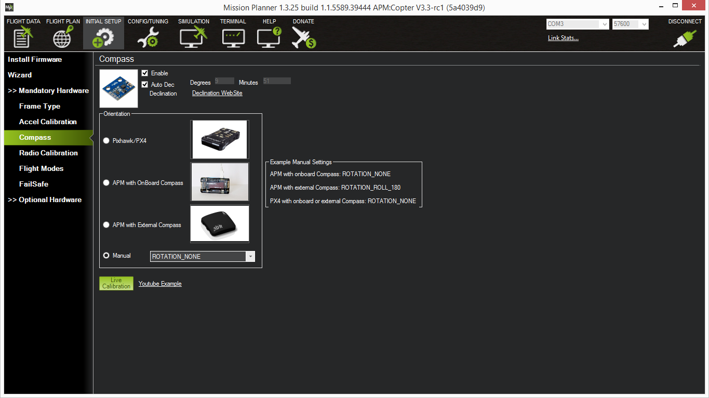

# Using with Pixhawk

<info>
This page is valid for firmware version 2.0 and newer.
Documentation for older versions is
[available here](https://old-docs.zubax.com/index.php?title=Zubax_GNSS_tutorial:_Using_with_Pixhawk&action=history).
Update instructions are [available here](http://zubax.com/news/zubax-gnss-firmware-update-v20).
</info>

## Overview

This tutorial shows how to connect and use [Zubax GNSS](/zubax_gnss) with [Pixhawk](http://pixhawk.org)
running APM or the native PX4 firmware.

Zubax GNSS can be set up for use with any other [UAVCAN](http://uavcan.org)-enabled system in a very similar way.

### Parts needed

Aside from Zubax GNSS itself and the Pixhawk it will be connected to, the following parts are needed:

* A **UAVCAN Micro to DF13 adapter cable**
* A **UAVCAN Micro termination plug** *(two plugs if the bus is doubly redundant)*

Also, in order to configure the board, *either* of these tools are needed:

* A **USB-UART bridge with a CLIK-Mate connector** - for configuring via the auxiliary serial port
* A PC CAN adapter, e.g., 8devices USB2CAN - for configuring via [UAVCAN](/uavcan)

The parts listed above in bold font can be purchased from [Zubax distributors](http://zubax.com/sales-network).
Alternatively, customers can choose to manufacture the needed cables/plugs on their own in order to suit some
custom needs, in which case they should refer to the relevant documentation for details.

## Configuring Zubax GNSS

<info>
If you're using PX4 flight software, Zubax GNSS will be able to auto-configure itself, so this step can be skipped.
</info>

If you're using APM, the default configuration should be changed manually as follows:

* The parameter `uavcan_node_id` needs to be set to an appropriate unique value to avoid Node ID conflicts
* Possibly, some functionality that is disabled by default needs to be enabled
(such as the time synchronization master or the air data sensor)

Connect the interface, open CLI, then execute:

```
cfg set uavcan.node_id 50
```

This command will set the Node ID to 50.

Save the configuration into the non-volatile memory:

```
cfg save
```

An error like `ublox: Invalid checksum` may appear,
which is expected because non-volatile memory IO disrupts other IO operations.

Now, restart the device in order to apply the new parameters:

```
reset
```

Configuration is complete.

## Configuring Pixhawk with APM firmware

UAVCAN is supported in the following APM firmwares:

* ArduPlane 3.2.1 and newer
* ArduCopter 3.3rc1 and newer

UAVCAN driver is enabled in APM by default, but it is necessary to change some configuration parameters
to make APM listen to external UAVCAN-connected sensors.
The following chapters assume that Mission Planner is installed on the user's computer,
and that Pixhawk is otherwise properly configured.

Remember that it may be necessary to restart Pixhawk before the changes take full effect.

### GPS

In order to make APM receive measurements from an UAVCAN-interfaced GNSS receiver, set the parameter `GPS_TYPE` to 9.


### Compass

In order to make APM receive measurements from an UAVCAN-interfaced compass, open the tab `INITIAL SETUP`,
then select `Mandatory Hardware` &rarr; `Compass`. On the displayed page:

* Check the checkbox `Enable`.
* In the Orientation frame, select the option `Manual`, `ROTATION_NONE`.
You may need to select a different rotation if the arrow printed on Zubax GNSS is not aligned with
vehicle's longitudinal axis.



Don't forget to perform compass calibration when done.

### Barometer

APM does not have proper support for external barometers, so proposed solution is a bit hackish, but it still works.
This modification is not required if external barometer is not needed.
Also, make sure that [the barometer is enabled on Zubax GNSS](/zubax_gnss#Configuration_parameters).

Power off the Pixhawk, extract its microSD card and mount it on a computer.
Create a file `etc/rc.txt` on the card and put the following script in it:

```bash
# uORB will be started again by the main init script later, it's OK
if uorb start
then
    echo "ext: uORB started"
    if uavcan start 1
    then
        echo "ext: UAVCAN started"
    else
        echo "ext: Could not start UAVCAN"
    fi
else
    echo "ext: Could not start uORB"
fi

# This delay allows UAVCAN to pick external sensors before internal ones
sleep 8
```

Insert the card back into Pixhawk.

Done, now the Pixhawk will be using barometer installed on Zubax GNSS,
provided that Zubax GNSS was connected to the bus at the time of boot;
otherwise it will fall back to internal barometer.

## Configuring Pixhawk with PX4 firmware

Set the configuration parameter `UAVCAN_ENABLE` to 2, then reboot.

<info>All other GNSS drivers must be disabled.</info>

Please refer to the [Pixhawk documentation](http://pixhawk.org/firmware/apps/uavcan) for extra info.

## Connecting

Since Zubax GNSS can be powered directly from the bus, the electrical connections are quite simple:

1. Connect Zubax GNSS with Pixhawk using the appropriate cable
(see the [overview section for details about which cable is appropriate in your case](#Overview)).
In case you're using a non-redundant CAN interface (which is the only available option for Pixhawk v1),
only CAN1 must be used, leaving CAN2 empty.
2. Insert the termination plug into another connector of the used CAN interface on the Zubax GNSS.

Now the setup is ready to work.

## Links

* [Zubax GNSS](/zubax_gnss)
* [Zubax GNSS product page](http://zubax.com/product/zubax-gnss)
* [Where to buy parts](http://zubax.com/sales-network)
