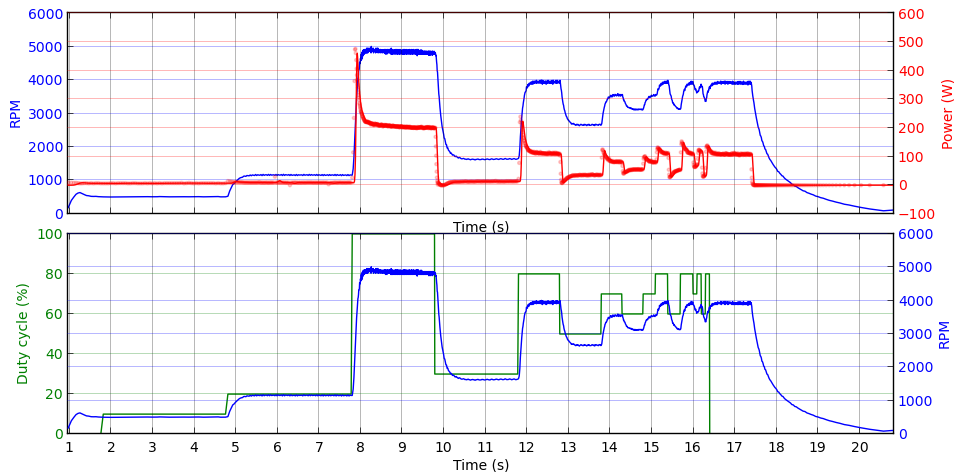
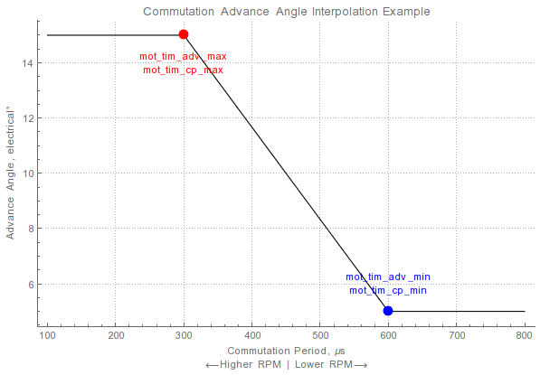

# PX4 Sapog BLDC Controller Firmware

PX4 Sapog is an advanced open source multiplatform BLDC motor controller firmware for electric aerial vehicles.

The source git repository and developer documentation are located at <https://github.com/PX4/sapog>.

## Overview

### Design goals

The Sapog firmware has been designed with the following core design goals in mind.

#### High reliability

The firmware employs a reliable multi-point back EMF sensing method with least squares fitting that enables
precise and reliable tracking of the rotor position.
Health of the power stage is monitored during operation and at power on, and reported via
doubly redundant CAN bus.

#### Good response characteristics

Sapog has been designed with multirotor applications in mind, where good response characteristics are
critical.
This is achieved by the reliable rotor position tracking algorithm and capability of regenerative braking.

### Hardware requirements

The Sapog firmware can be used with any hardware based on the microcontroller STM32F105RCT with compatible
wiring.
The wiring diagram will be published soon.

## Self-diagnostics

The firmware maps its status and the hardware health onto the following set of health and mode codes.

### Operating modes

- `INITIALIZATION` - The firmware is initializing.
- `OPERATIONAL` - The firmware is operating.
- `SOFTWARE_UPDATE` - The firmware is updating itself via the bootloader.

### Health codes

- `OK` - This status code is reported when the firmware and the hardware are functioning normally.
- `CRITICAL` - This status code is reported if any of the following conditions are true:
    - The motor cannot be started.
    - The temperature sensor is not responding correctly.

In the mode `SOFTWARE_UPDATE`, the following health codes are used:

- `OK` - Everything is OK.
- `CRITICAL` - Firmware update has failed; another attempt will be made soon.

### Power-on self test

Sapog performs a self test after powering on.
If the self test was successfull, the firmware will enter the normal operating mode.
If the self test was unsuccessful, detailed information will be printed to the CLI,
the firmware will abort initialization, and then it will reboot a few seconds later.
The reboot loop will continue indefinitely until the cause of the self test failure is removed.

The following components are tested during the self test:

- Power stage drivers and transistors.
- Back EMF sensing channels.
- Cross-phase short circuit (only if the motor is not connected).

## Configuration parameters

Valid range and default values for each parameter can be retrieved using the communication interfaces
documented below (CAN, UART).
Also note that the list below may not present complete list of all available parameters.

### Motor control settings

Duty cycle is defined in the range [0, 1]. All RPM refers to mechanical RPM.

#### High-level settings

##### `mot_v_min`

Minimum phase voltage needed for stable rotation of the motor.

Units: Volts.

##### `mot_dc_accel`

Maximum step change of the duty cycle.
If larger change is requested, slope pacing will be used.

Units: duty cycle units.

##### `mot_dc_slope`

If change of the duty cycle larger than `mot_dc_accel` is requested, the controller
will pace the duty cycle change at the rate defined by this configuration parameter.

Units: duty cycle units per second.
E.g. value 2 defines that the controller will pace the duty cycle from 0 to 1 in 0.5 seconds.

##### `mot_num_poles`

Number of magnetic poles in the motor.
Must be an even number.

##### `ctl_dir`

Direction of rotation: 1 - forward, 0 - reverse.

##### `mot_rpm_min`

Minimum mechanical RPM needed for stable rotation of the motor.

Units: RPM.

##### `mot_i_max`

Maximum DC motor current.

Units: Amperes.

##### `mot_i_max_p`

Motor current limiting factor, in the form of the duty cycle reduction per every Ampere above the limit.

Units: duty cycle units per Ampere.

##### `mot_lpf_freq`

Voltage and current low-pass filter corner frequency.

Units: Hertz.

##### `mot_stop_thres`

Number of unsuccessfull attemts to start the motor before locking up.

The lock can be removed by setting the target duty cycle or RPM to zero.

#### BLDC commutation settings

##### `mot_pwm_hz`

Motor PWM frequency.

Units: Hertz.

##### `mot_i_shunt_mr`

Resistance of the current shunt.

Units: milliohm.

##### `mot_tim_adv_min`

Minimum commutation advance angle.

Refer to `mot_tim_adv_max` for more info.

Units: angular degrees electrical.

##### `mot_tim_adv_max`

Maximum commutation advance angle.

The angle is specified in electrical degrees; one electrical degree is equivalent to 3 phase degrees.
For example, 90&deg; of phase advance is equivalent to 30&deg; of electrical advance.

Refer to `mot_tim_cp_min` and `mot_tim_cp_max` for even more info.

Contract: `mot_tim_adv_max` &ge; `mot_tim_adv_min`.

Units: angular degrees electrical.

##### `mot_tim_cp_min`

When the commutation period is **longer** than this value, the **minimum** advance angle will be used
(see `mot_tim_adv_min`).

Refer to `mot_tim_cp_max` for more info.

Units: microseconds.

##### `mot_tim_cp_max`

When the commutation period is **shorter** than this value, the **maximum** advance angle will be used
(see `mot_tim_adv_max`).

When the commutation period is between `mot_tim_cp_max` and `mot_tim_cp_min`, the advance angle will be
proportionally linearly interpolated between `mot_tim_adv_min` and `mot_tim_adv_max`.
The interpolation feature allows the controller to use low advance angles at low RPM,
and high advance angles at high RPM,
which allows to significantly extend the range of stable operating RPM of the motor.

Contract: `mot_tim_cp_max` &le; `mot_tim_cp_min`.

Units: microseconds.

##### `mot_blank_usec`

Blank time after commutation.

Units: microseconds.

##### `mot_bemf_win_den`

Refer to the implementation.

##### `mot_bemf_range`

Refer to the implementation.

##### `mot_zc_fails_max`

When this number of successive zero cross detection failures is reached, the motor will be stopped.

##### `mot_zc_dets_min`

When this number of successful zero crossings is detected, the motor is assumed to have reached
stable RPM.

##### `mot_comm_per_max`

Maximum commutation period.

Units: microseconds.

#### Spinup settings

##### `mot_spup_to_ms`

If the motor could not reach stable rotation in this time, spinup will be aborted.

Units: milliseconds.

##### `mot_spup_st_cp`

Initial commutation period during spinup.

Units: microseconds.

##### `mot_spup_en_cp`

Final commutation period during spinup.

Units: microseconds.

##### `mot_spup_gcomms`

After this number of good zero cross detections the spinup will be considered finished.

##### `mot_spup_dc_inc`

Duty cycle increment during spinup.

Units: duty cycle units.

#### Closed-loop RPM control settings

##### `rpmctl_p`

RPM to duty cycle PID controller - P coefficient.

##### `rpmctl_d`

RPM to duty cycle PID controller - D coefficient.

##### `rpmctl_i`

RPM to duty cycle PID controller - I coefficient.

### RCPWM input settings

##### `pwm_enable`

Whether to enable RCPWM input capture. Disabled by default.

##### `pwm_min_usec`

RCPWM pulse duration that matches zero setpoint.

Units: microseconds.

##### `pwm_max_usec`

RCPWM pulse duration that matches maximum setpoint.

Units: microseconds.

### UAVCAN node settings

See details at the [UAVCAN page](/uavcan) and at <http://uavcan.org>.

#### General

##### `uavcan_node_id`

Node ID of the local UAVCAN node.

#### ESC control

##### `esc_index`

Index of the current ESC.

##### `cmd_ttl_ms`

Command expiration time.

Units: milliseconds.

##### `cmd_start_dc`

The motor will not start if the initial duty cycle value was above this value.

#### Indication control

##### `light_index`

Index of the current ESC's RGB LED.

## UAVCAN interface

This section describes the properties specific for this product only.
For general info about the UAVCAN interface, please refer to the [UAVCAN interface documentation page](/uavcan).

<info>If Sapog is used in a setup with non-redundant CAN bus, only CAN1 must be used.</info>

UAVCAN node name: `io.px4.sapog`.

### Messages

#### Input messages

##### `uavcan.equipment.esc.RawCommand`

Sets the duty cycle (open loop) set point.

##### `uavcan.equipment.esc.RPMCommand`

Sets the RPM setpoint (closed loop mode).

##### `uavcan.equipment.indication.BeepCommand`

Makes the ESC beep with the motor windings, with defined frequency and duration.

##### `uavcan.equipment.indication.LightsCommand`

Assigns the RGB LED state.

##### `uavcan.protocol.enumeration.Begin`

Used for automatic motor index identification; refer to the UAVCAN specification for details.

The indication input is implemented through manual rotation of the motor;
the direction of rotation will be remembered and used to initialize the motor reverse.

##### `uavcan.protocol.dynamic_node_id.Allocation`

Used for dynamic node ID allocation; refer to the UAVCAN specification for details.

#### Output messages

##### `uavcan.protocol.NodeStatus`

UAVCAN node status.
Node mode and health codes are mapped durectly onto the UAVCAN node status constants.

##### `uavcan.equipment.esc.Status`

Standard ESC status message.
The following data fields are populated:

- Error count
- Voltage
- Current
- Temperature
- RPM
- Power rating, in percent

##### `uavcan.protocol.enumeration.Indication`

Used for automatic motor index identification; refer to the UAVCAN specification for details.

##### `uavcan.protocol.debug.LogMessage`

Used to publish status reports, e.g. during software update.

##### `uavcan.protocol.dynamic_node_id.Allocation`

Used for dynamic node ID allocation; refer to the UAVCAN specification for details.

### Services

#### Node control servers

##### `uavcan.protocol.GetNodeInfo`

##### `uavcan.protocol.GetTransportStats`

##### `uavcan.protocol.RestartNode`

##### `uavcan.protocol.file.BeginFirmwareUpdate`

Request arguments will be ignored;
the device will reboot into the bootloader shortly after receiving request.

#### Configuration control servers

##### `uavcan.protocol.param.GetSet`

Configuration parameters are described later in this document.

##### `uavcan.protocol.param.ExecuteOpcode`

This service must not be invoked while the motor is running.

## RCPWM interface

RCPWM input features:

- Can be disabled completely (refer to configuration parameters).
- Pulse width range from 1 ms to 2 ms (configurable).
- Safety feature - the motor will not start if the setpoint went straight to a high value.

## Serial CLI

<info>
It is recommended to use [Zubax DroneCode Probe](/dronecode_probe) to access the CLI.
</info>

### Parameters

- Baudrate: 115200
- Word width: 8
- Parity: no
- Stop bits: 1
- Echo enabled

The board prints diagnostic info at power on, which can be used for troubleshooting.

### Basic commands

- `help` - Get basic usage info.
- `cfg` - Change, save or reset the board configuration.
    - `cfg help` - Crash course on command usage.
- `dc` - Set duty cycle.
    - `dc arm` - Needs to be executed once before the command can be used.
    - `dc X` - Set duty cycle to (X * 100) percent, e.g. 0.5 for 50%
    - `dc` - Stop.
- `rpm` - Set RPM setpoint.
    - `rpm arm` - Needs to be executed once before the command can be used.
    - `rpm X` - Set RPM setpoint to X RPM.
    - `rpm` - Stop.
- `test` - Run the self test.
- `stat` - Print the basic motor control state (RPM, duty cycle, mode, voltage, current).

## Indication

### Sound

Note that sound indication only works if the motor is connected.

After power on:

- Two short high-pitched beeps - Self test OK, ready to work.
- One short low-pitched beep every few seconds - Self test failed, the motor will not start.

### RGB LED

State           | Meaning
----------------|----------------------------------------------------------------------------------
Solid white     | Initialization is in progress, not ready to work yet
Solid green     | Everything is OK
Blinking cyan   | UAVCAN auto-enumeration is in progress, awaiting confirmation
Solid yellow    | Unable to start the motor (e.g. rotor is stuck)
Solid red       | Fatal error, or self test failure. Use CLI to obtain detailed info

Note that if the LED is being controlled externally (e.g. via UAVCAN), the firmware won't indicate its status via LED in order to not interfere with external LED commands.

While the firmware update is in progress, LED indication is different. **TODO: document.**
