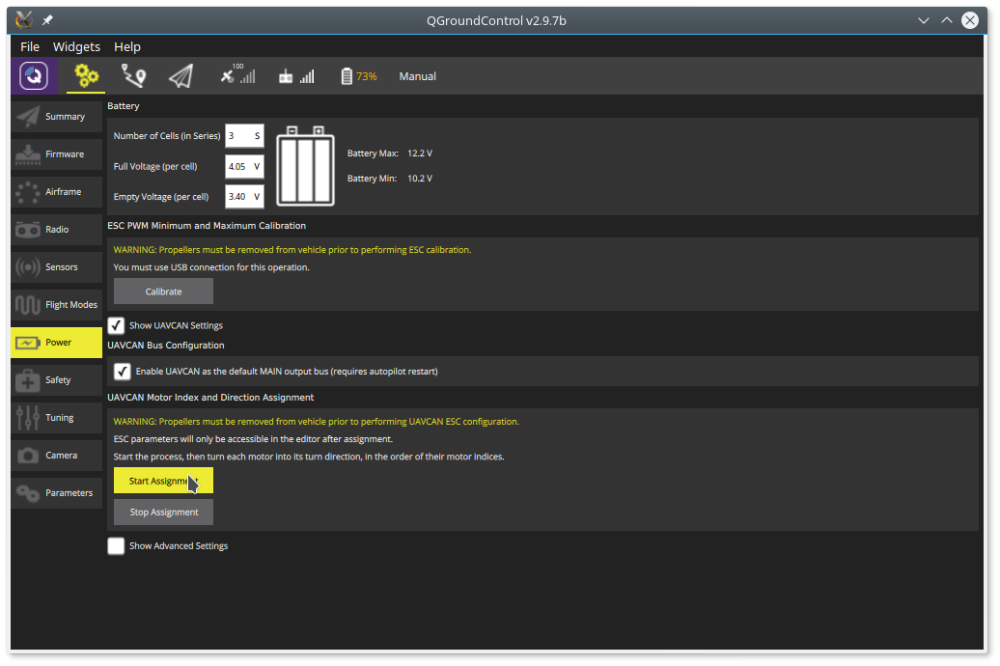

# Using with PX4 Flight Stack

This article demonstrates how to install [Sapog](/sapog)-based ESC into a UAV controlled by the
[PX4 Flight Stack](http://px4.io).
Autopilots based on the PX4 Flight Stack include Pixhawk, Pixracer, and many others.

The concepts explained here are applicable to any Sapog-based ESC design, such as [Zubax Orel 20](/zubax_orel_20).

## Connecting

Connect all of the on-board CAN devices into a daisy chain and make sure the bus is terminated at the end nodes.
The order in which ESC are chained does not matter.
More information about proper bus connections can be gathered from the [UAVCAN documentation page](/uavcan).

## Configuring Sapog

PX4 supports the automatic ESC enumeration feature, so no manual configuration is needed.
You may need to [perform some tuning pertaining to the motor control characteristics](/sapog/tuning) though,
but that task is out of the scope of this tutorial, and you may do that later.

The theory behind the process of auto-enumeration can be learned from the [UAVCAN specification](http://uavcan.org).
A hands-on example from the developer perspective can be found on the page dedicated to
[direct control via UAVCAN](/sapog/direct_control_via_uavcan).

During auto-enumeration, the following configuration parameters will be assigned:

* `esc_index`
* `ctl_dir`

Learn more about configuration parameters on the [main page](/sapog).

## Configuring the flight controller

First of all, make sure the PX4 stack is of version 1.4.2 or newer.

Power on the UAV (powering on only the flight controller is not sufficient!),
connect [QGroundControl](http://qgroundcontrol.com) to the UAV, and navigate to the settings tab.

### Enabling the UAVCAN driver

Set the configuration parameter `UAVCAN_ENABLE` to `Motors/Update` (the corresponding numeric value is 3),
then reboot the flight controller.

### Enumerating the ESC

You can skip this section if there is only one ESC in your setup,
because the ESC index is already set to zero by default.

Start the process of ESC auto-enumeration as shown on the screenshot below:

You will hear a sound indication that the flight controller has entered the ESC enumeration mode.
After that, manually turn each motor in the correct direction of its rotation,
starting from the first motor and finishing with the last motor.
Make sure to turn each of the motors in the correct direction,
because the ESC will automatically learn and remember it
(i.e. motors that spin clockwise during normal operation must also be turned clockwise during enumeration).
Each time you turn a motor, you will hear a sound confirmation.
After the last motor is enumerated, the confirmation sound will be different,
hinting you that the procedure is now completed.

See this video: <https://youtu.be/4nSa8tvpbgQ>

## See also

PX4 documentation portal: [px4.io](http://px4.io) and [pixhawk.org](http://pixhawk.org).

If you have any questions, bring them to the [support forum](https://productforums.zubax.com).
