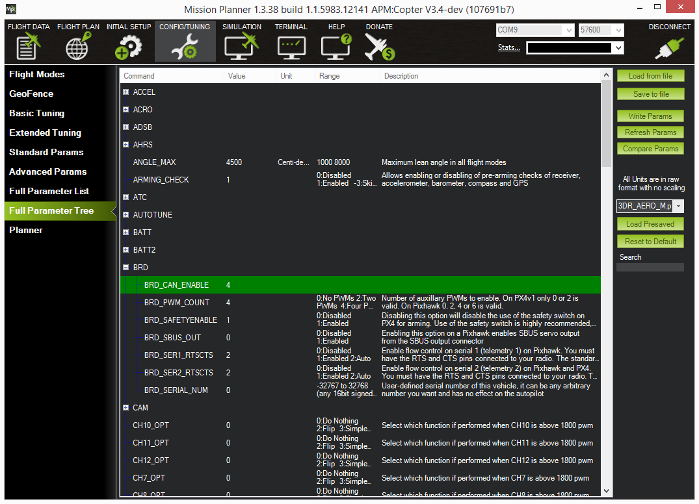
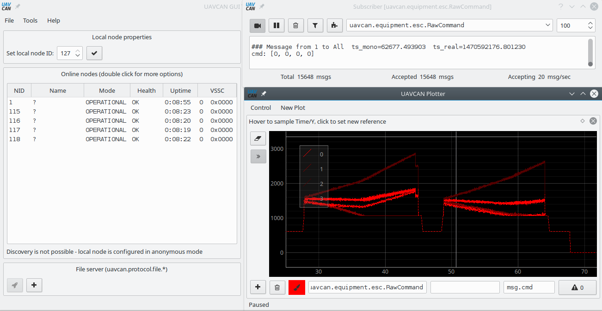

# Using with ArduPilot

This article demonstrates how to install [Sapog](/sapog)-based ESC into a UAV controlled by
[ArduPilot](http://ardupilot.org).
The concepts explained here are applicable to any Sapog-based ESC design, such as [Zubax Orel 20](/zubax_orel_20).

## Connecting

Connect all of the on-board CAN devices into a daisy chain and make sure the bus is terminated at the end nodes.
The order in which ESC are chained does not matter.
More information about proper bus connections can be gathered from the [UAVCAN documentation page](/uavcan).

## Configuring Sapog


At the time of writing this tutorial, ArduPilot did not support automatic ESC enumeration,
so we'll need to assign ESC indices manually,
unless you're using only one ESC, in which case you can skip this section.
Besides assigning ESC indices, you may also need to
[perform some tuning pertaining to the motor control characteristics](/sapog/tuning),
but that task is out of the scope of this tutorial, and you may do that later.

The ESC index, like any other configuration parameter, can be changed either via
<abbr title="Command Line Interface">CLI</abbr> or via UAVCAN, e.g. using the
[UAVCAN GUI Tool](https://github.com/UAVCAN/gui_tool).

If you chose to use the UAVCAN GUI Tool,
refer to its documentation to learn how to change configuration parameters using it.

If you prefer CLI, you will need a [DroneCode Probe](/dronecode_probe) to connect to the
debug port of your ESC ([here's how to connect](/usb#How_to_connect)).
Once connected, execute the following commands on each ESC, using the correct values for the ESC index:

```
ch> cfg set esc_index 2
esc_index        = 2
ch> cfg save
ch> reboot
```

You may also want to set the parameter `ctl_dir` to change the direction of rotation to the opposite.

## Configuring the flight controller

You will need a version of ArduPilot that is not older than the ones specified below:

* ArduCopter 3.4
* ArduPlane 3.5

Set the configuration parameter `BRD_CAN_ENABLE` to the value of 3, then reboot the flight controller
(at the time of writing this,
the documentation of ArduPilot wrongly stated that the only valid values of `BRD_CAN_ENABLE` are 0 and 1;
this is not true).

If you're using MissionPlanner <abbr title="Ground Control Station">GCS</abbr>,
you will see something like this:



### Checking the configuration

This part is entirely optional.
You may use the UAVCAN GUI Tool to check what ESC setpoints are being sent to the bus by the flight controller:



## See also

ArduPilot documentation portal: [ardupilot.org](http://ardupilot.org/).

A somewhat related article on the ArduPilot website: <http://ardupilot.org/copter/docs/common-uavcan-escs.html>.

If you have any questions, bring them to the [support forum](https://productforums.zubax.com).
