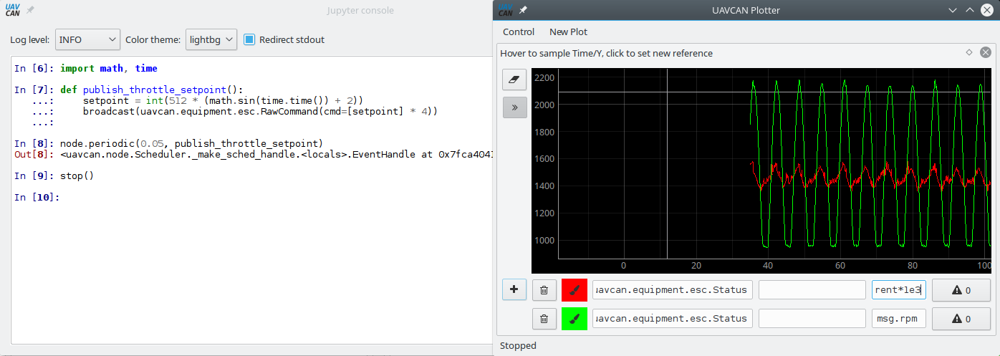

# Directly controlling PX4 Sapog via UAVCAN

This article demonstrates how to control PX4 Sapog (or any other UAVCAN-interfaced ESC) directly via UAVCAN.
It is primarily intended for developers and integrators.

We're going to use [PyUAVCAN](http://uavcan.org/Implementations/Pyuavcan/) - a Python implementation of the
[UAVCAN stack](http://uavcan.org).
The concepts covered here are still valid for UAVCAN in general, so the explained here basics can be applied
equally well to other implementations of the UAVCAN stack in other languages.

## Getting dependencies

We're going to need the following hardware:

* A general purpose computer running Linux, Windows, or OSX.
* A CAN adapter supported by PyUAVCAN, e.g. Zubax Babel.
* An ESC running the Sapog firmware, or any other UAVCAN interfaced ESC.

Make sure that the following dependencies are installed on the computer:

* Python 3.4 or newer, or just [UAVCAN GUI Tool](https://github.com/UAVCAN/gui_tool).
* PyUAVCAN; install as follows: `pip install uavcan` (skip this if you're using UAVCAN GUI Tool).

## Writing the script

One code sample is worth 1024 words:

```python
import uavcan, time, math

# Initializing UAVCAN node instance
node = uavcan.make_node('/dev/ttyACM0', node_id=1, bitrate=1000000)

# Initializing a dynamic node ID allocator
node_monitor = uavcan.app.node_monitor.NodeMonitor(node)
dynamic_node_id_allocator = uavcan.app.dynamic_node_id.CentralizedServer(node, node_monitor)

# Waiting for at least one ESC to appear online
while len(dynamic_node_id_allocator.get_allocation_table()) <= 1:
    print('Waiting for other nodes to become online...')
    print(dynamic_node_id_allocator.get_allocation_table())
    node.spin(timeout=1)

# Publishing setpoint values from this function; it is invoked periodically from the node thread
def publish_throttle_setpoint():
    # Generating a sine wave
    setpoint = int(512 * (math.sin(time.time()) + 2))
    # Commanding ESC with indices 0, 1, 2, 3 only
    commands = [setpoint, setpoint, setpoint, setpoint]
    message = uavcan.equipment.esc.RawCommand(cmd=commands)
    node.broadcast(message)

# This is how we invoke the publishing function periodically
node.periodic(0.05, publish_throttle_setpoint)

# Printing ESC status message into stdout
node.add_handler(uavcan.equipment.esc.Status, lambda msg: print(uavcan.to_yaml(msg)))

# Running the node until the application is terminated or until first error
node.spin()
```

It is also possible to control ESC directly from the interactive console of the
[UAVCAN GUI Tool](https://github.com/UAVCAN/gui_tool).
In that case you won't need to create a new node yourself in the script - just use the application's own node,
it is accessible from the interactive console.
For details, please read the documentation of the UAVCAN GUI Tool.



## Running the script

Save the code somewhere and run it.
The connected ESC will be changing their RPM in a sine pattern, slowly accelerating and decelerating.
The script will print output similar to this:

```
### Message from 124 to All  ts_mono=19376.645693  ts_real=1470440665.872391
error_count: 0
voltage: 13.2812
current: 1.3379
temperature: nan
rpm: 1514
power_rating_pct: 13
esc_index: 3
```
