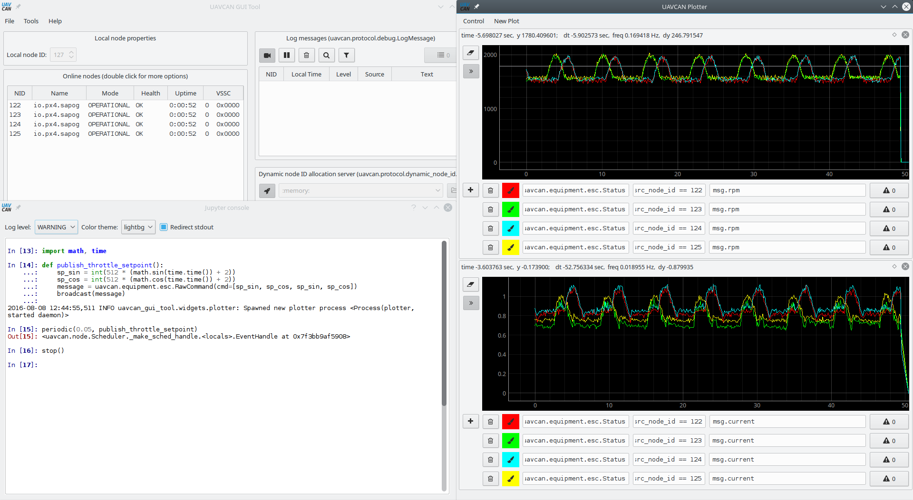

# Directly controlling PX4 Sapog via UAVCAN

This article demonstrates how to control PX4 Sapog (or any other UAVCAN-interfaced ESC) directly via UAVCAN.
It is primarily intended for developers and integrators.

We're going to use [PyUAVCAN](http://uavcan.org/Implementations/Pyuavcan/) - a Python implementation of the
[UAVCAN stack](http://uavcan.org).
The concepts covered here are still valid for UAVCAN in general, so the explained here basics can be applied
equally well to other implementations of the UAVCAN stack in other languages.

The reader is assumed to be well familiar with the [UAVCAN specification](http://uavcan.org) and Python.

## Getting dependencies

We're going to need the following hardware:

* A general purpose computer running Linux, Windows, or OSX.
* A CAN adapter supported by PyUAVCAN, e.g. [Zubax Babel](/zubax_babel).
* An ESC running the Sapog firmware, or any other UAVCAN interfaced ESC.

Make sure that the following dependencies are installed on the computer:

* Python 3.4 or newer, or just [UAVCAN GUI Tool](http://uavcan.org/GUI_Tool).
* PyUAVCAN; install as follows: `pip install uavcan` (skip this if you're using UAVCAN GUI Tool).

## Controlling throttle setpoint

<info>
Make sure that no other node on the bus (e.g. autopilot) issues contradictory ESC commands concurrently.
</info>

Here we'll write a script that changes ESC setpoints in a sine pattern.

### Writing the script

One code sample is worth 1024 words:

```python
import uavcan, time, math

# Initializing UAVCAN node instance
# In this example we're using an SLCAN adapter on the port '/dev/ttyACM0'
# PyUAVCAN also supports other types of adapters, refer to its docs to learn more
node = uavcan.make_node('/dev/ttyACM0', node_id=10, bitrate=1000000)

# Initializing a dynamic node ID allocator
node_monitor = uavcan.app.node_monitor.NodeMonitor(node)
dynamic_node_id_allocator = uavcan.app.dynamic_node_id.CentralizedServer(node, node_monitor)

# Waiting for at least one other node to appear online (our local node is already online)
while len(dynamic_node_id_allocator.get_allocation_table()) <= 1:
    print('Waiting for other nodes to become online...')
    node.spin(timeout=1)

# Publishing setpoint values from this function; it is invoked periodically from the node thread
def publish_throttle_setpoint():
    # Generating a sine wave
    setpoint = int(512 * (math.sin(time.time()) + 2))
    # Commanding ESC with indices 0, 1, 2, 3 only
    commands = [setpoint, setpoint, setpoint, setpoint]
    message = uavcan.equipment.esc.RawCommand(cmd=commands)
    node.broadcast(message)

# This is how we invoke the publishing function periodically
node.periodic(0.05, publish_throttle_setpoint)

# Printing ESC status message into stdout
node.add_handler(uavcan.equipment.esc.Status, lambda msg: print(uavcan.to_yaml(msg)))

# Running the node until the application is terminated or until first error
node.spin()
```

### Running the script

Save the code somewhere and run it.
The connected ESC will be changing their RPM in a sine pattern, slowly accelerating and decelerating.
The script will print output similar to this:

```
### Message from 124 to All  ts_mono=19376.645693  ts_real=1470440665.872391
error_count: 0
voltage: 13.2812
current: 1.3379
temperature: 313.15
rpm: 1514
power_rating_pct: 13
esc_index: 3
```

### Using UAVCAN GUI Tool

It is also possible to control ESC directly from the interactive console of the
[UAVCAN GUI Tool](https://github.com/UAVCAN/gui_tool).
In that case you won't need to create a new node yourself in the script - just use the application's own node,
it is accessible from the interactive console.
For details, please read the documentation of the UAVCAN GUI Tool.



## Automatically enumerating ESC

Here we'll show how the automatic enumeration feature works from the inside.
You may find this video interesting: <https://youtu.be/4nSa8tvpbgQ>.

### Writing the script

Here we go:

```python
import uavcan, time

# Initializing UAVCAN node instance
# In this example we're using an SLCAN adapter on the port '/dev/ttyACM0'
# PyUAVCAN also supports other types of adapters, refer to its docs to learn more
node = uavcan.make_node('/dev/ttyACM0', node_id=10, bitrate=1000000)

# Initializing a dynamic node ID allocator
node_monitor = uavcan.app.node_monitor.NodeMonitor(node)
dynamic_node_id_allocator = uavcan.app.dynamic_node_id.CentralizedServer(node, node_monitor)

# Waiting until new nodes stop appearing online
def wait_for_all_nodes_to_become_online():
    num_nodes = 0
    while True:
        node.spin(timeout=10)
        new_num_nodes = len(dynamic_node_id_allocator.get_allocation_table())
        if new_num_nodes == num_nodes and num_nodes > 1:
            break
        num_nodes = new_num_nodes

print('Waiting for all nodes to appear online, this should take less than a minute...')
wait_for_all_nodes_to_become_online()
print('Online nodes:', [node_id for _, node_id in dynamic_node_id_allocator.get_allocation_table()])

# Determining how many ESC nodes are present
# In real use cases though the number of ESC should be obtained from elsewhere, e.g. from control mixer settings.
# There is a helper class in PyUAVCAN that allows to automate what we're doing here,
# but we're not using it for the purposes of greater clarity of what's going on on the protocol level.
def detect_esc_nodes():
    esc_nodes = set()
    handle = node.add_handler(uavcan.equipment.esc.Status, lambda event: esc_nodes.add(event.transfer.source_node_id))
    try:
        node.spin(timeout=3)            # Collecting ESC status messages, thus determining which nodes are ESC
    finally:
        handle.remove()
    return esc_nodes

print('Detecting ESC nodes...')
esc_nodes = detect_esc_nodes()
print('ESC nodes:', esc_nodes)

# Enumerating ESC
# In this example we're using blocking code for simplicity reasons,
# but real applications will most likely resort either to asynchronous code (callback-based),
# or implement the logic in a dedicated thread.
# Conversion of the code from synchronous to asynchronous/multithreaded pertains to the domain of general
# programming issues, so these questions are not covered in this demo.
def enumerate_all_esc(esc_nodes, timeout=60):
    begin_responses_succeeded = 0
    def begin_response_checker(event):
        nonlocal begin_responses_succeeded
        if not event:
            raise Exception('Request timed out')
        if event.response.error != event.response.ERROR_OK:
            raise Exception('Enumeration rejected\n' + uavcan.to_yaml(event))
        begin_responses_succeeded += 1

    overall_deadline = time.monotonic() + timeout

    print('Starting enumeration on all nodes...')
    begin_request = uavcan.protocol.enumeration.Begin.Request(timeout_sec=timeout)
    for node_id in esc_nodes:
        print('Sending enumeration begin request to', node_id)
        node.request(begin_request, node_id, begin_response_checker)

    while begin_responses_succeeded < len(esc_nodes):
        node.spin(0.1)

    print('Listening for indications...')
    enumerated_nodes = []
    next_index = 0
    while set(enumerated_nodes) != esc_nodes:
        received_indication = None

        def indication_callback(event):
            nonlocal received_indication
            if event.transfer.source_node_id in enumerated_nodes:
                print('Indication callback from node %d ignored - already enumerated' % event.transfer.source_node_id)
            else:
                print(uavcan.to_yaml(event))
                received_indication = event

        indication_handler = node.add_handler(uavcan.protocol.enumeration.Indication, indication_callback)
        print('=== PROVIDE ENUMERATION FEEDBACK ON ESC INDEX %d NOW ===' % next_index)
        print('=== e.g. turn the motor, press the button, etc, depending on your equipment ===')
        try:
            while received_indication is None:
                node.spin(0.1)
                if time.monotonic() > overall_deadline:
                    raise Exception('Process timed out')
        finally:
            indication_handler.remove()
        target_node_id = received_indication.transfer.source_node_id
        print('Indication received from node', target_node_id)

        print('Stopping enumeration on node', target_node_id)
        begin_responses_succeeded = 0
        node.request(uavcan.protocol.enumeration.Begin.Request(), target_node_id, begin_response_checker)
        while begin_responses_succeeded < 1:
            node.spin(0.1)

        print('Setting config param %r to %r...' % (received_indication.message.parameter_name.decode(), next_index))
        configuration_finished = False

        def param_set_response(event):
            if not event:
                raise Exception('Request timed out')
            assert event.response.name == received_indication.message.parameter_name
            assert event.response.value.integer_value == next_index
            print(uavcan.to_yaml(event))
            node.request(uavcan.protocol.param.ExecuteOpcode.Request(
                             opcode=uavcan.protocol.param.ExecuteOpcode.Request().OPCODE_SAVE),
                         target_node_id,
                         param_opcode_response)

        def param_opcode_response(event):
            nonlocal configuration_finished
            if not event:
                raise Exception('Request timed out')
            print(uavcan.to_yaml(event))
            if not event.response.ok:
                raise Exception('Param opcode execution rejected\n' + uavcan.to_yaml(event))
            else:
                configuration_finished = True

        node.request(uavcan.protocol.param.GetSet.Request(value=uavcan.protocol.param.Value(integer_value=next_index),
                                                          name=received_indication.message.parameter_name),
                     target_node_id,
                     param_set_response)

        while not configuration_finished:
            node.spin(0.1)

        print('Node', target_node_id, 'assigned ESC index', next_index)
        next_index += 1
        enumerated_nodes.append(target_node_id)
        print('Enumerated so far:', enumerated_nodes)

    return enumerated_nodes

enumerated_esc = enumerate_all_esc(esc_nodes)

print('All ESC enumerated successfully; index order is as follows:', enumerated_esc)
```

### Running the script

Connect ESC to the CAN bus
(it's better to use multiple ESC, otherwise the auto-enumeration procedure becomes rather pointless),
start the script, and follow its instructions.

For each ESC you will see the output similar to this:

```
=== PROVIDE ENUMERATION FEEDBACK ON ESC INDEX 0 NOW ===
=== e.g. turn the motor, press the button, etc, depending on your equipment ===
### Message from 124 to All  ts_mono=94836.894482  ts_real=1470647890.850445
value:
  empty:
    {}
parameter_name: 'esc_index' # [101, 115, 99, 95, 105, 110, 100, 101, 120]
Indication received from node 124
Stopping enumeration on node 124
Setting config param 'esc_index' to 0...
### Response from 124 to 10  ts_mono=94837.077415  ts_real=1470647891.033378
value:
  integer_value: 0
default_value:
  integer_value: 0
max_value:
  integer_value: 15
min_value:
  integer_value: 0
name: 'esc_index' # [101, 115, 99, 95, 105, 110, 100, 101, 120]
### Response from 124 to 10  ts_mono=94837.122424  ts_real=1470647891.078387
argument: 0
ok: true
Node 124 assigned ESC index 0
Enumerated so far: [124]
```

## Generating audiovisual feedback

Some nodes, Sapog-based ESC in particular, support UAVCAN messages from the namespace `uavcan.indication.*`
that allow to generate arbitrary indications on remote UAVCAN nodes.
Here's how this feature can be invoked from the interactive console of the UAVCAN GUI Tool:

```python
# Beeping at 1kHz for 0.1 seconds
broadcast(uavcan.equipment.indication.BeepCommand(frequency=1000, duration=0.1))

# Beeping at 1kHz for 0.1 seconds every 0.5 seconds for 5 seconds
broadcast(uavcan.equipment.indication.BeepCommand(frequency=1000, duration=0.1), interval=0.5, duration=5)

# Turning all RGB LEDs of index 0 magenta
broadcast(uavcan.equipment.indication.LightsCommand(commands=[
    uavcan.equipment.indication.SingleLightCommand(color=uavcan.equipment.indication.RGB565(red=31,
                                                                                            green=0,
                                                                                            blue=31))]))
```
