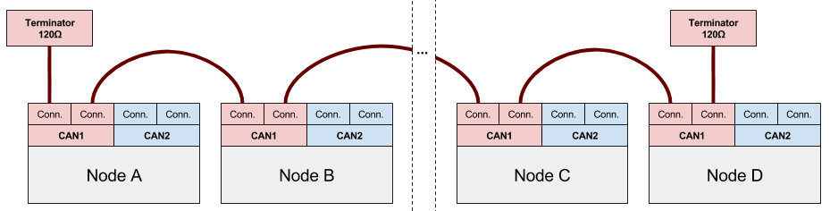
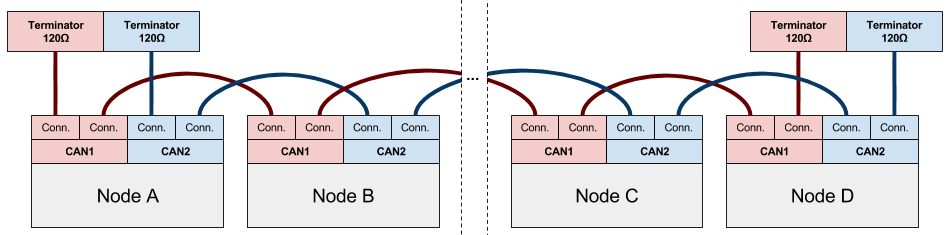
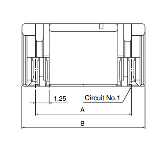

# UAVCAN interface


UAVCAN is a lightweight protocol designed for reliable communication in aerospace and robotic applications via CAN bus.
Zubax Robotics employs UAVCAN as a primary communication interface for many of its products.

The UAVCAN specification is available at [uavcan.org](http://uavcan.org).

## Connectors


Products by Zubax Robotics incorporate two UAVCAN Micro connectors in parallel for each available CAN interface.
Such parallel connection allows to eliminate an external T-connector when attaching the device to a CAN bus.
End nodes of the daisy chain must terminate the bus with 120&#8486; termination resistors,
typically in the form of termination plugs (pictured on the right).

The UAVCAN stack allows to use any redundantly interfaced node with a non-redundant bus by design.
In this case, **only the first interface must be used**, and the redundant interfaces should be simply left unconnected.

Non-redundant bus connection diagram:



Doubly redundant bus connection diagram:



Note that some nodes have embedded termination resistors, and therefore they do not require an
external termination plug on the unused connectors.
Such nodes are sometimes implemented with only one CAN connector, and therefore they
must be placed at the ends of the bus.

If the device incorporates redundant CAN interfaces,
the CAN bus connection circuitry prevents direct current flow between power inputs from different interface connectors,
so that if one bus suffers a power failure (e.g., a short circuit), it won’t affect the other bus.
The power inputs of all available interfaces are always protected by a self-recovering fuse or some other
overcurrent protection circuit.

[More information can be gathered from the relevant part of the UAVCAN specification](http://uavcan.org/Specification/8._Hardware_design_recommendations).

## Cables

This part contains specifications for cables that are widely used with UAVCAN.
Items listed below can be [purchased from our distributors](http://zubax.com/sales-network).

### UAVCAN Micro Patch Cable



A twisted-pair cable with standard UAVCAN Micro plugs (JST GH, 4 circuits) on each end.
Connector pinout is shown below.

Function        | UAVCAN Micro  | Wire                                                          | UAVCAN Micro
----------------|---------------|---------------------------------------------------------------|----------------------
+5 VDC          | 1             |  pair 1 tip    | 1
CAN H           | 2             |  pair 2 ring              | 2
CAN L           | 3             |  pair 2 tip  | 3
GND             | 4             |  pair 1 ring                | 4

Note that some cables may use an alternative wire coloring, in which case the closest available color
should be used instead of the specified one.

#### Manufacturing instructions

##### Parts needed

Part Name                                               | Manufacturer          | Part Number           | Quantity | Notes
--------------------------------------------------------|-----------------------|-----------------------|----------|----------
JST GH plug housing, 4 circuits                         | JST                   | GHR-04V-S             | 2        |
JST GH crimp terminal                                   | JST                   | SSHL-002T-P0.2        | 8        |
Twisted pair cable (see requirements below)             | 3M                    | 1700/10 100SF         | N/A      | Can be replaced with an alternative.

Requirements to the twisted pair cable:

* Type: 4-core 2-pair twisted pair (see note below)
* Wire gauge: #26..30 AWG
* Wire strands: 7 or more
* Wire insulation diameter: 0.8 to 1 mm

It should be noted that most types of USB 2.0 cables would be a perfect fit to the requirements above.
Also there are some types of telephone cable that fit the requirements as well.

Certain applications that use very short CAN bus wiring (typically under two meters),
that are not subject to severe EMI, and/or that do not require high data rates,
may use flat cable instead of twisted pair.

##### Optional tools

Part Name                                               | Manufacturer          | Part Number           | Notes
--------------------------------------------------------|-----------------------|-----------------------|-------------------------------
JST GH hand crimping tool                               | JST                   | YRS-1590              | Can be purchased from DigiKey.

##### Manual assembly instructions

Wire strip requirements:

* Outer insulation strip length (if any): 10 to 20 mm.
* Wire insulation strip length: 1.5 mm.

Perform the following steps:

1. Cut the cable.
2. Strip the insulation on both ends of the cable as described above.
3. Crimp the terminals using hand crimp tool.
4. Insert the terminals into plug housings following the pinout specification above.

### UAVCAN Micro to DF13 Adapter Cable


A 4-wire cable with a standard UAVCAN Micro plug (JST GH, 4 circuits) on one end
and a JST DF13 four-circuit plug (Pixhawk v1 compatible) on the other end.
Connector pinout is shown below.

Function        | UAVCAN Micro  | DF13
----------------|---------------|--------------
+5 VDC          | 1             | 1
CAN H           | 2             | 2
CAN L           | 3             | 3
GND             | 4             | 4

#### Manufacturing instructions

##### Parts needed

Part Name                                               | Manufacturer          | Part Number           | Quantity | Notes
--------------------------------------------------------|-----------------------|-----------------------|----------|----------
JST GH plug housing, 4 circuits                         | JST                   | GHR-04V-S             | 1        |
JST GH crimp terminal                                   | JST                   | SSHL-002T-P0.2        | 4        |
Hirose DF13 plug housing, 4 circuits                    | Hirose Electric       | DF13-4S-1.25C         | 1        |
Wire with crimped Hirose DF13 terminals, 28 AWG, tin plating | Hirose Electric  | H4BXT-10112-W8        | 4        | Can be replaced with an alternative.

Wire requirements:

* Wire gauge: #26..30 AWG
* Wire strands: 7 or more

Note that it is possible to use the same cable type as for UAVCAN Micro Patch Cable.

##### Optional tools

Refer to the UAVCAN Micro Patch Cable assembly specification.

##### Manual assembly instructions

Wire strip requirements on the JST GH side:

* Wire insulation strip length: 1.5 mm.

Perform the following steps:

1. For each of the 4 wires:
    1. Crimp a JST GH terminal on the bare end of the wire using hand crimp tool.
2. Insert the crimped DF13 terminals into a DF13 plug housing.
3. Insert the crimped JST GH terminals into a JST GH plug housing following the pinout specification above.

### UAVCAN Micro Termination Plug

A UAVCAN Micro plug with a 120-&Omega; resistor between the pins CAN H and CAN L.
Connector pinout is shown below.

Function        | UAVCAN Micro  | Resistor
----------------|---------------|---------------
                | 1             |
CAN H           | 2             | Any
CAN L           | 3             | Any
                | 4             |

#### Manufacturing instructions

##### Parts needed

Part Name                                               | Manufacturer          | Part Number           | Quantity | Notes
--------------------------------------------------------|-----------------------|-----------------------|----------|----------
JST GH plug housing, 4 circuits                         | JST                   | GHR-04V-S             | 1        |
JST GH crimp terminal                                   | JST                   | SSHL-002T-P0.2        | 2        |
Low power resistor, 120 &Omega; (see requirements below)| Stackpole Electronics | CF18JT120R            | 1        | Can be replaced with an alternative.
Heat shrink tube (shrink ratio: 3.5&plusmn;0.5 mm &rarr; 0.7&plusmn;0.3 mm) | TE Connectivity | PD-CAP-1/8-0 | 15 mm | Can be replaced with an alternative.

Termination resistor requirements:

* Resistance: 120 &Omega;
* Power: 0.125 W or higher
* Tolerance: &plusmn;5% or better

##### Optional tools

Refer to the UAVCAN Micro Patch Cable assembly specification.

##### Manual assembly instructions

1. Bend one resistor lead at 180&deg; so that it points in the same direction with the other lead.
2. Cut both resistor leads at the same place so that the shortest one would be approximately 3 to 10 mm long.
3. Crimp two JST GH terminals directly on both resistor leads using hand crimp tool.
Relative rotation about the lateral axis between the crimped terminals should not exceed 45&deg;.
4. Do either:
    1. Slip an insulation tube (e.g. a heat shrink tube) on the longer lead.
Make sure the tube prevents the resistor leads from shorting with each other.
    2. Apply some liquid insulating varnish on the longer lead preventing it from shorting with the shorter lead.
    3. Ensure that the shorter resistor lead is less than 5 mm long,
so it can't be deformed enough to short with the longer lead. See the second step.
5. Insert the resistor leads with crimped terminals into a JST GH plug according to the specified pinout.
6. Slip a heat shrink tube on the resistor covering both leads and the resistor itself.
Make sure the tube has at least 3 mm long overhang on the outer side.
7. Apply heat to shrink the insulation.
8. Recommended: Using an ohmmeter ensure that the resistance between the pins 2 and 3 of the plug is within
120&plusmn;10 &Omega;.

### UAVCAN Micro to D-SUB DB9F CAN Adapter Cable


A twisted-pair cable with a standard UAVCAN Micro plug (JST GH, 4 circuits) on one end and
a typical CAN bus connector D-SUB DB9F (female) on the other end.
Connector pinout is shown below.

Function        | UAVCAN Micro  | Wire                                                          | D-SUB DB9F
----------------|---------------|---------------------------------------------------------------|----------------------
+5 VDC          | 1             |  pair 1 tip    | 9
CAN H           | 2             |  pair 2 ring              | 7
CAN L           | 3             |  pair 2 tip  | 2
GND             | 4             |  pair 1 ring                | 3

Note that some cables may use an alternative wire coloring,
in which case the closest available color should be used instead of the specified one.

Cable requirements: see [UAVCAN Micro Patch Cable](#UAVCAN_Micro_Patch_Cable).

## Node identification

All products by Zubax Robotics support the standard UAVCAN service `uavcan.protocol.GetNodeInfo`.
The response field `name` always contains a string that starts with `com.zubax.`,
immediately followed by the node name in lowercase with an underscore as a word separator.
For instance, a device named "Sub-Etha Sens-O-Matic" may have the following name string:

```
com.zubax.subetha_sensomatic
```

Please refer to your product's documentation for its node name string value.

The following version information is always provided via `uavcan.protocol.GetNodeInfo` by all products:

* Hardware version number, major and minor
* 128-bit unique hardware ID
* Software version number, major and minor
* Software VCS commit hash
