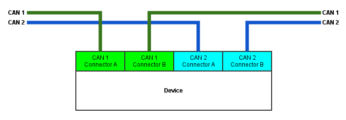
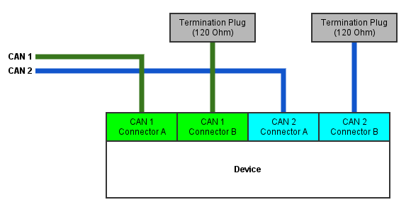
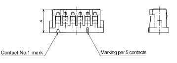
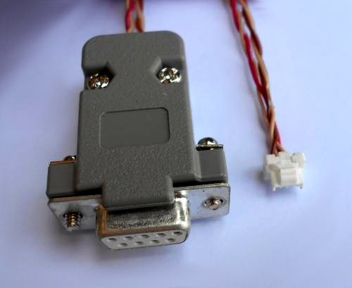

# UAVCAN interface


UAVCAN is a lightweight protocol designed for reliable communication in aerospace and robotic applications via CAN bus.
Zubax Robotics employs UAVCAN as a primary communication interface for many of its products.

The UAVCAN specification is available at [uavcan.org](http://uavcan.org).

## Connectors


Products by Zubax Robotics incorporate two UAVCAN Micro connectors in parallel for each available CAN interface.
Such parallel connection allows to eliminate an external T-connector when attaching the device to a CAN bus.



If a given CAN node is the last node of the bus, it must terminate the bus with termination plugs,
as shown in the diagram below.



If the device incorporates redundant CAN interfaces,
the CAN bus connection circuitry prevents direct current flow between power inputs from different interface connectors,
so that if one bus suffers a power failure (e.g., a short circuit), it won’t be propagated to the other bus.
The power inputs of all available interfaces are always protected by a self-recovering fuse or some other
overcurrent protection circuit.

[UAVCAN Micro connector documentation and pinouts](http://uavcan.org/Specification/8._Hardware_design_recommendations/#uavcan-micro-connector).

### Connecting to a non-redundant bus

The UAVCAN stack allows to use any redundantly interfaced node with a non-redundant bus by design.
In this case, **only the first interface must be used**, and the redundant interfaces should be simply left unconnected.

## Cables

This part contains specifications for cables that are widely used with UAVCAN.
Items listed below can be [purchased from our distributors](http://zubax.com/sales-network).

### UAVCAN Micro Patch Cable


A twisted-pair cable with standard UAVCAN Micro plugs (CLIK-Mate, 4 circuits, 1.25 mm) on each end.
Connector pinout is shown below.

Function        | UAVCAN Micro  | Wire                                                          | UAVCAN Micro
----------------|---------------|---------------------------------------------------------------|----------------------
+5 VDC          | 1             |  pair 1 tip    | 1
CAN H           | 2             |  pair 2 ring              | 2
CAN L           | 3             |  pair 2 tip  | 3
GND             | 4             |  pair 1 ring                | 4

Note that some cables may use an alternative wire coloring, in which case the closest available color
should be used instead of the specified one.

Cable requirements:

* Type: 4-core 2-pair twisted pair
* Wire gauge: #26..28 AWG
* Wire strands: 7 or more
* Wire insulation diameter: 0.78 to 1.07 mm

### UAVCAN Micro to DF13 Adapter Cable




A 4-wire cable with a standard UAVCAN Micro plug (CLIK-Mate, 4 circuits, 1.25 mm) on one end
and a JST DF13 four-circuit plug (Pixhawk v1 compatible) on the other end.
Connector pinout is shown below.

Function        | UAVCAN Micro  | DF13
----------------|---------------|--------------
+5 VDC          | 1             | 1
CAN H           | 2             | 2
CAN L           | 3             | 3
GND             | 4             | 4

Cable requirements:

* Wire gauge: #26..28 AWG
* Wire strands: 7 or more

### UAVCAN Micro to D-SUB DB9F CAN Adapter Cable




A twisted-pair cable with a standard UAVCAN Micro plug (CLIK-Mate, 4 circuits, 1.25 mm) on one end and
a typical CAN bus connector D-SUB DB9F (female) on the other end.
Connector pinout is shown below.

Function        | UAVCAN Micro  | Wire                                                          | D-SUB DB9F
----------------|---------------|---------------------------------------------------------------|----------------------
+5 VDC          | 1             |  pair 1 tip    | 9
CAN H           | 2             |  pair 2 ring              | 7
CAN L           | 3             |  pair 2 tip  | 2
GND             | 4             |  pair 1 ring                | 3

Note that some cables may use an alternative wire coloring,
in which case the closest available color should be used instead of the specified one.

Cable requirements: see [A UAVCAN Micro patch cable](#UAVCAN_Micro_Patch_Cable).

### UAVCAN Micro Termination Plug


A UAVCAN Micro plug with a 120-&Omega; resistor between the pins CAN H and CAN L.
Connector pinout is shown below.

Function        | UAVCAN Micro  | Resistor
----------------|---------------|---------------
                | 1             |
CAN H           | 2             | Any
CAN L           | 3             | Any
                | 4             |

Termination resistor requirements:

* Resistance: 120 &Omega;
* Power: 0.125 W or higher
* Tolerance: &plusmn;5% or better

## Node identification

All products by Zubax Robotics support the standard UAVCAN service `uavcan.protocol.GetNodeInfo`.
The response field `name` always contains a string that starts with `com.zubax.`,
immediately followed by the node name in lowercase with an underscore as a word separator.
For instance, a device named "Sub-Etha Sens-O-Matic" may have the following name string:

```
 com.zubax.subetha_sensomatic
```

Please refer to your product's documentation for its node name string value.

The following version information is always provided via `uavcan.protocol.GetNodeInfo` by all products:

* Hardware version number, major and minor
* 128-bit unique hardware ID
* Software version number, major and minor
* Software VCS commit hash
