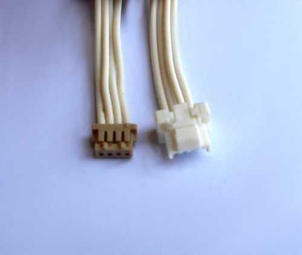

# Obsolete cables

This section contains specifications for cables that were used on earlier stages of UAVCAN adoption,
until a proper connector standard was defined.
The cables listed there should be available from our distributors approximately until 2017.

## CLIK-Mate cables

### CLIK-Mate UAVCAN Micro Patch Cable

<warning>This item is obsolete, please refer to other sections for alternatives.</warning>

A twisted-pair cable with standard UAVCAN Micro plugs (CLIK-Mate, 4 circuits, 1.25 mm) on each end.
Connector pinout is shown below.

Function        | UAVCAN Micro  | Wire                                                          | UAVCAN Micro
----------------|---------------|---------------------------------------------------------------|----------------------
+5 VDC          | 1             |  pair 1 tip    | 1
CAN H           | 2             |  pair 2 ring              | 2
CAN L           | 3             |  pair 2 tip  | 3
GND             | 4             |  pair 1 ring                | 4

Note that some cables may use an alternative wire coloring, in which case the closest available color
should be used instead of the specified one.

#### Manufacturing instructions

##### Parts needed

Part Name                                               | Manufacturer          | Part Number           | Quantity | Notes
--------------------------------------------------------|-----------------------|-----------------------|----------|----------
Molex CLIK-Mate plug housing, 4 circuits, 1.25 mm       | Molex                 | 5023800400            | 2        |
Molex CLIK-Mate crimp terminal, 1.25 mm                 | Molex                 | 5023810000            | 8        |
Twisted pair cable (see requirements below)             | 3M                    | 1700/10 100SF         | N/A      | Can be replaced with an alternative.

Requirements to the twisted pair cable:

* Type: 4-core 2-pair twisted pair (see note below)
* Wire gauge: #26..28 AWG
* Wire strands: 7 or more
* Wire insulation diameter: 0.78 to 1.07 mm

It should be noted that most types of USB 2.0 cables would be a perfect fit to the requirements above.
Also there are some types of telephone cable that fit the requirements as well.

Certain applications that use very short CAN bus wiring (typically under two meters),
that are not subject to severe EMI, and/or that do not require high data rates,
may use flat cable instead of twisted pair.

##### Optional tools

Part Name                                               | Manufacturer          | Part Number           | Notes
--------------------------------------------------------|-----------------------|-----------------------|-------------------------------
HAND CRIMP TOOL 26-28AWG                                | Molex                 | 638194400             | Can be purchased from DigiKey.

##### Manual assembly instructions

Follow this link to find the crimp specification: <http://www.molex.com/pdm_docs/cs/CS-502381-001.pdf>.

Wire strip requirements:

* Outer insulation strip length (if any): 10 to 20 mm.
* Wire insulation strip length: 1.5 to 1.7 mm.

Perform the following steps:

1. Cut the cable.
2. Strip the insulation on both ends of the cable as described above.
3. Crimp the terminals using hand crimp tool.
4. Insert the terminals into plug housings following the pinout specification above.

### CLIK-Mate UAVCAN Micro to DF13 Adapter Cable

<warning>This item is obsolete, please refer to other sections for alternatives.</warning>

A 4-wire cable with a standard UAVCAN Micro plug (CLIK-Mate, 4 circuits, 1.25 mm) on one end
and a JST DF13 four-circuit plug (Pixhawk v1 compatible) on the other end.
Connector pinout is shown below.

Function        | UAVCAN Micro  | DF13
----------------|---------------|--------------
+5 VDC          | 1             | 1
CAN H           | 2             | 2
CAN L           | 3             | 3
GND             | 4             | 4

#### Manufacturing instructions

##### Parts needed

Part Name                                               | Manufacturer          | Part Number           | Quantity | Notes
--------------------------------------------------------|-----------------------|-----------------------|----------|----------
Molex CLIK-Mate plug housing, 4 circuits, 1.25 mm       | Molex                 | 5023800400            | 1        |
Molex CLIK-Mate crimp terminal, 1.25 mm                 | Molex                 | 5023810000            | 4        |
Hirose DF13 plug housing, 4 circuits                    | Hirose Electric       | DF13-4S-1.25C         | 1        |
Wire with crimped Hirose DF13 terminals, 28 AWG, tin plating | Hirose Electric  | H4BXT-10112-W8        | 4        | Can be replaced with an alternative.

Wire requirements:

* Wire gauge: #26..28 AWG
* Wire strands: 7 or more

Note that it is possible to use the same cable type as for UAVCAN Micro Patch Cable.

##### Optional tools

Refer to UAVCAN Micro Patch Cable assembly specification.

##### Manual assembly instructions

Follow this link to find the CLIK-Mate crimp specification: <http://www.molex.com/pdm_docs/cs/CS-502381-001.pdf>.

Wire strip requirements on the CLIK-Mate side:

* Wire insulation strip length: 1.5 to 1.7 mm.

Perform the following steps:

1. For each of the 4 wires:
    1. Crimp a CLIK-Mate terminal on the bare end of the wire using hand crimp tool.
2. Insert the crimped DF13 terminals into a DF13 plug housing.
3. Insert the crimped CLIK-Mate terminals into a CLIK-Mate plug housing following the pinout specification above.

### CLIK-Mate UAVCAN Micro Termination Plug

<warning>This item is obsolete, please refer to other sections for alternatives.</warning>

A UAVCAN Micro plug with a 120-&Omega; resistor between the pins CAN H and CAN L.
Connector pinout is shown below.

Function        | UAVCAN Micro  | Resistor
----------------|---------------|---------------
                | 1             |
CAN H           | 2             | Any
CAN L           | 3             | Any
                | 4             |

#### Manufacturing instructions

##### Parts needed

Part Name                                               | Manufacturer          | Part Number           | Quantity | Notes
--------------------------------------------------------|-----------------------|-----------------------|----------|----------
Molex CLIK-Mate plug housing, 4 circuits, 1.25 mm       | Molex                 | 5023800400            | 1        |
Molex CLIK-Mate crimp terminal, 1.25 mm                 | Molex                 | 5023810000            | 2        |
Low power resistor, 120 &Omega; (see requirements below) | Stackpole Electronics | CF18JT120R           | 1        | Can be replaced with an alternative.
Heat shrink tube (shrink ratio: 3.5&plusmn;0.5 mm &rarr; 0.7&plusmn;0.3 mm) | TE Connectivity | PD-CAP-1/8-0 | 15 mm | Can be replaced with an alternative.

Termination resistor requirements:

* Resistance: 120 &Omega;
* Power: 0.125 W or higher
* Tolerance: &plusmn;5% or better

##### Optional tools

Refer to UAVCAN Micro Patch Cable assembly specification.

##### Manual assembly instructions

1. Bend one resistor lead at 180&deg; so that it points in the same direction with the other lead.
2. Cut both resistor leads at the same place so that the shortest one would be approximately 3 to 10 mm long.
3. Crimp two CLIK-Mate terminals directly on both resistor leads using hand crimp tool.
Relative rotation about the lateral axis between the crimped terminals should not exceed 45&deg;.
4. Do either:
    1. Slip an insulation tube (e.g. a heat shrink tube) on the longer lead.
Make sure the tube prevents the resistor leads from shorting with each other.
    2. Apply some liquid insulating varnish on the longer lead preventing it from shorting with the shorter lead.
    3. Ensure that the shorter resistor lead is less than 5 mm long,
so it can't be deformed enough to short with the longer lead. See the second step.
5. Insert the resistor leads with crimped terminals into a CLIK-Mate plug according to the specified pinout.
6. Slip a heat shrink tube on the resistor covering both leads and the resistor itself.
Make sure the tube has at least 3 mm long overhang on the outer side.
7. Apply heat to shrink the insulation.
8. Recommended: Using an ohmmeter ensure that the resistance between the pins 2 and 3 of the plug is within
120&plusmn;10 &Omega;.

### CLIK-Mate UAVCAN Micro to D-SUB DB9F CAN Adapter Cable

<warning>This item is obsolete, please refer to other sections for alternatives.</warning>

A twisted-pair cable with a standard UAVCAN Micro plug (CLIK-Mate, 4 circuits, 1.25 mm) on one end and
a typical CAN bus connector D-SUB DB9F (female) on the other end.
Connector pinout is shown below.

Function        | UAVCAN Micro  | Wire                                                          | D-SUB DB9F
----------------|---------------|---------------------------------------------------------------|----------------------
+5 VDC          | 1             |  pair 1 tip    | 9
CAN H           | 2             |  pair 2 ring              | 7
CAN L           | 3             |  pair 2 tip  | 2
GND             | 4             |  pair 1 ring                | 3

Note that some cables may use an alternative wire coloring,
in which case the closest available color should be used instead of the specified one.

Cable requirements: see [CLIK-Mate UAVCAN Micro Patch Cable](#CLIK-Mate_UAVCAN_Micro_Patch_Cable).
