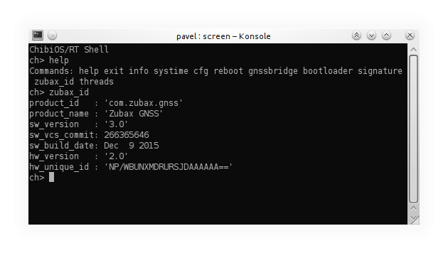

# USB command line interface



Some of the products by Zubax Robotics are equipped with USB command line interface that provides access to
device's internal command shell.
This page documents properties that are common to all USB <abbr title="Command Line Interface">CLI</abbr>-enabled
Zubax products.
Normally you would want to read this document in context of some particluar product.

## USB parameters

All Zubax products that use USB CLI have USB <abbr title="Vendor ID">VID</abbr> 0x1D50 and
<abbr title="Product ID">PID</abbr> 0x60C7.
The USB device's vendor name is reported as `Zubax Robotics`.

Zubax products with USB CLI use <abbr title="Communications Device Class">CDC</abbr>
<abbr title="Abstract Control Model">ACM</abbr> profile, also known as <abbr title="Virtual COM port">VCP</abbr> or
"virtual serial port". USB devices of this class are recognized by host OS as a regular serial port,
e.g. `COMx` on Windows, `/dev/ttyACMx` on Linux, etc.

Note that virtual serial ports are mostly indifferent to physical layer settings such as baudrate, parity,
word size, etc, so when accessing a USB command shell they need not be configured explicitly, unless documentation
specific to your product instructs you otherwise.

USB CDC ACM devices can be used out of the box, without need to install special drivers, with all major operating
systems except older versions of Windows (older than Windows 10).
If you're using an old version of Windows and your system does not recognize a Zubax product,
please follow instructions below to configure your system manually.

### Configuring older versions of Windows

Please skip this section if you're not using Windows, or if your OS is not older than Windows 10.

1. Save the following file to your computer: <https://files.zubax.com/drivers/zubax.inf>.
2. Make sure the downloaded file has name `zubax.inf`. If it is named differently, rename it.
3. Right-click the file and select `Install`.
4. Follow the dialogs.

If installation fails due to missing digital signature, please follow instructions provided on this page:
<http://answers.microsoft.com/en-us/windows/forum/windows_8-hardware/how-to-install-a-driver-that-does-not-contain/7c3f299b-3483-4c96-8c44-87c7451af222>.

### Configuring permissions on Linux

Most Linux distributions assign very restrictive permissions to connected USB devices,
which makes it impossible for regular users to access serial ports.
This is what typically can be seen when an application fails to access the port due to insufficient permissions:

```bash
$ cat /dev/ttyACM0
cat: /dev/ttyACM0: Permission denied
```

The problem can be solved in two ways.

#### First way

First way to fix the problem is to configure udev so that it assigns correct permissions automatically:

```bash
echo 'SUBSYSTEMS=="usb", ATTRS{idVendor}=="1d50", ATTRS{idProduct}=="60c7", MODE="0666"' | sudo tee /etc/udev/rules.d/42-zubax.rules
sudo udevadm control --reload
```

Now connect your device.

#### Second way

Another way to fix the problem is to add the current user to the group `dialout`:

```bash
sudo usermod -a -G dialout $USER        # Adding the current user to the group 'dialout'
exit                                    # It is necessary to re-login before changes take effect
```

Make sure to logout and then log back in, otherwise the changes may not take effect.

## How to connect

There is a variety of software that can be used to access command line over serial port.
Some of the most convenient and popular options are reviewed below.

### PuTTY


PuTTY is an open source GUI program that works on Windows, Linux and Mac.
This is the recommended option for Windows users.

PuTTY can be freely downloaded from <http://www.putty.org/>.

In order to connect to CLI, start PuTTY, select the serial port option, and type the name of the serial port
into the corresponding field (e.g. `COM5`).
If necessary, configure the following terminal options (although they should be configured by default):

* Line ending: CR+LF (`\r\n`)
* Local echo: Off
* Local line editing: Off

See the screenshot for an example.

### GNU Screen

GNU Screen is an open source command line application that can be used to access serial CLI.
It is the recommended option for Linux and Mac users.

Assuming that the serial port name is `/dev/ttyACM0`, GNU Screen can be started trivially as follows:

```bash
screen /dev/ttyACM0
```

To exit the application, press <kbd>Ctrl+A</kbd>, then <kbd>K</kbd>, then confirm by pressing <kbd>Y</kbd>.

#### Note for Linux users

On most Linux systems, instead of directly specifying TTY device such as `/dev/ttyACM0`,
it is possible to use persistent symlinks in `/dev/serial/by-id/`.
These symlinks allow to refer directly to the device using its vendor name, product name, and unique ID,
which is more convenient because unlike TTY number these parameters are persistent.
For example, `/dev/ttyACM0` could be replaced with persistent device path like
`/dev/serial/by-id/usb-Zubax_Robotics_Zubax_GNSS_34FFD305435730343944224300000000-if00`,
or just
`/dev/serial/by-id/usb-Zubax_Robotics*` to refer to any connected Zubax product.

## How to identify the connected device

All products by Zubax Robotics that implement USB CLI feature have one common CLI command: `zubax_id`.
When executed without arguments, it prints a set of device's properties as a flat YAML dictionary
(a list of colon-separated key/value pairs).
Some of the properties are standard and are guaranteed to be reported by any Zubax product, they are documented below:

Key             | Value                                                                                                 | Example
----------------|-------------------------------------------------------------------------------------------------------|------------------------------
`product_id`    | Reversed internet domain name suffixed with product name in lowercase.                                | `'com.zubax.gnss'`
`product_name`  | Human-readable product name. This name is typically used by humans when referring to the product.     | `'Zubax GNSS'`
`sw_version`    | Software version string in the format `<major>.<minor>`.                                              | `'1.12'`
`hw_version`    | Hardware version string in the format `<major>.<minor>`.                                              | `'3.0'`
`hw_unique_id`  | Unique 128-bit ID of the product encoded in Base64.                                                   | `'NP/TBUNXMDQ5RCJDAAAAAA=='`

Some products may also report extra properties.

Note that the reported properties are specific to the device, not to the interface,
i.e. properties such as `product_id`, version information, etc., will be reported identically via
other supported interfaces, e.g. UAVCAN.

Consider an example below:

```
ChibiOS/RT Shell
ch> zubax_id
product_id   : 'com.zubax.gnss'
product_name : 'Zubax GNSS'
sw_version   : '3.0'
sw_vcs_commit: 266365646
sw_build_date: Dec  9 2015
hw_version   : '2.0'
hw_unique_id : 'NP/TBUNXMDQ5RCJDAAAAAA=='
hw_signature : 'sqKqz6bJCimo3/oy/x3sAbTkwRYA9LaubgUycJwKdxGVtqrqGBRfbQkllBhHaU5l+RIDRqKnxQVSzU7
QIeGuScK3RDfrAT3ke42i+MlTh20+mr+TRV2T9YAu/2q6pq0rSYnbYRqncA1WyGhrGtlEav/K4svfL/jgwNxfE3d/YiI='
ch>
```

Refer to your product's documentation page for the complete list of product-specific properties and their values.
